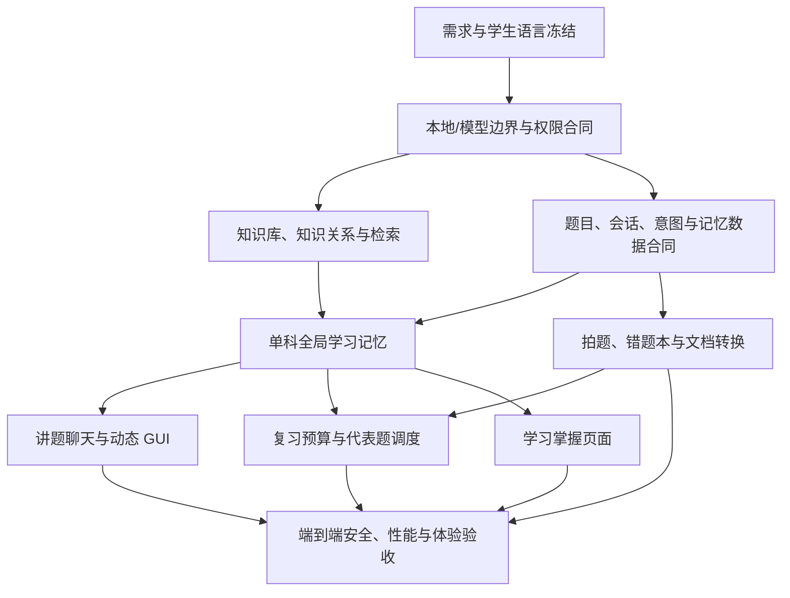

# 智能错题本总体任务计划

## 目标

在不引入云端服务的前提下，把当前 Android 工程完成为一款以大模型为核心、以本地数据和权限边界为底座的高中智能错题本：学生操作足够简单，讲题、错题整理、学习记忆、每日复习和学习情况展示形成真实闭环，并通过完整内容、性能、安全、真机交互和真实模型质量验收。

## 当前阶段

阶段 0：需求冻结与现状审计。

当前只完善计划和验收口径，不开始新的源码实现。

## 不可偏离的产品原则

1. 底部固定为 `复习 / 讲题 / 错题本 / 我的` 四栏。
2. `讲题` 是完整聊天入口：空会话也有输入框，同时保留拍题和从错题本选择；用户可以直接提问、查错题、问学习情况或闲聊。
3. 用户没有要求时，模型不得主动出新题、变式题、校准题或用额外题目探测能力；能力边界只能从用户正在处理的题和真实交互中逐步形成。
4. `复习` 只承担今日计划、进度和打卡，不放任何录入错题入口。
5. `错题本` 承担单题拍摄、相册导入、批量导入、浏览、检索和整理；分类固定为科目 → 板块 → 知识点，掌握程度是独立维度，不向学生展示错因、来源、题型等低价值分类。
6. 高中知识库是 AI 内部基础设施，不是学生维护页面；学生端不出现资料完整度、待补齐、来源审校、检索召回、细粒度实现术语。
7. `我的` 中对应页面改为只读的“学习掌握”：展示学生各科、各板块、各知识点的掌握情况与变化，不让学生管理知识资料。
8. 学习记忆按科目隔离、在单科内全局共享，并细化到一道题内的基础知识点、方法和关键步骤；新题讲解必须真正读取相关全局记忆，避免重复询问已经稳定掌握的内容。
9. 图片可读性、题面理解、OCR 纠错、知识点细分、模糊意图和讲题策略主要交给大模型；本地只做文件安全、确定性校验、权限、存储、检索、调度、渲染和失败关闭。
10. 不把离线智能讲题作为重点，不建设本地推理模型，不部署应用云端；用户自带模型 API，应用直接连接所选服务商。
11. 不让学生替 OCR 或知识库做录入、审校和分类；只有无法继续时才提出一次最小、具体、可直接回答的补充。
12. 动态 GUI 由模型输出受控数据协议、本地确定性渲染；不依赖模型生成图片，不做手写演算板，不显示“示意动画”等无价值标签。
13. 大量错题录入不等于把所有题一次性塞进复习。所有错题保留复习资格，但每日只安排有限时间内最有价值的代表题，并保证其余题不会永久饿死。
14. 产品完成以真实调用链、真实数据库、模拟器/真机和真实 Provider 证据为准，不以静态设计稿、假数据或仅有 Prompt 约束代替实现。
15. 高中知识库不是题库，但可以保存服务于讲解的完整例题、答案、推导、常见解法和方法模型。边界不在于内容是否带题干或答案，而在于它不能具有可布置、可评分、可排复习、可记录学生作答的独立练习身份；真实评测题和学生错题仍与正式知识内容包物理隔离。
16. 资料是否权威与资料表达是否允许进入应用是两套判断。官方、教材、教培或开放资料都先按具体版本登记使用权；没有明确许可、许可地址和署名时，只能经过独立审校后重新归纳，不能复制正文。例题和完整解答是否允许保留仍由内容身份与具体许可共同决定，而不是按“有没有答案”粗暴拦截。
16. 动态 GUI 不是逐题、逐题型开发。模型只输出版本化声明式命令；本地通用渲染引擎组合基础组件并驱动统一动画运行时，新增题目不新增专用页面。

## 依赖总图

## 阶段

### 阶段 0：需求冻结与现状审计

- [ ] 将两份项目文档、全部对话决定、当前代码和当前产品文档合并为一份可追踪需求表。
- [ ] 每条需求标记为 `已落实 / 部分落实 / 未落实 / 删除`，并附真实代码或模拟器证据。
- [ ] 修正文档中与最新决定冲突的旧设计，例如“复习保留录入入口”“讲题空态没有输入框”“学生查看知识资料完整度”。
- [ ] 建立功能依赖、数据所有者、模型权限和完成门槛。
- [ ] 冻结学生端词汇表和禁用词表。
- [ ] 在改生产代码前完成四个主页面及关键二级页的可点击交互原型，并用真实内容状态走通核心任务。
- **完成门槛：** 每条用户要求都有唯一归属阶段、验收方式和明确状态；不存在相互矛盾的产品文档；交互原型得到确认。
- **状态：** 进行中

### 阶段 1：工程基线、架构边界与已知风险清零

- [ ] 在 D 盘工程内确认 Android SDK、ADB、API 36 模拟器、JDK、Gradle Wrapper 和构建路径；禁止依赖未说明的系统 Gradle。
- [ ] 先修复已确认的相机/相册缓存孤儿、输入流无超时、IPv6 特殊地址、配置并发、批量授权文案、意图阻断写入、PDF 零宽字符/组合字符性能问题。
- [ ] 为模型所有可见文本统一接入学生语言过滤，包括动态按钮标签。
- [ ] 把“只能靠 Prompt 保证”的关键边界提升为本地合同：模型不能直接写掌握度、不能直接保存/删除错题、不能越权读取数据、不能把额外题目伪装成诊断。
- [ ] 将超大文件按领域边界拆分，优先处理讲题网关、捕获流程、数据库 DAO 和会话路由；业务核心不依赖 Compose、Room 或具体 Provider。
- [ ] 保留 strict-offline 仅作为失败关闭与诊断构建，不再把它作为学生端产品模式扩展。
- **完成门槛：** 已知安全报告全部关闭；关键模块编译和回归通过；核心文件有清晰所有权，新增功能不继续堆进巨型文件。
- **状态：** 待开始

### 阶段 2：AI 内部高中知识库与检索底座

- [ ] 建立九科完整目录：科目、板块、知识点、别名、边界、先后关系、易混关系和资料依据；正式知识包同时允许概念解释、方法模型、完整例题及其推导和答案，但禁止练习编号、评分答案键、作答记录、难度/分值、复习调度等题库身份字段。
- [ ] 内容来源至少覆盖现行课程标准、主流教材和获授权/可合法使用的优质第三方教培资料；逐条保存版本、科目、出处、授权状态和审校时间。
- [ ] 学生端完全移除知识库覆盖率、待完善分类、资料数量和审校状态；内部缺口进入静默研究队列。
- [ ] 本地检索采用结构化别名/全文检索为主、知识关系扩展为辅；只有真实标注集证明仍有缺口时才考虑增加本地向量索引。
- [ ] 大模型负责从题面生成规范化检索意图和候选细分；本地检索只返回同科、有依据、已审校的候选；模型不能自行创建正式知识点。
- [ ] 本地召回不足时允许受控联网搜索：限定可信来源、记录查询和引用、进入内部审校流程，不直接写入正式知识库，不打断学生。
- [ ] 建立与知识库物理隔离的真实题目人工标注评测集，覆盖九科、长题面、多知识点、同名异义、跨板块、图表题和边界案例；只用于离线验收，不打包进 App，不参与学生运行时检索。
- **完成门槛：** 九科内容覆盖审计通过；真实标注集达到约定 Recall@K/Precision@K；中端 Android 设备 2 万级知识点检索 p95 < 150 ms；无跨科串入；学生端无知识库运维信息。
- **状态：** 待开始

### 阶段 3：题目、意图、权限与单科全局学习记忆

- [ ] 将会话目标分为：无绑定对话、临时拍题、已存错题；三者共享聊天体验，但使用不同可读数据和可写权限。
- [ ] 意图覆盖：当前题讲解、纯文字知识提问、错题查询、学习情况查询、设置帮助、闲聊、结束会话、保存请求、模糊意图。
- [ ] 明确意图本地快速路由；模糊或复合意图交给模型结构化解析；低置信度不执行动作，只用一句最小澄清。
- [ ] 模型只能请求有界读取和建议动作；本地权限层决定是否读取错题/学习情况，保存、删除、结束等写操作必须由本地事实和用户确认驱动。
- [ ] 题目拆解为细粒度知识点、方法、步骤和先修关系；记忆按科目隔离，单科内跨题共享。
- [ ] 每条能力证据保存时间、题目、知识点、交互方式、独立/提示后/答案暴露、置信度和可撤销投影；同一事实幂等。
- [ ] 新题讲解先检索“当前题知识点 + 同科相关知识邻域”的全局记忆，不再只读当前题直接绑定节点。
- [ ] 已稳定掌握且近期有可靠证据的基础点不重复提问；矛盾、过期或再次出错的知识点重新提高关注度。
- [ ] 无绑定闲聊和单纯阅读讲解默认不写掌握度；只有可归因的真实作答/选择/复习结果才进入能力投影。
- **完成门槛：** 新拍题也能读取同科相关历史能力；跨科严格隔离；模糊意图不误执行；模型不能直接修改记忆；重建应用后会话与权限仍一致。
- **状态：** 待开始

### 阶段 4：拍题、错题本与图片转文档

- [ ] 保留两条不同入口：`讲题` 拍题先建立临时会话、是否入库由用户决定；`错题本` 拍题/批量导入直接整理入库、不自动讲解。
- [ ] 图片质量、题目边界、是否缺页、OCR/结构化题面和知识归类交给模型；本地只做文件完整性、尺寸、类型、授权和协议校验。
- [ ] 题面可用时自动继续，不固定停在人工“检查/确认”步骤；只有模型无法继续时请求最小补充，修改题面是可选入口。
- [ ] 支持相机、相册、多图、PDF 分页导入；长批次可暂停、恢复、重试和查看失败项，不要求学生逐题校对。
- [ ] 错题本学生分类固定为科目 → 板块 → 知识点，掌握程度单独筛选；模型可给一题多个知识点。
- [ ] 去掉所有学生可见的错因、来源、题型和内部资料字段；保留必要的内部文件溯源但不作为学生分类。
- [ ] 图片转为受信结构化文档，支持题干、选项、公式、表格、坐标图和图片区域；导出 PDF 时只使用通过协议校验的文档。
- [ ] 重复/近重复题只做安静合并提示和内部关联，不能误删学生原始记录。
- **完成门槛：** 单题、批量、缺页、糊图、跨页、公式/表格、重复题和中断恢复全链路通过；正常路径不要求人工 OCR；两种入口不会串错结果。
- **状态：** 待开始

### 阶段 5：讲题聊天、约束与动态 GUI

- [ ] `讲题` 首页直接显示聊天输入框；拍题和从错题本选择是输入区附近的附件/快捷动作，不是进入聊天的前置条件。
- [ ] 无绑定文字可处理知识提问、错题查询、学习情况、设置帮助和闲聊；需要具体题面时才邀请拍照或选择错题。
- [ ] 用户没有要求时不生成任何额外练习题；当前题内诊断问题必须有教学价值、难度匹配且可省略，不能问已明显掌握的基础点。
- [ ] 讲题策略读取当前题和同科全局能力记忆；答案默认分层揭示，但用户明确要答案时直接响应。
- [ ] 动态话题和下一步操作由当前对话实时生成，不使用固定死话题；自由输入始终可用。
- [ ] 建立版本化声明式 `VisualCommand` 协议：模型只能给出组件、数据、变量、单位、关系、时间轨道和允许的交互，不得输出 Kotlin、JavaScript、HTML、任意 SVG 或其他可执行代码。
- [ ] 建立通用原语与组合层：文字/数学、表格、坐标轴、数据序列、节点、连线、形状、向量、标签、步骤和状态卡；步骤、对照、证据链、时间线、知识关系、公式、函数、空间/电路、化学关系和数据图都由这些组件组合，不为单题写页面。
- [ ] 建立统一动画运行时：实体属性、时间变量、关键帧、受限数值表达式、路径、约束和交互控制由同一引擎执行；直线、抛体、圆周、振动以及后续新运动只是结构化参数组合，不新增专用动画页面。
- [ ] 模型回复采用“一个主场景 + 最多一个确有必要的辅助场景”；本地根据屏幕密度、内容重复度、命令预算和复杂度决定组合、折叠或拒绝。
- [ ] 本地对命令做 Schema、数量、坐标、单位、表达式、时间、文本和资源预算校验；无效命令降级为安全 Markdown，不影响会话。
- [ ] 数值和交互由本地确定性计算，支持播放/暂停/复位/拖动/倍速；只显示当前重要参数，名称和单位符合学生习惯。
- [ ] 删除“示意动画”等小字、工程说明和无意义提示；不做手写演算板，不用模型生成图片代替可交互 GUI。
- [ ] Markdown、公式、表格、选择项和 GUI 按钮统一学生语言与安全校验；选择题可直接点击，文字输入同等优先。
- **完成门槛：** 空会话可真实发送并得到正确意图响应；当前题约束有本地校验；全局记忆影响提问策略；各 GUI 使用真实模型协议并通过重建、无动画和无障碍测试。
- **状态：** 待开始

### 阶段 6：非机械的复习预算与大量录入调度

- [ ] 所有错题都进入“可复习集合”，但“保存错题”和“安排今天复习”分开；批量录入首先更新知识分布和能力证据，不制造当天洪峰。
- [ ] 每日计划同时受时间预算和题数硬上限约束；默认值以高中生可持续完成为目标，并允许在“我的 → 提醒与复习偏好”中简单选择轻量/标准/加强。
- [ ] 优先级综合遗忘风险、知识掌握下界、近期再次出错、重复错题、逾期时间和用户明确考试目标；没有真实考试信息时不虚构考试权重。
- [ ] 同一知识点或高度相似题按题族聚类，每天只选少量代表题；成功完成代表题可以降低同族兄弟题的紧迫度，但不能把未做题伪装成已复习。
- [ ] 建立轮换和老化机制：长期未被选中的题逐步提高优先级，确保大批量导入后没有永久饥饿。
- [ ] 已稳定掌握的题降频但不删除；知识点重新出错、证据过期或出现矛盾时升频。
- [ ] 每日计划完成后不自动追加无止境题目；未选/未完成项回到后续日期重排，向学生只显示今日可完成的数量和预计时间。
- [ ] 区分“学习画像样本”和“必须直接重做的题”：模型可建议代表性，但最终调度、预算和状态变化由本地确定性算法完成。
- [ ] 用 10、100、500、1000、5000 道批量录入场景验证首日负担、30/90 天轮换、公平性、去重、掌握后降频和再次出错升频。
- **完成门槛：** 任意规模录入都不突破每日预算；同质题不过量；高风险题及时出现；长期项无饥饿；未做题不被误记为已完成；计划可解释但不向学生堆算法术语。
- **状态：** 待开始

### 阶段 7：学生端信息架构与“学习掌握”页面

- [ ] `复习` 删除顶部和底部两个录入入口，只保留今日数量、预计用时、开始/继续、完成状态、连续复习和必要的薄弱提示。
- [ ] `讲题` 首页改为聊天优先；`错题本` 保留全部录入入口；职责不交叉。
- [ ] `我的` 将“知识点与资料”替换为“学习掌握”，知识库入口不再面向学生。
- [ ] “学习掌握”顶部只显示总体状态和最近变化，不显示分类依据、资料数量、完善/不完善或系统工作状态。
- [ ] 以科目卡片、掌握分布、板块进度、知识点列表、趋势图和最近变化时间线形成多样但克制的只读呈现。
- [ ] 学生只需查看；允许轻量的科目和时间筛选、点击下钻，不要求审核、维护、确认或补资料。
- [ ] 学生词汇使用“已掌握 / 正在巩固 / 需要复习 / 最近有进步”等日常说法；不使用“证据不足 / 完全未知 / 原子知识 / 检索召回”等术语。
- [ ] 所有系统提示只保留会改变用户下一步选择的关键信息，成功状态尽量直接体现在页面而不是弹窗。
- **完成门槛：** 四栏各自只有一个清晰职责；首次使用者无需说明即可完成拍题讲解、录入、复习和查看掌握情况；无不可操作的系统运维信息。
- **状态：** 待开始

### 阶段 8：真实质量、性能、兼容性与发布验收

- [ ] 建立九科真实题目集，最低目标为 2700 道、每科不少于 300 道；分别评测图片理解、结构化文档、知识点归类、检索、讲题正确性、提问边界和动态 GUI 选择。
- [ ] 对至少两家 OpenAI 兼容 Provider 做文本、图片、结构化输出、超时、限流、断流、错误响应和配置切换测试。
- [ ] 完成 JVM 单元、Room 迁移、Compose、API 级别模拟器、进程强杀恢复、时区/DST、通知、批量导入、PDF 导出和无障碍测试。
- [ ] 覆盖项目最低 Android API 到 API 36 的代表版本，并在至少两台中端 ARM Android 设备上测试 500/1000/5000 题、2 万知识点、长会话、长 Markdown、组合字符、零宽字符和大 PDF。
- [ ] 用参考截图逐页核对布局、文字层级、触控、滚动、键盘、返回、空态、错误态和深色/大字体边界。
- [ ] 邀请高中生完成课后录题、晚自习求助、批量迁移、每日复习、查看掌握情况五类任务，记录操作数、完成率和困惑点。
- [ ] 全量需求表逐条回归，不允许用“文档已写”“测试替身通过”代替真实功能。
- **完成门槛：** 所有阻断和高优先级缺陷关闭；全量构建、测试、Lint 和端到端验收通过；剩余限制有明确非核心范围且得到用户确认。
- **状态：** 待开始

## 关键完成标准

| 领域 | 必须达到 |
|---|---|
| 用户负担 | 正常拍题不手工录 OCR；模糊情况只问最小问题；无多余系统提示 |
| 讲题边界 | 用户未要求时不出新题；不会重复问稳定掌握的基础点；答案揭示符合用户意图 |
| 记忆 | 单科内跨题共享细知识点能力；时间、掌握和证据可追踪；模型无直接写权限 |
| 错题本 | 科目 → 板块 → 知识点 + 独立掌握程度；无错因/来源可见分类 |
| 复习 | 有严格预算、代表题、去重、轮换、降频/升频和无饥饿保证 |
| 知识库 | AI 内部使用、九科完整、有来源、可检索、学生端不可见运维信息 |
| 动态 GUI | 类型丰富、协议受控、本地渲染、可交互、文字与数值易懂 |
| GUI 通用性 | 新题只产生新的声明式命令和数据，不增加题目专用页面、专用动画或模型生成图片 |
| 数据权限 | 模型只做有界读取请求和建议；本地授权和持久化；敏感写操作需要事实或确认 |
| 性能安全 | 已知问题清零；大批量、大知识库、PDF 和网络异常下仍可用 |
| 验证 | 当前轮新鲜测试证据；模拟器、真实设备、真实 Provider 和真实题集均覆盖 |

## 单项任务的完成定义

本计划中的每个大项都必须拆成 `implementation_work_packages.md` 中的独立工作包。一个工作包只有同时满足以下条件才能标记完成：

1. **行为合同完成：** 明确学生能看到什么、能做什么、异常时发生什么，以及明确不会发生什么。
2. **数据合同完成：** 数据所有者、主键、时间线、幂等、迁移、删除/撤销和进程重建行为明确。
3. **模型边界完成：** 模型输入、输出 Schema、可读数据、可请求能力、禁止动作、超时和无效输出处理明确。
4. **真实生产链完成：** 不是 Preview、假仓库或静态 XML；从真实入口经过真实数据库/Provider 到真实 UI。
5. **完整状态完成：** 首次、空态、加载、成功、失败、重试、离开返回、进程重建、批量和极端数据均有行为。
6. **自动验证完成：** 单元、数据库、Compose/仪器、属性/压力或安全测试按风险覆盖。
7. **设备验证完成：** 至少 API 36 模拟器验证；涉及性能、相机、通知、文件和长任务时还要真机验证。
8. **质量证据完成：** 涉及模型语义时使用真实 Provider 和真实题集；涉及 UI 时保留当前截图和可访问性结果。
9. **回归完成：** 全工程相关测试、Lint 和构建通过，没有破坏其他入口或旧数据。
10. **文档一致完成：** 需求表、架构、场景注册表、测试证据和用户可见说明同步，不留相互冲突的旧条款。

只完成其中一部分时，状态必须保持 `部分落实`；不得为了推动进度降低完成口径。

## 执行批次

| 批次 | 工作包范围 | 开始条件 | 结束条件 |
|---|---|---|---|
| 0. 冻结 | A01–A08 | 当前审计证据齐全 | 需求、词汇、入口职责、根因登记、状态恢复和验收矩阵无冲突 |
| 1. 地基 | B01–B09 | 批次 0 通过 | 工程基线、权限硬边界、统一任务治理和已知安全/性能问题清零 |
| 2. 知识与记忆 | C01–C06、D01–D08 | 批次 1 通过 | AI 知识库、检索、用途授权和单科全局记忆真实接通 |
| 3. 核心体验 | E01–E06、F01–F08 | 批次 2 的数据合同稳定 | 拍题、错题本、自由聊天、讲题和动态 GUI 闭环 |
| 4. 长期学习 | G01–G07、H01–H04 | 批次 2 完成，核心入口可用 | 非机械复习和学生掌握页面闭环 |
| 5. 发布验收 | I01–I07 | 所有功能工作包完成 | 真实内容、Provider、设备、规模、公平、性能、安全和学生测试通过 |

## 已决定的方案

| 决定 | 原因 |
|---|---|
| 先冻结总计划，再实施 | 当前代码与最新产品方向已有多处冲突，先改会造成重复返工 |
| 知识库与学习掌握彻底分离 | 前者是 AI 基础设施，后者才是学生真正关心的信息 |
| 自由聊天与题目绑定会话共用外观、分开权限 | 既满足聊天习惯，又避免无题闲聊污染错题和能力记忆 |
| 复习采用预算内代表题，不采用“所有错题逐题轮完” | 避免批量导入后负担失控，同时保留每题的后续复习资格 |
| 结构化检索优先，向量检索按评测决定 | 高中知识目录本身结构明确，避免无证据增加移动端复杂度 |
| 关键边界必须本地硬约束 | Prompt 不能作为权限、安全或学习事实的唯一防线 |
| 不扩展本地智能推理和应用云端 | 项目核心是模型能力、交互、记忆和本地数据闭环 |
| 动态 GUI 使用统一声明式运行时 | 新题只增加结构化命令，避免逐题/逐题型堆专用页面和动画 |
| 知识包与评测题物理隔离 | 知识库可含服务于方法讲解的完整例题与答案，但不能把它们变成可布置、可评分、可复习调度的练习；真实评测题只用于质量验收 |

## 尚需在实施前量化但不阻塞总体方案的问题

1. 默认每日复习先以 15 分钟作为实验基线，最终分钟数和题数上限需要用学生测试校准；实现支持轻量/标准/加强策略。
2. 第三方教培资料的可用范围必须按版权和授权逐项确认；无法合法内置的内容只保存可公开引用的目录与出处。
3. 真实 Provider 质量门槛和测试成本需要在阶段 8 前确定供应商与预算。
4. 中端真机型号需在性能验收前确定；模拟器数据不能替代 ARM 真机结论。

## 已知错误与风险

| 问题 | 当前处理 |
|---|---|
| 从 D 盘直接运行部分 Gradle 测试曾出现 `GradleWorkerMain` 类路径错误 | 已确认使用工程现有 ASCII SUBST 路径可通过；阶段 1 固化为脚本并消除双路径混用 |
| 当前知识库仅有九科 19 个知识点和 9 份资料 | 不视为完整；阶段 2 重新做内容覆盖与检索验收 |
| 当前新拍题讲题未读取单科全局能力 | 阶段 3 作为阻断项修复，不能只改 Prompt |
| 当前学生端暴露知识库覆盖/待完善状态 | 阶段 7 删除并改为学习掌握页面 |
| 当前复习页有两个录入入口 | 阶段 7 删除，错题本保留录入职责 |
| 当前空讲题页无聊天输入框 | 阶段 5 补齐无绑定会话与输入权限 |

## 计划维护规则

- 新需求先进入本计划并标注依赖、验收和状态，再开始实现。
- 每发现一个具体问题，都必须向上归纳根因，并扫描同一通性在其他模块的全部命中点；不能只修用户点名位置。
- 每完成一个阶段，同步更新 `findings.md` 与 `progress.md`，并重新运行该阶段验收。
- 不把“代码存在”“Prompt 写了”“模拟数据能显示”判为完成。
- 所有产品文件只写入 `D:\智能错题本`。
- 动态 GUI 详细方案见 `dynamic_gui_architecture_plan.md`；AI 内部知识库详细方案见 `knowledge_base_architecture_plan.md`。
