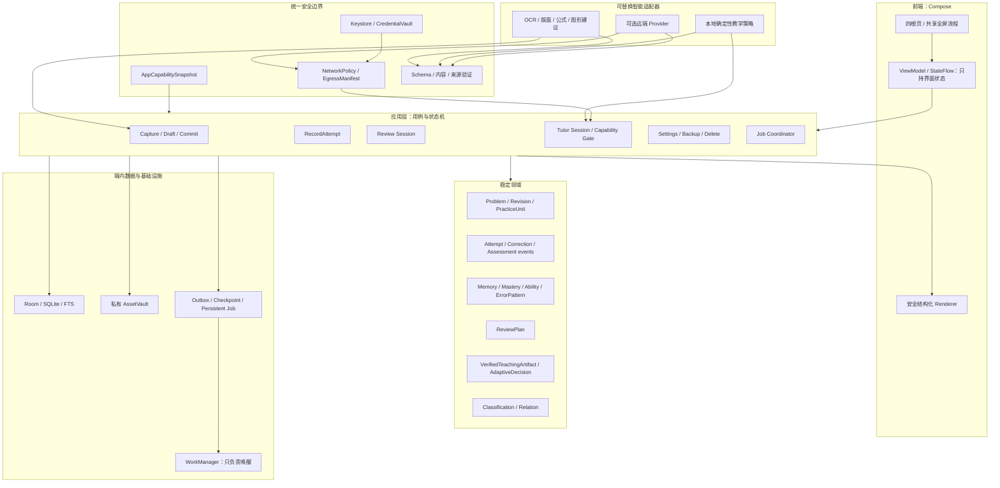
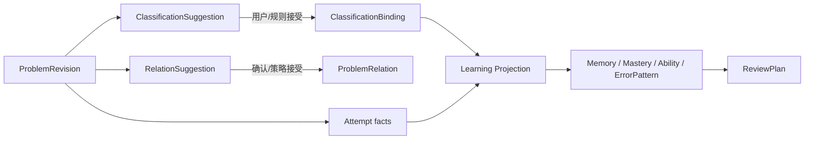

# 智能错题本 M1“真实情况穷举”产品与系统合同

版本：1.1（冻结执行合同；实现状态由场景注册表追踪）  
日期：2026-07-22  
适用范围：面向中国高中生、Android、单一学习者；“纯本地优先”仅保留为历史 M1 验收背景  
性质：执行合同与历史里程碑验收决策表；本文不再决定当前产品的智能能力优先级

> **产品方向覆盖说明（2026-07-20）：** 当前本地/模型职责以 [`model-first-product-boundaries.md`](model-first-product-boundaries.md) 为权威，学生界面、真实情境与功能完整性以 [`student-experience-spec.md`](student-experience-spec.md) 为权威。本文继续用于判断已有 M1–M4 实现是否真实、可恢复、可验证，但其中“离线完成核心智能闭环”的优先级已被 D-001 覆盖。

> **2026-07-22 冻结覆盖：** 本文保留历史里程碑证据，但不得重新引入已被当前产品合同否决的行为。底栏固定为 `复习 / 讲题 / 错题本 / 我的`；模型负责语义理解、讲题和当前题内按需 GUI spec，本地负责可信持久化、规则、Schema/allowlist 校验、渲染、调度和密钥；不重点建设离线智能。OCR/转写候选足以继续时直接使用且始终可修订，只有缺失使当前任务无法继续才打断；不得让学生逐字校对或手录来替识别系统兜底，也不得展示内部流水线状态。没有用户明确要求，不生成新题、同类题、变式题或校准题，也不用额外题探测能力；能力边界只来自用户给出的题及其历史可信行为。错题本可见归类只保留 `科目 → 板块 → 知识点`，掌握程度独立，错因/来源/题型不可见。无数据显示“暂无学习记录”或隐藏。不做手写演算板。记忆跨会话、绑定精确题目修订并记录尝试/提示/答案暴露/卡住步骤/学习变化；模型省略字段或关系不表示删除，只有显式本地命令可删，向模型只发送当前任务真正相关的最小记忆。答案暴露必须绑定精确模型任务和答案表面，只有该答案表面的底部真实进入视口才落事实。真实复习只读取保存时的原始转写和修订，不用模型生成替代题面；生产包不注入 seed/fixture，所有 `ACTIVE` 真实错题都可进入排程。每个逻辑外部操作跨请求合计最多 3 次真实 dispatch；本地执行不计数。恢复外部动作必须持有当前进程内有效租约，或让学生明确点击一次“继续”后签发新租约；不得自动复用持久授权，也不得重复首次启动。模型不能直接写掌握度。后文若描述历史测试夹具，只能解释为测试隔离数据，不能成为生产内容或当前体验。

治理入口：[`scenario-registry.md`](scenario-registry.md)。本文表内保留的 `CAP-*`、`TRU-*`、`TUT-*`、`REV-*`、`AI-*`、`SEC-*` 是局部短 ID；跨文档引用时 canonical ID 一律加 `M1-`，例如 `TUT-12A` 写作 `M1-TUT-12A`。蓝图中的同名短 ID 属于 `BP-*`，不得视为本合同别名。

## 0. 证据、状态和使用方法

本合同以以下材料为高权重事实，并把其中的研究结论压缩为可实施、可拒绝、可验收的决策：

1. `纯本地安卓高中智能错题本智能体深度研究报告.docx`；
2. `面向高中生的 Android 智能错题本项目计划.docx`；
3. `docs/system-blueprint.md`；
4. 当前仓库的 pre-M1（旧 Phase 0）实现、`docs/history/design-qa.md` 和本轮数据/领域审计。

“穷举真实情况”不等于为每一种组合写一套页面。输入来源、题面结构、作答痕迹、能力证据、设备资源、联网状态、生命周期和隐私状态的笛卡尔积近乎无限。本合同采用三层覆盖：

- 先列出每个正交维度的稳定状态与唯一行为；
- 再列出会造成数据丢失、错误评分、答案泄露或隐私出网的高风险组合；
- 最后用持久状态机、唯一写入者和降级契约覆盖未逐条列出的同类组合。

### 0.1 状态标签

| 标签 | 准确定义 | 可以对用户声称什么 |
|---|---|---|
| **已实现（pre-M1，旧 Phase 0）** | 当前仓库已有、且旧 Phase 0 构建/测试/模拟器或视觉 QA 已通过 | 只能声称“隔离测试 fixture 驱动的可交互原型”，不能变成生产 seed |
| **本里程碑（M1）** | 当前必须完成并通过本合同门禁的真实数据闭环 | 门禁通过前不能声称已实现 |
| **后续里程碑（M2–M4）** | 契约现在冻结，能力按后续门禁交付 | 页面占位不能算能力交付 |
| **研究阶段（R）** | 需要独立数据集、模型、评测或平台基础设施 | 不写进 MVP 宣传，不把单个演示当通用能力 |
| **不建设（NO）** | 与核心价值链不符或成本/风险不成立 | 不预留“顺手加一下”的入口 |

任何接口、表、Mock、截图、固定样例、静态计数或成功动画都不是业务能力完成的证据。只有真实数据经唯一写入命令落库、可恢复、可回放并通过相应门禁，才算实现。

### 0.2 当前真实状态

| 能力 | 当前判断 | 严格边界 |
|---|---|---|
| D 盘 Android 工程、双 flavor、构建环境 | **已实现（pre-M1）** | `strictOffline`/`localFirst` 是工程能力；不能由此推导真实数据安全已全部完成 |
| 四底栏、根页导航、视觉方向 1、可点击讲题样例 | **已实现（pre-M1）** | 自动化测试可使用隔离 fixture；生产运行时不得注入或展示 fixture，也不得据此宣称可讲任意高中题 |
| 结构化选择题交互、能力门和证据规则 | **部分完成（M1 未过门禁）** | curated 可信材料与共享 Room Repository 已在 Android 16 上完成双 flavor `5/5` 根体验复验；只证明受控材料链，不代表可评测任意内容 |
| 相机/照片选择器入口 | **部分完成（M2 单题采集切片）** | 私有临时缓存、CanonicalSourceAsset、结构化转写候选、非阻塞修订、原子入库和精确重放已存在；任何校对都必须是可选修订，不能变成逐字确认关卡 |
| 错题数、错题列表、今日计划、学习数据 | **部分完成（真实生产入库切片）** | 正式 `CommitProblemDraft` 让学生保存的题进入真实错题列表与计数；生产计划只读取 `ACTIVE` 真实题和正式 Attempt，测试 seed/fixture 必须隔离且不得参与生产排程 |
| Room 权威数据源、Attempt/outbox、投影、排程联动 | **部分完成（M1 未过门禁）** | 当前 schema、迁移和最新验证数字统一以 [`scenario-registry.md`](scenario-registry.md) 为准；DAO/事务、共享 Repository、逻辑外部操作预算和精确答案曝光已有受控切片，但物理设备强杀、真实 Provider 质量与全持久点故障注入仍未完成，不能声称 M1 已交付 |
| 印刷中英文 OCR 候选 | **部分完成（M2 单图切片）** | bundled ML Kit 中文模型可在无模型下载时生成带区域/版本/置信度的候选；只覆盖单图基础文本，不把候选当题目真值 |
| 全科手写分离、公式识别、通用图形重建 | **M2 起步 / R 完整能力** | 尚未实现；本合同继续禁止将基础印刷 OCR 外推为这些能力 |
| 受控远端 Provider/BYOK | **已实现受控纵切面（M3 未过门禁）** | OpenAI-compatible 多模态适配器、凭证保险库、逐次出站授权和四类强类型任务已接通；尚未用用户真实 Provider 做线上兼容性与质量验收，也不得成为已有数据查看/恢复的前置条件 |
| 跨设备同步、老师/家长后台 | **研究阶段 R 或 NO** | 与 M1–M4 独立，不得借 Provider 接入顺带宣称完成 |

## 1. 产品裁决：真正要构建的是什么

核心结果只有一个：

> 把一次错误变成可随时修订、可检索、可讲解、可重做、可调度、可验证掌握、可删除和可迁移的本地学习资产。

产品不是“拍照搜答案”，也不是“聊天机器人套壳”。学习效果来自三条相互约束的链：

1. **题目真相链**：来源资产 → 可随时修订的结构化候选 → 用户明确保存 → 不可变题目修订 → 错题条目；
2. **学习事实链**：明确提交 → Attempt 追加事实 → 题目记忆/知识掌握/错因投影 → 复习计划；
3. **教学证据链**：可信答案与解法 → 能力门 → 分层提示/当前题内按需互动 → 可评分或仅会话级互动。

三条链不得互相偷写：OCR 不能直接改题库，模型不能直接改掌握度，聊天中的一次点选也不能自动冒充正式作答。

### 1.1 不可破坏的不变量

1. 原始来源和用户修订不可被 OCR/模型静默覆盖。
2. 临时讲题不等于存入错题本；只有显式提交才获得稳定题目身份。
3. 打开题目、看解析、导入图片、点击打卡都不是有效作答。
4. 所有学习事实只由统一 `RecordAttempt` 路径追加，重复提交必须幂等。
5. 题目记忆、知识掌握、题型熟练、学科能力和错因状态分别投影。
6. 提示后正确、答案揭示后重做、独立正确、猜中和用户自评分开记录。
7. 分类建议、正式分类、题目关系和学习投影是四类不同数据。
8. 每次评分引用不可变题目/答案快照；答案未知或冲突时不得自动评分。
9. 复习长期计划和考前冲刺临时队列不得互相覆盖。
10. 异步任务可定位、可恢复、可重试、可部分成功，迟到结果不得覆盖新编辑。
11. 无网或未配 API 时，已保存题库、基于原始转写的复习和学习事实仍可用；新的图片理解、自动分类和语义讲题保持待继续，不用本地模板伪装模型能力。
12. 未成年人默认最小采集、最小出网、可导出、可删除；`strictOffline` 由 APK 无 INTERNET 权限硬保证。
13. 模型只读取当前题和当前动作所需的最小相关记忆；未被本轮模型输出提及的本地事实、归类或关系保持不变，删除必须由显式本地命令完成。
14. 生产复习只呈现错题保存时的 `ProblemRevision` 原始转写及其明确修订；不得临时生成替代题面、替代答案或测试题填充队列。

## 2. 四底栏信息架构与用户习惯合同

底栏固定为 **复习 / 讲题 / 错题本 / 我的**。这是四个稳定意图，不按技术模块命名。

| 栏目 | 用户脑中的问题 | 根页唯一主动作 | 必须读取 | 允许写入 | 明确不负责 |
|---|---|---|---|---|---|
| 复习 | 今天该练什么，为什么？ | 开始或继续复习 | 同一检查点的 ReviewPlan、题目摘要、学习投影 | 开始会话；提交时调用统一 AttemptService | 录题表单、API 配置、手动打卡 |
| 讲题 | 这题卡在哪里，下一步怎么想？ | 拍题讲解或继续上次 | 题目快照、可信教学材料、学习者快照、会话事件 | TutorSession/Interaction；符合资格时转交 AttemptService | 自动入错题本、模型直接改掌握度 |
| 错题本 | 我保存了什么，怎样找和整理？ | 录入错题 | 正式题目、修订、科目/板块/知识点、独立掌握投影 | Draft/Commit、修订、归类、回收站 | 自动开始讲题、错因/来源/题型可见分类、把模型建议当事实 |
| 我的 | 我学得怎样，系统怎样控制？ | 查看可行动的学习档案 | Attempt 派生画像、能力快照、存储和隐私摘要 | 目标、偏好、网络策略、凭证引用、备份/删除命令 | 直接编辑作答事实或内部概率 |

### 2.1 为什么“我的”比“设置”更合适

当前产品假设（`ASSUMED`）是高中生会在“我的”中同时寻找个人进展和设置，但页面必须防止变成杂物箱：

1. 上半屏先显示本周学习、薄弱点、变化和下一步行动；
2. 下半屏再分为智能能力、数据与隐私、提醒与偏好、存储与备份；
3. 数据不足时显示“暂无学习记录”或隐藏对应模块，不生成虚假趋势，也不显示“证据不足”“完全未知”；
4. `strictOffline` 隐藏无法生效的远程 API 表单；未成年人不展示越权能力。

### 2.2 拍照不是第五个栏目

拍照是共享输入能力，入口必须携带意图：

- `讲题 → 拍题讲解`：建立临时题面和讲题会话，默认不入库；
- `错题本 → 录入错题`：候选足以保存时直接正式建档，随时可修订；只有无法保存当前题时请求最小补充，入库后不自动讲题；
- 系统分享图片/PDF：只询问一次“讲解这题 / 存入错题本”；
- 复习中的“需要讲解”复用当前题目，不重新拍照或 OCR。

不建设含义模糊的全局相机 FAB。

### 2.3 高频最短路径

| 习惯假设 | 最短路径 | 便利性硬规则 | 证据等级 |
|---|---|---|---|
| 每天打开 App | 冷启动 → 复习 → 开始 | 1 次操作进入第一题；有中断任务优先“继续上次” | `ASSUMED` |
| 晚自习临时求助 | 讲题 → 拍题讲解 → 快门 | 不先填分类；候选可用就继续，只有无法继续才请求最小补充 | `ASSUMED` |
| 课后收录一题 | 错题本 → 录入错题 → 快门 | 先落盘再处理；不强制 OCR 校对，只有无法继续才打断 | `ASSUMED` |
| 月考后批量整理 | 错题本 → 批量导入 | 每页独立保存、允许部分失败和周末再校对 | `ASSUMED` |
| 从已有题求助 | 题目详情 → 讲这题 | 不重复识别；返回后保持来源页面状态 | `ASSUMED` |
| 复习中卡住 | 当前题 → 需要讲解 → 返回 | 计时暂停；答案草稿、提示层级、揭示状态不丢 | `ASSUMED` |
| 考前冲刺 | 复习 → 冲刺 → 时间预算 | 临时队列，不破坏长期间隔 | `ASSUMED` |
| 单手 2–5 分钟 | 复习 → 短时模式 | 主动作在下半屏；可随时结束且已提交事实保留 | `ASSUMED` |

`ASSUMED`、`OBSERVED`、`VALIDATED` 的升级证据与降级规则见 [`scenario-registry.md`](scenario-registry.md#6-用户习惯证据治理)。模拟器可点击或设计 QA 不会把习惯假设升级为已观察或已验证。

### 2.4 页面状态不是新模块

以下都属于现有栏目或共享全屏流程，不增加底栏：需要补充、搜索、日历、打卡、统计、聊天历史、导出、重复处理、备份恢复、模型设置。底栏切换各自保留返回栈、滚动位置和筛选状态；采集、修订、复习会话、题目详情、导出和备份恢复按 workflow ID 恢复。内部可以有 OCR/模型任务状态，但不能把流水线名展示给学生。

## 3. 前端、端内后端、AI、数据和安全依赖合同

本项目首版的“后端”主要在设备内，不等于先建云服务器。



### 3.1 依赖方向硬规则

- `feature:* → core:domain + core:model + core:ui`；feature 之间不互相依赖。
- `core:data → core:domain + core:model + core:database`。
- `core:database` 不把 Room entity 暴露给 UI。
- Compose、Room、CameraX、WorkManager、模型 SDK 和 API Client 都是插件，核心领域不得依赖它们。
- UI 不得直接拿 DAO；跨模块只允许明确命令、稳定查询和已提交事件。
- WorkManager 不是真相源；Room 中的 Job、租约、检查点和幂等键才是。
- 网络请求只能经过统一 Gateway；连接测试只发送合成数据。

### 3.2 唯一写入者

| 数据 | 唯一写入者 | 禁止的捷径 |
|---|---|---|
| SourceAsset / CanonicalSourceAsset | CaptureImportService / AssetVault | OCR 覆盖原图；UI 直接删文件 |
| ProblemDraft | DraftService | 模型直接创建正式题 |
| Problem / Revision | ProblemCatalog / `CommitProblemDraft` | 讲题页、校对页各写一套题库 |
| ErrorBookEntry | ErrorBookService | “讲完即自动入库” |
| ClassificationBinding | ClassificationService | 把建议置信度当正式标签 |
| ProblemRelation | RelationService | 题目修订后仍静默沿用旧关系 |
| Attempt / Correction | AttemptService | UI、Tutor、ReviewPlanner 直接改掌握度 |
| Memory / Mastery / Ability / ErrorPattern | LearningProjectionEngine | 模型评分直接写画像 |
| ReviewPlan / Queue | ReviewPlanner | 打卡页或通知直接改计划 |
| TutorSession / AssessmentEvent | TutorSessionService | 只存在内存；相信 UI 的 `answerRevealed=false` |
| API/NetworkPolicy | SettingsService / CredentialVault | Key 存明文 SharedPreferences、日志或备份 |

概念写入者到当前仓库接口、函数和 Room 事务的逐项映射见 [`scenario-registry.md`](scenario-registry.md#4-概念唯一写入者到当前实现)。该映射会明确区分 fixture 写入、已接线垂直切片和尚不存在的生产命令。

### 3.3 逻辑实际运行在哪里

| 运行位置 | 必须放置的逻辑 | 原因 |
|---|---|---|
| Android 端内、始终存在 | Room 真相源、AssetVault、Attempt 事务、投影、ReviewPlanner、能力门、Job 状态、安全 Renderer、删除、本地设置与密钥 | 可信事实和确定性行为不受 Provider 生命周期控制 |
| Android 端内、工程兜底 | 安全解码、尺寸/字节限制、EXIF 清理及已有过渡 OCR | 本地只判断文件能否安全打开，不裁决模糊、遮挡、题块或语义质量，也不扩成第二套离线智能 |
| 模型 Provider、仅显式授权后 | 画质/完整性语义判断、多模态结构化转写、科目/板块/知识点建议、讲题和当前题内 GUI spec | 只返回建议或声明式展示块，不拥有题库、学习事实、调度或密钥 |
| 首版不需要云后端 | 登录、账号、同步、班级、支付、消息推送服务器 | 都不是“录入—复习—掌握”的前置依赖 |

即使后续接入远端，服务端也只能接收任务级最小快照；它不能拥有完整数据库、API Key、文件系统访问、作答写权限或 Mastery 写权限。远端返回经过 schema、来源和内容验证后，只能成为建议、教学候选或已提交 Turn。

## 4. 功能取舍、系统规模和数据成本

复杂度：S 为薄页面/薄适配器，M 为明确状态机或事务，L 为跨流程且需迁移和系统测试，XL 为独立研究或平台系统。

### 4.1 当前必须做、Beta 前必须做、研究与拒绝

| 模块 | 决策 | 规模 | 真正依赖 | 数据/评测成本 | 失败时产品是否还能用 |
|---|---|---:|---|---|---|
| 四栏导航与设计系统 | **已实现（pre-M1），持续维护** | M | 路由、恢复 ID、无障碍 | 真实设备与视觉 QA | 能，但用户路径会混乱 |
| Problem/Revision/PracticeUnit | **M1 必须** | L | Room、不可变修订、来源引用 | 迁移与一致性样本 | 不能；这是题目真相层 |
| Attempt Ledger + outbox/checkpoint | **M1 必须** | L | 幂等事务、追加事实 | 崩溃注入、重放金标 | 不能；无它不能声称个性化 |
| 题目记忆/知识掌握/错因投影 | **M1 必须，规则基线** | L | Attempt、知识点绑定、版本 | 假时钟、重放、校准日志 | 题库能用，个性化停用 |
| ReviewPlanner/Session | **M1 必须** | L | 同一投影检查点、时间预算 | 队列金标、时区测试 | 回退最近成功计划 |
| DB 驱动四根页 | **M1 必须** | M/L | Repository Flow、统一快照 | 空库/样例/真实状态 | 不能保留假 128 题 |
| 真实用户题与测试 fixture 隔离 | **M1 必须** | S/M | 生产空库、测试专用装配、Draft/Commit | 生产启动与升级回归 | 生产无 seed；测试 fixture 永不进入真实列表、统计或排程 |
| 单图拍摄、模型画质判断与结构化转写 | **M2 必须** | L | CameraX/Picker、AssetVault、Model Gateway、持久任务 | 模糊/遮挡/身份字段样本 | 保留原图和待继续任务；不要求学生逐字手录 |
| 本地 OCR 工程兜底 | **非重点 / 可移除** | M/L | 已有适配器、安全恢复 | 只验证不破坏来源 | 不承担语义质量裁决，不形成面向学生的离线智能模式 |
| FTS、科目/板块/知识点归类与独立掌握程度 | **M2 必须** | L | 正式绑定、taxonomy 版本、学习投影 | 搜索/层级回归集 | 回退基础列表；错因/来源/题型不做可见分面 |
| 基础去重、修订和变式确认 | **M2 必须** | L | 指纹、关系、可撤销映射 | 重复/变式成对样本 | 不自动合并，交给用户 |
| VerifiedTeachingArtifact 目录 | **M1 小范围必须，M3 扩充** | L | 答案来源、验证结果、版本 | 人工金标题库 | 无可信材料只整理/澄清 |
| 动态 GUI 与安全 Renderer | **M1 补齐安全基线，M3 接真实内容** | L | 白名单 AST、公式限制、事件 | schema/fuzz/无障碍测试 | schema 错误回退纯文本 |
| 当前题内 TutorGuiSpec 策略 | **M1 规则基线，M3 接真实内容** | L | 当前题、历史可信行为、allowlist Renderer | 当前题交互与恢复集 | 无合适控件时只讲解，不生成额外题 |
| 可选远端讲题 Provider/BYOK | **M3 可选** | L | Capability、Gateway、Keystore | 合成连接、数学/教学/安全集 | 本地题库和复习不受影响 |
| PDF/多图批量、跨页候选 | **M3/M4** | XL | 持久 Job、页级状态、容量预检 | 多版式整卷数据集 | 单页失败不回滚其他页 |
| PDF/Markdown/系统打印 | **M4 应做** | L | 固定 selection、Renderer、分页 | 公式/分页/字体金标 | 失败项报告，其余继续 |
| 加密便携备份/恢复 | **M4 Beta 门槛** | L | generation、manifest、哈希、迁移 | 篡改/错密/旧版样本 | 校验失败不切 active generation |
| 通知 | **M2/M3 可做** | M | 本地计划、用户主动授权 | 时区/勿扰/拒权 | App 内计划完全可用 |
| 通用照片手写 HWR | **研究阶段 R** | XL | 行/块分割、手写域模型 | 大量自采标注与设备评测 | 保留原图和待继续任务，不把手录设为默认退路 |
| 公式图片到 LaTeX | **研究阶段 R** | XL | 公式检测、MER、语法验证 | 各学科公式裁图金标 | 以公式裁图显示 |
| 通用几何/电路/力学/化学图重建 | **研究阶段 R，分学科立项** | XL | 多种解析器、scene graph | 每类独立标注和拓扑评测 | 保留原图裁块，不伪造图 |
| 本地大模型运行时与模型商店 | **研究阶段 R** | XL | 设备分级、下载、校验、温控 | 多设备性能/安全矩阵 | 研究能力失败不影响当前 BYOK 外部 Provider 主线 |
| 跨设备同步/账号 | **研究阶段 R** | XL | 身份、E2EE、冲突、资产和删除传播 | 多设备故障矩阵 | 手动加密备份换机 |
| 老师/家长后台、多学生档案 | **独立产品，不进 MVP** | XL | 多角色授权、监护、混合画像 | 合规与权限体系 | 学生主动导出报告 |
| 社区、排行榜、学习币、课程商城、广告 | **不建设（NO）** | XL | 与核心闭环无正向依赖 | 未成年人和内容治理成本 | 完全不需要 |

### 4.2 哪些看似轻，实际很重

- **“拍照识别一下”是 XL 文档理解系统**：模糊质检、多题切分、跨页、阅读顺序、手写覆盖、公式和图形分别需要数据与回退。
- **“像机器人一样聊”是 L/XL 教学系统**：需要可信答案、误区、提示层级、事件顺序、评测资格和回归集，聊天框只是表面。
- **“自动分类”是 L 数据治理系统**：建议、正式绑定、taxonomy 版本、用户覆盖和修订失效必须并存。
- **“换机同步”是 XL 一致性系统**：不是上传一个数据库文件；要处理身份、修订冲突、资产、事件合并和删除传播。
- **“识别图形”不是一个模型开关**：几何、函数、电路、受力、实验装置和化学结构是不同问题。

### 4.3 真正轻量且值得先做的能力

- 相册选择、原图可靠落盘和明确的失败恢复文案；手动输入只作为学生主动寻找的可选入口；
- 测试 fixture 只存在于测试装配；生产首次打开为空库并引导录入第一道真实错题；
- 规则版遗忘曲线、加权证据和时间预算队列；
- 科目/板块/知识点与独立掌握程度的确定性筛选；
- LocalityBadge、能力不可用页、EgressPreview；
- 已缓存内容查看与当前题白名单交互的确定性渲染；
- 题图或公式无法结构化时保留可信裁图。

## 5. 真实情况决策矩阵

阶段列表示“最迟在哪个里程碑必须通过”，不是当前已实现状态。所有场景的契约现在就冻结，避免后续数据库或 UI 把异常当补丁。

### 5.1 采集、错页、质量和版面

| ID | 真实情况 | 必须行为与持久状态 | 禁止行为 | 阶段 |
|---|---|---|---|---|
| CAP-01 | 首次打开、空库 | 不登录、不先要权限；只给“录入第一道真实错题”，显示真实空状态 | 注入 seed/fixture、展示示例题数或虚假趋势 | M1 |
| CAP-02 | 清晰单题 | 先写 CaptureRecoveryBuffer；确认裁切后生成不可变 CanonicalSourceAsset | 识别完成前只存在内存 | M2 |
| CAP-03 | 拍糊、抖动、文字像素不足 | 模型指出真正阻塞区域并给重拍/补拍动作；原图和待继续任务保留 | 用本地阈值作语义裁决，或要求学生逐字手录 | M2 |
| CAP-04 | 反光、阴影、歪斜 | 提供局部提示、自动增强候选、原图对照 | 增强图覆盖原图 | M2 |
| CAP-05 | 截断题干/选项/图形 | 标记缺块，禁止自动评分和讲解；要求补拍/合并 | 模型补造缺失条件 | M2 |
| CAP-06 | 拍错页、答案页、空白页或非题目 | 识别为“疑似非题目”，允许返回或仅存来源草稿 | 强行创建 Problem 和复习项 | M2 |
| CAP-07 | 一图多题 | 模型只给出完整题目区域；本地有界裁切并一次性生成独立草稿；原图保留，失败可重试，不要求学生框选或确认 | 每个 OCR 块自动成题 | M2 |
| CAP-08 | 一题跨页 | SourceBundle 保留页序和坐标；低置信关联必须确认；最终稳定 Problem 可引用多页 | 把第二页误当独立题 | M3 |
| CAP-09 | 共用材料、多小问 | SharedStimulus + ProblemPart 树；PracticeUnit 可只指向错的小问 | 一题任一小问错就给整题全扣分 | M2/M3 |
| CAP-10 | 双栏、表格、题图混排 | 保存模型给出的 reading order 建议、块类型与区域证据；学生可按需修订 | 把 OCR 平铺文本当唯一真相，或强制重排确认 | M3 |
| CAP-11 | 学生手写覆盖打印题面 | 模型尽量分离原始题面、学生作答层和教师批注层；失败时保留混合裁图并请求最小补拍 | 把手写答案拼进题干，或要求学生完整转录 | M2 基础 / R 精细 |
| CAP-12 | 红叉、批语、分数、印章 | 作为 AttemptOverlay/TeacherAnnotation 候选，不自动当标准答案或错因 | “×”识别成数学乘号后静默入题 | M2/R |
| CAP-13 | 公式识别失败 | Formula block 保留原始裁图、区域证据和待继续模型任务；能结合原图继续就不中断，确实阻塞时只请求最小补拍/澄清 | 生成看似正确的 LaTeX，或要求学生完整手录公式 | M2 基础 / R 自动 |
| CAP-14 | 几何/函数/物理/化学图复杂 | 保留 Figure 裁图；只有通过专用验证才生成 scene graph | 用通用 LLM 文本“重画”并当事实 | M2 回退 / R 解析 |
| CAP-15 | 照片含姓名、学校、人脸、二维码 | 本地提示裁切/涂抹，剥离 EXIF；远端前展示实际 payload | 自动打开二维码或默认上传整页 | M2/M3 |
| CAP-16 | 相机权限拒绝 | 立即给 Photo Picker 和去设置；手动输入只在学生主动寻找时提供，不循环弹权限 | 阻断整个 App，或把手录提升为默认主动作 | M2 |
| CAP-17 | 相机过程中来电、锁屏、进程死亡 | 已拍页独立落盘，按 workflow ID 恢复；未提交页明确状态 | 返回后整批归零 | M2 |
| CAP-18 | 低电、发热、低内存 | 优先保存来源，重处理排队或换轻模型 | 为追求 OCR 卡死/丢图 | M2 |
| CAP-19 | 低存储 | 拍前预检；先清可重建缓存、旧导出、过期临时题 | 自动删正式原图、题目或 Attempt | M2 |
| CAP-20 | 相册/PDF 外部 URI 权限即将失效 | 复制进私有临时区并校验哈希后才释放 URI | 长期依赖外部 URI | M2/M3 |

### 5.2 OCR、答案、题目真相、分类和重复

| ID | 真实情况 | 必须行为与持久状态 | 禁止行为 | 阶段 |
|---|---|---|---|---|
| TRU-01 | OCR 候选足以继续 | 保存来源、模型/版本、坐标和置信度并直接继续；始终可编辑 | 强迫用户先完成校对 | M2 |
| TRU-02 | 数字、符号、单位、上下标有风险 | 原图联动提示但不阻塞；只有缺失导致无法继续才请求最小补充 | 按低置信度自动制造校对关卡 | M2 |
| TRU-03 | 用户已编辑，迟到 OCR 结果返回 | 旧结果标 STALE，仅做可对比建议 | 覆盖用户修改 | M2 |
| TRU-04 | 答案未知 | 可以保存题目；能力门关闭自动评分/掌握更新 | 为了讲题让模型猜答案 | M1 |
| TRU-05 | 用户自行输入答案但无证据 | 标 `USER_ASSERTED`，只支持讨论或明确自评 | 自动升级为 VERIFIED | M1 |
| TRU-06 | 教师答案/来源答案 | 保存来源快照；若用户主动修订，只确认修订内容与来源一致；必要时确定性校验，不设置必经确认页 | 只凭一次点击宣称答案一定正确，或强迫逐字确认 | M1/M2 |
| TRU-07 | 两个答案来源冲突 | 阻断客观评分，显示冲突和修订提案，保留两份来源 | 选择模型置信度高的一份静默覆盖 | M1/M2 |
| TRU-08 | 单选题实际多解/多项成立 | 转为澄清、多选或主观讨论；该题 BLOCKED | 强迫提交单选并扣掌握度 | M1/M3 |
| TRU-09 | 精确重复题 | 提供“新一次错误/附加来源/新修订/独立保存”；幂等保存 | 自动新建多个 Problem | M2 |
| TRU-10 | 只改数字、条件或问法 | 建立 VARIANT_OF 建议，用户确认后成正式关系 | 因文本相似直接合并 | M2/M3 |
| TRU-11 | 同一题再次做错 | 新增 Attempt/Error occurrence，复用题目身份 | 复制题目来表示新错误 | M1/M2 |
| TRU-12 | 题目来源后来纠正 | 新建不可变 ProblemRevision；旧 Attempt 继续引用旧修订 | 原地改题导致历史评分失真 | M1/M2 |
| TRU-13 | 模型给归类建议 | 输出只允许 subject、section、knowledgePoints 及证据/taxonomy/model 版本，写 ClassificationSuggestion | 输出错因/来源/题型作为可见分类，或直接改正式分类/掌握状态 | M2 |
| TRU-14 | 用户接受/拒绝/修改分类 | 写正式 Binding 与 reviewStatus，保留建议历史 | 模型重跑后重写用户选择 | M2 |
| TRU-15 | 题目多知识点/跨学科 | 多绑定、主次权重；错时仅对有证据的知识点产生负证据 | 强塞单文件夹或“一错全扣” | M1/M2 |
| TRU-16 | 分类体系/教材版本升级 | 旧绑定带版本保留，新映射作为新建议 | 静默改写历史标签 | M3/M4 |
| TRU-17 | 题目修订影响关系 | 关系保存 basisRevisionIds；旧建议转 STALE | 继续用过期重复/先修关系排程 | M2/M3 |

### 5.3 讲题、当前题内互动、作答和答案揭示

| ID | 真实情况 | 必须行为与证据 | 禁止行为 | 阶段 |
|---|---|---|---|---|
| TUT-01 | 从已有错题讲解 | 复用当前 ProblemRevision/PracticeUnit，不重复 OCR | 建一份临时重复题 | M1/M3 |
| TUT-02 | 新拍题只想讲解 | 建 EphemeralTutorProblem；只有显式保存才 CommitProblemDraft | 讲完自动入库 | M2/M3 |
| TUT-03 | 有可信答案但没有完整解法 | 能力门可允许核对答案，未必允许分步讲解或评测 | UI 统一显示“可完整讲解” | M1 |
| TUT-04 | 无 VerifiedTeachingArtifact | 只整理/澄清/让用户补来源；明确“暂不能可靠讲解/评测” | 模型自信就开放评分 | M1 |
| TUT-05 | 可信历史显示相关基础已稳定 | 跳过基础，只处理用户给出的当前题并记录所用历史引用 | 另生成迁移题、边界题或反例题探测 | M1/M3 |
| TUT-06 | 掌握高但历史陈旧 | 仍只处理当前题；从当前表达调整讲法，不另出校准题 | 从零重教或偷偷复核能力 | M1/M3 |
| TUT-07 | 当前题行为与历史掌握冲突 | 追加冲突事实并保守投影；继续解释当前题 | 自动生成非同构题区分原因，或一题错就把掌握度打低 | M1/M3 |
| TUT-08 | 没有历史 | UI 显示“暂无学习记录”或隐藏画像；只依据当前题和用户表达继续 | 默认零基础、显示“完全未知”或另出诊断题 | M1/M3 |
| TUT-09 | 低掌握且证据充分 | 给 worked example 或逐步淡出，避免连续幼稚盘问 | 机械重复同一句 | M3 |
| TUT-10 | 单选/多选只“选中”未提交 | 只存本地选择草稿；可修改；首次提交才形成 firstResponse | 选中即评分 | M1 |
| TUT-11 | 提交前看概念提示/下一步/关键步骤 | 追加 HINT_REVEALED，按实际层级降权 | UI 只传一个可伪造布尔值 | M1 |
| TUT-12 | 提交前揭示答案 | 先渲染精确答案表面；只有该表面的底部真实进入视口，才按精确模型任务 ID、表面种类和响应序号追加 ANSWER_REVEALED，正向独立证据权重为 0 | 以“模型说含答案”、按钮点击或同回合其他回复的可见性代替真实曝光 | M1 |
| TUT-12A | 直接揭示答案后退出、切题或进程死亡，始终没有提交选择 | 若精确答案表面底部已进入视口，则幂等保存曝光事实和不占 responseOrdinal 的终态；若尚未真正可见则不记曝光。只更新题目记忆并安排短期复习，不给知识掌握正证据 | 预渲染写曝光、把同一回合另一条回复当作曝光，或伪造作答占用首次响应序号 | M1 |
| TUT-13 | 曝光事实写入失败 | 已显示内容保持可读，但不得把本轮标记为已曝光；在同一精确表面再次真实可见时幂等补记 | 预先写曝光来换取渲染许可，或凭回合级布尔值补写 | M1 |
| TUT-14 | 答案内容已提交、渲染前崩溃 | 恢复已提交内容，但保持“未曝光”；只有恢复后精确答案表面底部真实进入视口才记曝光 | 因内容已落库就保守认定学生看过答案 | M1 |
| TUT-15 | Reveal 与提交并发 | 数据库 eventSequence 决定顺序，事务重算 AssessmentSubmissionContext | 相信点击时间或 UI 缓存 | M1 |
| TUT-16 | 提示后答对 | 记录 assisted correct，题目记忆可改善但知识掌握降权 | 等同独立正确 | M1 |
| TUT-17 | 猜中/信心低 | 记录 ConfidenceReport/guessRisk，降低证据 | 只看正确结果 | M1/M3 |
| TUT-18 | 第一次错、立即第二次点对 | 保留 firstResponse；同题即时重试正证据封顶 | 覆盖第一次错误 | M1 |
| TUT-19 | 多知识点整题错但无法定位 | 只记录当前题中已观察到的卡住步骤，不把歧义扩写为所有知识点负证据 | 另出题区分假设，或对全部 KC 记满额负证据 | M1/M3 |
| TUT-20 | 证明、推导、作图、建模题 | 当前先使用已实现的步骤流/对照/证据链或纯讲解；目标形态可在扩展 allowlist 后加入步骤排序、短答或图上点选。纸笔过程只允许拍照补充 | 把规划中的交互写成当前能力、硬塞选择题或建设手写演算板 | M3 |
| TUT-21 | 当前题不适合点选 | `guiSpec` 缺省，转澄清或讲解 | 用弱智选项凑数，或另生成一道题 | M3 |
| TUT-22 | 连续答错 | 缩小步骤、换表示/方法、检查先修；动态动作最多 3 个 | 写死“检查一下”或反复同问 | M3 |
| TUT-23 | 用户明确“换种方法” | 策略引擎确认有可信替代路径再展示 | 模型编造伪方法 | M3 |
| TUT-24 | 用户时间紧并明确要完整答案 | 记录直接请求；展示可信完整解法和证据来源；答案揭示后不记独立掌握 | 永远拒绝或暗中记高分 | M3 |
| TUT-25 | 模型输出 schema 错、数学/单位校验失败 | 不提交 Turn；回退可信模板、澄清或错误恢复页 | 展示半验证流式内容 | M3 |
| TUT-26 | 讲题中决定入库 | 走统一 CommitProblemDraft 幂等路径；会话只保存关联 ID | Tutor DAO 直接写题库 | M2/M3 |
| TUT-27 | 用户明确要求生成额外练习 | 生成内容保持 SESSION_ONLY，与真实题库、能力边界和掌握投影隔离；能力仍只从用户自己提供的题及其可信行为更新 | 用模型生成题做隐性校准，或因学生在生成题上的表现改能力/掌握度 | M3 |

### 5.4 复习、推送、打卡和时间

| ID | 真实情况 | 必须行为与状态 | 禁止行为 | 阶段 |
|---|---|---|---|---|
| REV-01 | 今日有到期题 | 按时间预算、风险、薄弱点、考试目标和成本生成队列 | 固定塞题数 | M1 |
| REV-02 | 今天无到期题 | 显示已完成/暂无到期；允许薄弱点加练但清楚标注额外 | 制造红点焦虑 | M1 |
| REV-03 | 多日未学、积压很多 | 截断成可完成小队列，解释剩余量 | 一次推完全部、断签羞辱 | M1 |
| REV-04 | 同源/同题族挤在一起 | sibling/来源去重与分散，避免提示效应 | 连续刷高度重复题制造虚假流畅 | M1 |
| REV-05 | 只有 2–5 分钟 | 依据题目预计成本选短队列，结束时保留事实 | 因没做完计划判失败 | M1 |
| REV-06 | 长计算/纸上作答 | 支持暂停计时、用户自评、可选拍结果；证据类型明确 | 强迫在手机输入全部过程 | M2/M3 |
| REV-07 | 复习做错并进入讲题 | 当前 ReviewSession/题/答案草稿保持；返回继续 | 讲题返回后另起一题 | M1/M3 |
| REV-08 | 作答已落库，投影/排程失败 | 显示“学习记录已保存，计划整理中”；outbox 重放 | 回滚 Attempt 或展示半新半旧数据 | M1 |
| REV-09 | 调度算法升级 | Attempt 不变；新 projector/planner 版本重算并可比较负担 | 改写历史事件 | M1/M4 |
| REV-10 | 考前冲刺 | 生成 SprintPlan 临时视图；长期 ReviewPlan 保留 | 冲刺覆盖稳定度/下次日期 | M2/M3 |
| REV-11 | 通知拒绝、勿扰、系统杀后台 | App 内计划照常；提醒只是深链入口 | 把通知成功当复习成功 | M2 |
| REV-12 | 完成打卡 | 至少一个符合政策的有效 Attempt 才成立 | 单独按钮空打卡 | M1 |
| REV-13 | 时区改变、跨午夜 | 事实用 UTC；打卡/计划使用明确 local study date 和 timezone snapshot | 只按系统当前日期重复生成 | M1 |
| REV-14 | 用户把系统时间回拨/快进 | 单调序列和事实时间检测异常；不重复打卡/发奖；计划按校准策略重算 | 让回拨制造新 Attempt 或重复 streak | M1/M4 |
| REV-15 | 切计算器、来电、锁屏 | 暂停有效用时；恢复同一题 | 把后台时间算作作答时长 | M1 |
| REV-16 | 误记“会/不会” | 短时撤销追加 AttemptCorrection，再重放投影 | 删除原 Attempt | M1 |
| REV-17 | 生产生成今日队列 | 所有 `ACTIVE` 真实错题进入可排程全集，再由本地规则选择今日子集；题面直接使用保存时的 `ProblemRevision` 原始转写和明确修订 | 注入 seed/fixture、把 ACTIVE 真题排除在全集外，或让模型生成替代题面/替代答案 | M1 |
| REV-18 | 保存后的题面仍不完美 | 复习照常呈现已保存原始转写并允许从题目详情修订；新修订生成新不可变版本 | 让学生在每次复习前替 OCR 重录，或由模型静默改写旧版本 | M2 |

### 5.5 模型、网络、离线和供应商

| ID | 真实情况 | 必须行为 | 禁止行为 | 阶段 |
|---|---|---|---|---|
| AI-01 | 完全离线 | 已保存题库、搜索、基于原始转写的真实复习、作答和投影可用；新的识题、分类和语义讲题保持待继续 | “无网=应用不可用”，或用本地模板伪装智能讲题 | M1 |
| AI-02 | 本地模型未安装/设备不兼容 | 不提供面向学生的本地智能模式；保留任务并引导配置/恢复 BYOK Provider | 提示下载本地大模型、空转、崩溃或假装本机推理 | M3/R |
| AI-03 | API 未配置 | 保留题目和请求，跳转配置后按 requestId 返回 | 清空草稿或要求重拍 | M3 |
| AI-04 | Key 错误/过期 | 只标 Provider 不可用；要求重输；Key 不进日志 | 把鉴权错误写成“题目无法识别” | M3 |
| AI-05 | 超时、弱网、限流 | 持久同一逻辑外部操作；跨 request envelope 合计最多 3 次真实 Provider dispatch，达到上限后保持可恢复失败；本地执行不消耗该预算 | 自动无限重试、通过新 requestId 规避预算或重复扣费 | M3 |
| AI-06 | 流式响应中断 | 只提交通过验证的完整 Turn；半段仅临时显示并可丢弃 | 恢复后把半句当完成答案 | M3 |
| AI-07 | Provider 返回非 schema/恶意 Markdown | 校验失败，纯文本安全回退；不执行 HTML/JS/远程资源 | 原样渲染模型 HTML | M3 |
| AI-08 | Provider 地区、保留、训练政策未知 | 禁止发送真实题面；连接测试仅合成数据 | 默认同意或隐藏去向 | M3/M4 |
| AI-09 | 用户配置局域网模型 | 视为网络端点，仍需 localFirst、主机白名单和发送预览 | 冒充 strictOffline 端上模型 | M3 |
| AI-10 | 模型建议与用户编辑冲突 | 以版本/fingerprint 标 STALE，作为新建议展示 | 迟到结果覆盖用户内容 | M2/M3 |
| AI-11 | 模型包下载中断/哈希不符 | 断点续传；隔离暂存；验证后原子切换；保留可回滚版本 | 执行未验证模型/脚本/pickle | R/M4 基础 |
| AI-12 | 模型说“我很确定” | 只作为低权重元数据；不能生成 VerifiedTeachingArtifact | 置信度替代独立验证 | M1/M3 |
| AI-13 | 应用重建后存在待发送讲题动作 | 恢复精确动作并显示“继续讲题/继续对话”；只有学生明确点击一次继续后签发新的当前进程内租约并发送 | 自动复用持久授权、显示假加载、或要求重复配置 Provider | M3 |
| AI-14 | 新拍题已在当前进程明确批准并自动启动 | 只启动一次；后续重组、导航返回和观察者重订阅复用同一逻辑任务 | 同时显示/触发第二个“开始”，或创建重复初始请求 | M3 |
| AI-15 | 续聊或恢复时授权仍在数据库 | 数据库只保存披露证据和待执行动作；真正出网还必须持有当前进程内有效租约，租约过期、配置/策略变化或进程重建都回到一次明确继续 | 把持久 manifest 当作可跨进程直接出网的许可 | M3 |

### 5.6 未成年人、共享设备、换机、删除和恢复

| ID | 真实情况 | 必须行为 | 禁止行为 | 阶段 |
|---|---|---|---|---|
| SEC-01 | 年龄未知 | 按最严格未成年人默认：本地、最小采集、远端关闭 | 为了增长默认成人能力 | M2/M4 |
| SEC-02 | 不满 14 岁 | V1 远端能力硬禁用；不收真实身份做人脸年龄验证 | 显示任意 Base URL/API 上传 | M4 |
| SEC-03 | 14–17 岁 | 默认本地；若未来远端开放，必须是审查 Provider、明确同意和任务级发送预览 | 普通设置开放任意服务商 | M4 |
| SEC-04 | 18 岁以上高级模式 | 仍经 Gateway、Keystore、EgressManifest；高风险能力显式开启 | 把成人模式变成绕过安全验证 | M3/M4 |
| SEC-05 | 家长帮忙拍卷 | 只产生 Asset/Draft，不产生学生 Attempt/打卡 | 用拍摄行为更新掌握度 | M2 |
| SEC-06 | 家庭多人共用设备 | MVP 明示“一位学习者”，提供重置/备份后切换；阻止混用画像 | 把不同学生事件写入同一 profile | M1/M4 |
| SEC-07 | 学生换机且有备份 | 解密到 staging generation，迁移、哈希/引用校验后原子切换 | 在活动库上边恢复边覆盖 | M4 |
| SEC-08 | 换机但从未备份 | 明确数据无法恢复；引导今后创建本地加密备份 | 暗示 strictOffline 有云端副本 | M4 |
| SEC-09 | 备份密码错、文件截断、篡改、空间不足 | 校验失败不切 active generation；旧数据保持可用；给可重试报告 | 半恢复后启动新库 | M4 |
| SEC-10 | App 升级/数据库迁移 | 旧版本样本迁移；失败时停止写入、保留原数据和诊断 | destructive migration 静默清库 | M1 起、M4 完整 |
| SEC-11 | 删除一题 | 区分归档、回收站、删题及学习记录；按选项重建投影 | 一个“删除”按钮混合语义 | M2/M4 |
| SEC-12 | 只删讲题历史 | 保留题目与 Attempt；长期 Attempt 所需最小脱敏快照按政策保留 | 删除后让历史评分失去依据 | M3/M4 |
| SEC-13 | 重算画像 | 删除可重建投影，从 Attempt 重放；不删原事实 | 伪装成“清空学习历史” | M1 |
| SEC-14 | 删除全部应用数据 | 停任务、清 DB/资产/缓存/日志/凭证/模型配置，重启后核对空库 | 保留带原 ID/题面/画像的影子审计 | M4 |
| SEC-15 | 用户曾导出/分享到 App 外 | 明确 App 无法删除外部文件，提供文件清单提示 | 宣称“一键彻底删除所有副本” | M4 |
| SEC-16 | strictOffline 使用外部相机 App | 清楚说明所选相机有自身隐私策略；真实安全验收优先 CameraX 进程内采集 | 把本 APK 无网保证延伸到别的 App | M2/M4 |

## 6. 题目记忆、能力记忆、关系、分类和掌握必须分离

### 6.1 五类“记忆”回答不同问题

| 状态 | 回答的问题 | 主键范围 | 输入事实 | 典型输出 | 绝不能混入 |
|---|---|---|---|---|---|
| ProblemMemoryState | 这道 PracticeUnit 现在可能忘了吗？ | profile × practiceUnit | 可评分 Attempt、提示层级、间隔 | stability、retrievability、nextDue | 章节标签、模型分类 |
| KnowledgeMasteryState | 这个知识点真正会吗？ | profile × knowledgeNode | 多题族的加权独立证据 | pKnow、证据量、状态、置信区间 | 单题熟悉感 |
| QuestionTypeSkillState | 这类表示/套路熟练吗？ | profile × itemFamily/type | 多种题目上的策略表现 | 熟练度、速度、提示依赖 | 具体题的到期时间 |
| SubjectAbilityState | 新题冷启动时大致水平如何？ | profile × subject | 大量跨知识点事实 | ability theta/区间 | “高二”等静态标签 |
| ErrorPatternState | 哪种错误反复出现？ | profile × misconception/errorPattern | 首错步骤、干扰项、人工错因 | 频率、近期性、关联题 | 知识点掌握概率 |

### 6.2 分类、关系与投影不是同一概念



- “函数单调性”可以是可见知识点；“选择题”“审题遗漏”最多是内部题面/教学候选，不得成为错题本可见分类；
- “3 天后复习”“稳定掌握 0.82”是投影，不是标签；
- “变式”“同源”“先修”是有方向/依据的关系，不是文件夹；
- 模型可以建议前三者，不能直接决定学习投影。

### 6.3 学习事实最小链

```text
AssessmentItem/AnswerSpec 快照
→ PRESENTED / HINT_REVEALED / ANSWER_REVEALED / RESPONSE_SUBMITTED
→ AssessmentSubmissionContext（按 eventSequence 重算）
→ AttemptSubmission + AttemptEvent + projection outbox（同一事务）
→ LearningProjectionEngine（幂等消费、更新 checkpoint）
→ 一致的 LearnerSnapshot
→ ReviewPlanner 与 CurrentProblemTutorPolicy 读取同一 checkpoint
```

错题是否保存和作答是否形成长期证据也是两项独立选择。未保存题只有在内容已验证、用户选择 LONG_TERM 且保存最小脱敏评测快照时，才可形成 Attempt；否则只记录会话互动。

### 6.4 跨会话记忆合并与披露

- 本地事实账本是唯一权威，按精确 `profileId + sessionId + problemId/draftId + revision + modelTaskRequestId + surfaceKind + responseOrdinal` 追溯；模型摘要只能追加候选，不能覆盖事实。
- 模型输出采用 merge 语义：只更新本轮明确返回且通过策略的候选。字段、知识点或关系被省略不等于删除；删除、清空和解除绑定必须来自显式本地命令并留下事件。
- 组装模型请求时，从当前题精确修订出发，只发送与当前教学目标直接相关的尝试、提示、答案曝光和卡住步骤；没有显式关联就发送空集合，禁止发送完整学习账本、其他题目或仅因科目相同而扩张的画像。
- 题面新修订隔离旧教学记忆；旧事实可回放但不会静默进入新修订。恢复时复用已提交的精确回合，不另建本地逻辑回复或重复初始启动。

## 7. M1–M4 里程碑门禁和失败降级

里程碑只有两种结果：**通过后可对用户声称相应能力**，或 **未通过继续保持上一个稳定能力范围**。不得用“基本完成”绕过数据正确性、安全或恢复门禁。

阶段映射固定为：Phase 0 = pre-M1，Phase 1 = M1；旧 Phase 2 已拆为 M2 采集/目录和 M3 Provider/自适应/批处理；旧 Phase 3 进入独立研究阶段 R；旧 Phase 4 拆为 M3 受控 Provider、M4 导出/备份/韧性和 R 账号/同步/平台。完整对照见 [`scenario-registry.md`](scenario-registry.md#3-phase-04-与-m1m4-映射)。

### M1：真实的本地学习账本与复习闭环（当前里程碑）

范围：先证明“真实数据会长期改变下一次学习”，不承诺真实 OCR。

必须交付：

- Room 权威数据源与可测试 DAO/事务；当前 Room 3 垂直切片为**部分完成**，仍须通过本节全部退出门禁；若后续兼容性验证阻塞，允许明确回退 Room 2.8.4；
- Problem、Revision、PracticeUnit、ErrorBookEntry、KnowledgeNode/Binding、基础 Relation；
- AssessmentItem/Event、AttemptSubmission/Event/Correction、outbox/checkpoint；
- ProblemMemory、KnowledgeMastery、ErrorPattern/必要能力状态和版本化 ReviewPlan；
- `RecordAttempt` 幂等事务、投影重放、基于时间预算的可解释规划；
- Paragraph、Formula、ChoiceGroup、Figure 的白名单结构化 Renderer；恶意/未知内容必须安全降级；
- 复习、讲题、错题本、我的读取同一 Repository/数据库快照；删除静态 128/129、固定到期量和伪趋势；
- 生产数据库启动和升级后不注入 seed/fixture；测试 fixture 只能由测试装配创建并与生产列表、统计、复习排程完全隔离；
- 生产复习把全部 `ACTIVE` 真实错题作为可排程全集，再由本地策略生成今日子集；呈现其保存时的原始转写/明确修订，不生成替代题；
- 揭示答案、提示后正确、独立正确、错误、立即重试和多知识点歧义的证据策略。

退出门禁：

1. 飞行模式下完成“用户已保存的真实题原始转写 → 作答 → Attempt → 投影 → 新计划 → 我的学习数据”成功率 100%；生产首次启动题目数为 0，测试 fixture 泄漏数为 0；
2. 重复 `submissionId` 不产生重复 Attempt；Attempt 与 outbox 原子一致；
3. 在 Attempt 提交后、投影前/中/后注入崩溃，重放不重复计分；
4. UI 不出现半新画像和半旧计划；所有学习视图引用同一 projectionCheckpoint；
5. 未验证内容、SESSION_ONLY、答案先揭示后的正确产生正向独立掌握更新次数为 0；
6. 相同 Attempt 金标在重放后得到相同 Memory/Mastery/Plan；
7. 假时钟覆盖跨日、时区切换和时间回拨；
8. 单元测试、数据库测试、双 flavor 构建与 lint 通过。

失败降级：

- Room 3/KSP 阻塞：回退 Room 2.8.4，领域/Repository 契约不变；
- 投影失败：保留 Attempt 和 outbox，显示“学习记录已保存，计划整理中”；
- 计划失败：读取最近一次成功计划并标注生成时间，不临时拼接假计划；
- 可信答案不足：只开放整理、查看和会话级讨论，不评分；
- M1 未过：继续把产品称为 pre-M1 原型，不能声称真实个性化或真实错题库。

### M2：可靠单题采集、结构化转写和可检索错题本

必须交付：

- CameraX/Photo Picker；手动输入只作学生主动选择的可选入口；CaptureRecoveryBuffer、CanonicalSourceAsset、EXIF 剥离和引用完整性；
- 模型负责单题边界、可读性/遮挡/完整性语义判断和结构化转写；本地负责安全接收、区域预览、持久任务和可选修订；
- 现有本地 OCR 只作可移除工程兜底；复杂块保留裁图，任何置信度都不得自动制造逐字校对关卡；
- `CommitProblemDraft` 唯一事务；来源、修订、正式错题条目立即可见；
- FTS、科目→板块→知识点层级，以及独立掌握程度视图；错因/来源/题型不做可见分面；
- ClassificationSuggestion/Binding 分离；精确重复、修订、变式和新一次错误的用户选择；
- 低存储、权限拒绝、进程死亡、模型失败的恢复路径。

退出门禁：

1. 清晰单题从拍摄到正式保存平均不高于 25 秒，非阻塞候选不打断，只有任务无法继续才请求最小补充；
2. 模糊、错页、多题、截断、手写覆盖、公式/图形未知都由模型给出区域化最小补拍或待继续状态，不把完整手录设为默认回退，也不产生伪结构化事实；
3. 每个持久检查点强杀进程，已拍来源、裁切、可选修订和提交状态恢复率 100%；
4. 迟到 OCR/分类结果不会覆盖用户编辑；题目正式保存不被智能整理失败阻塞；
5. 重复保存幂等；新错误不会复制 Problem；变式不会被误合并；
6. 8–12 名高中生分层测试，核心任务首击归属正确率不低于 90%；
7. `strictOffline` 真实采集验收使用本进程 CameraX 或明确排除外部相机隐私边界。

失败降级：

- 相机拒权 → Photo Picker；手动输入只在学生主动寻找时提供；
- 模型转写/公式/图形失败 → 保留原始裁图和待继续任务；能保存就先保存，确实无法继续时只请求最小补拍或澄清；
- 自动切题不可靠 → 保留原图和原草稿并允许重新整理；跨页关联不可靠 → 保持逐页待处理，不让学生承担框选、合并和重排；
- 低存储 → 停重处理、先清可重建缓存，永不自动删除正式来源；
- 某智能作业失败 → 题目显示“已保存，智能整理待完成”。

### M3：受证据约束的自适应讲题与批量任务 Beta

必须交付：

- VerifiedTeachingArtifact 目录、来源/版本/覆盖范围和 TutorCapabilityGate；
- 持久 TutorAssessmentItem/Event、答案揭示顺序、动态白名单动作和安全结构化 Renderer；
- 当前题内 `TutorGuiSpec` 读取历史可信行为，跳过已掌握内容并允许控件缺省；
- 在新增对应本地 schema、确定性 renderer 和回归测试后，交付无可信干扰项时的短答、步骤排序、图上点选；纸上作答只作为拍照补充回退；
- TutorGenerationRequest 的幂等、取消、超时、流式验证和恢复；同一逻辑外部操作最多 3 次真实 Provider dispatch；
- 仅在 AppCapabilitySnapshot 允许时开放 Provider/BYOK；所有请求经 Gateway/EgressManifest；
- PDF/多图批量的页级任务、部分成功、暂停/恢复；
- 科目/板块/知识点归类和可解释“为什么这样讲当前题”。

退出门禁：

1. 未验证内容产生 Attempt/Mastery 更新次数为 0；答案揭示后的同题正确记为独立掌握次数为 0；
2. 稳定掌握基础的无意义重复率目标不高于 5%，并分别评估同构保持与非同构迁移；
3. 多正确选项、无真实干扰项、OCR/答案冲突在展示前被阻断；
4. 流式进程死亡后只恢复已提交 Turn，不展示半段“完成答案”；待发送动作必须经一次明确“继续”获得新进程内租约，初始自动启动不得重复；
5. API 未配、鉴权失败、超时、限流和 schema 错误均可回到原任务，题库与复习不受影响；
6. “为什么这样讲当前题”用户理解率不低于 80%；未经用户请求生成额外题和能力探测次数为 0；
7. 概率校准按学科/年级分组报告；未有真实数据前不声称达到通用个性化。

失败降级：

- 无 VerifiedTeachingArtifact → 只整理/澄清/补答案来源；
- Provider 不可用 → 已缓存内容或持久待继续请求；不以本地模板伪装语义讲题；
- 无合适当前题控件 → `guiSpec` 缺省，直接讲解；不生成替代题；
- selector 画像不一致 → 拒绝混合快照，重新读取统一 checkpoint；
- 批量某页失败 → 其余页继续，失败页单独重试。

### M4：公开 Beta 的可迁移、安全、可导出和设备韧性

必须交付：

- 加密便携备份、manifest、哈希、旧版本迁移、staging generation 和原子切换；
- PDF/Markdown/系统打印共用结构化内容模型与失败项报告；
- 回收站、永久删除、删除作答、重算画像、删除全部的不同语义；
- strictOffline 发布检查、localFirst 网络策略、Keystore、日志/分享/FileProvider/截屏边界；
- 未成年人能力矩阵、年龄未知默认、家庭共用设备提示；
- 低内存、低电、发热、低存储、横屏、分屏、200% 字体、读屏和单手测试；
- 至少 30 名分层 Beta 用户的数据正确性、录入摩擦、计划负担和教学策略报告。

退出门禁：

1. 备份错密、截断、篡改、空间不足、旧 schema 均不破坏活动数据；恢复后实体数、引用和资产哈希一致；
2. strictOffline release APK 无 INTERNET，抓包零出站；localFirst 未授权时零出站；
3. API Key 不出现在 logcat、备份、分享、通知、诊断包、剪贴板预览或模型输入；
4. 删除全部后重启为空库，且不虚假声称已删除用户导出到 App 外的文件；
5. 导出固定题目修订与答案策略；单题失败不使整批无结果；
6. 数据迁移无 destructive fallback；应用升级失败可保留原数据并恢复；
7. 所有 P0/P1/P2 视觉、无障碍和安全问题清零后才发布。

失败降级：

- 恢复校验失败 → 不切 active generation，旧数据继续可用；
- localFirst 合规/网关未过 → 只发布 strictOffline；
- 全库加密兼容性未验证 → 不空口宣称“数据库全加密”，保持私有存储、设备锁、字段/文件加密和威胁模型诚实说明；
- 复杂导出块不可重建 → 使用对应可信裁图并列入报告；
- M4 未过 → 只能内部测试，不公开称 Beta/正式版。

### 研究阶段 R：不与 M1–M4 捆绑承诺

以下每项单独立项、单独数据集、单独金标和退出门槛：

- 通用中文照片手写识别及手写/印刷/教师批注精细分层；
- 通用数学公式识别、复杂跨页文档理解；
- 几何、函数、电路、受力、实验装置、化学结构的专用图形解析；
- 全学科/多教材知识体系和长期参数校准；
- 本地大模型设备分级、模型包分发与温控；
- 跨设备端到端加密同步、账号、多人档案；
- 老师端或家长端。

单次成功截图、几道样例或模型自报准确率不能使研究能力升级为“已实现”。

## 8. 高风险组合测试清单

单一场景通过仍不足以交付。以下组合至少做成自动化或可重复人工验收：

自动/人工证据和当前未完成项见 [`scenario-registry.md`](scenario-registry.md#5-m1-高风险合同验证追踪)。

| canonical ID | 组合 | 故障注入 | 必须证明 |
|---|---|---|---|
| `M1-HR-01` | 模糊多题页 × 低存储 × 进程死亡 | OCR 处理中强杀 | 原图/已确认裁切不丢；未确认候选不冒充正式题 |
| `M1-HR-02` | 跨页题 × 第二页失败 × 用户先编辑第一页 | 迟到识别结果 | 第一页编辑不被覆盖；跨页关系仍待确认 |
| `M1-HR-03` | 手写覆盖 × 公式低置信 × 无可信答案 | 强制进入讲题 | 只澄清/整理，不生成答案或 Mastery |
| `M1-HR-04` | 精确重复 × 连续点击保存 × 网络重试 | 重复 idempotency key | 只产生一个 Problem，按用户选择新增来源或错误事实 |
| `M1-HR-05` | 精确答案表面滚动 × 提交并发 × UI 崩溃 | 分别让答案底部进入/未进入视口并交换提交顺序 | 只有精确答案表面底部真实可见才记曝光；未可见的已提交内容不记，同回合其他表面不能串写；曝光后独立权重为 0 |
| `M1-HR-06` | Attempt 已提交 × projector 崩溃 × planner 启动 | 在各事务边界杀进程 | 事实仅一次；计划最终引用完整新 checkpoint |
| `M1-HR-07` | 高掌握 × 非同构突然错 × 立即重试正确 | 模拟 slip/guess | 进入 CONFLICTED/验证，不剧烈升降整章掌握 |
| `M1-HR-08` | API 超时 × Key 失效 × 用户返回设置 | 中断进程 | 原题、输入和 requestId 保留；不重复发送真实题图 |
| `M1-HR-09` | PDF 批量 × 某页损坏 × 低电 | Worker 被系统回收 | 成功页保留，失败页可重试，重处理延后 |
| `M1-HR-10` | 时区切换 × 系统时间回拨 × 通知重复 | 连续改变时间 | 不重复计划/打卡/Attempt，事实顺序可解释 |
| `M1-HR-11` | 未满 14 岁 × localFirst 包 × 自定义 Base URL | 尝试越权配置 | UI、用例和网关三层均拒绝真实出网 |
| `M1-HR-12` | 恢复旧备份 × Worker 迟到提交 × 删除全部 | generation 切换期间运行旧任务 | 旧 generation 无法写入新库；删除后无影子关联数据 |
| `M1-HR-13` | 200% 字体 × 横屏 × 单手复习 | 展开长公式和选项 | 主动作、答案策略和退出始终可达 |

## 9. 实施时的每日决策检查表

每加一个页面、表、模型或 API，先回答：

1. 它服务哪个稳定用户意图，属于哪个根栈？
2. 它读取的真相源和 projectionCheckpoint 是什么？
3. 谁是唯一写入者，重复点击如何幂等？
4. 用户编辑和异步结果冲突时谁胜出？
5. 无网、无模型、低存储、进程死亡时保留了什么？
6. 答案/题面是否已验证，当前动作能否评分或更新掌握度？
7. 是否把题目记忆、知识掌握、分类或关系混成了一个字段？
8. 是否会把未成年人数据、题图、Key 或完整学习画像送出设备？
9. 这项能力是 S/M/L 还是实际上需要独立 XL 数据系统？
10. 对应 M1–M4 哪条门禁会证明它真实可用？若没有门禁，就不应声称完成。

## 10. 最终裁决

当前优先级不是继续增加静态页面，也不是先接一个“更聪明”的大模型，而是让四个根页共享同一条真实学习事实链：

```text
用户保存的真实题及其原始转写/明确修订
→ 明确提交作答
→ 不可变 Attempt
→ 可重放的题目记忆与知识掌握投影
→ 同一检查点的复习计划、当前题内教学策略和“我的”学习数据
```

M1 过门禁后，产品才第一次具备“记住一道题、记住用户在自己题目中的真实行为、知道题与知识的关系，并据此改变下一次学习”的核心。拍题画质/完整性判断、复杂手写、公式和图形理解走模型主链并按 M2–M4 逐步验收；在相应门禁通过前，系统必须保留原图和待继续任务，允许学生随时主动修订，阻断错误评分，但不能把逐字校对或手录变成默认工作。
