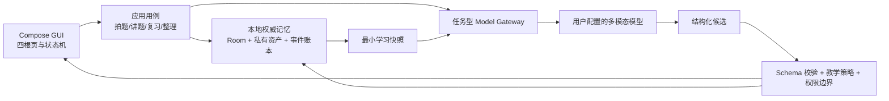

# 智能错题本：模型优先的产品与系统边界

状态：已冻结的产品架构决策（Decision D-001）  
日期：2026-07-22  
优先级：高于旧文档中的“纯本地优先 / 离线智能”设想；实现状态仍以 `scenario-registry.md` 为准。

> **2026-07-22 冻结合同：** 后文任何历史方案、实现切片或里程碑表述与本段冲突时，以本段为准。底栏固定为 `复习 / 讲题 / 错题本 / 我的`。模型负责画质/完整性语义判断、多模态结构化转写、科目/板块/知识点建议、讲题和当前题内 GUI spec；本地负责安全接收、可信持久化、确定性规则、Schema/allowlist 校验、渲染、调度和密钥。产品不重点建设离线智能，不强迫 OCR 校对或手录，不展示内部流水线状态，不做手写演算板。没有用户明确要求时，绝不生成新题、同类题、变式题或校准题，也不得用额外题探测能力；能力边界只来自用户给出的题与历史可信行为。错题本的可见归类只采用 `科目 → 板块 → 知识点`，掌握程度作为独立视图；错因、来源和题型不作为可见分类。无数据时只显示“暂无学习记录”或隐藏对应模块。学习记忆跨会话并绑定精确题目修订；模型省略字段或关系不表示删除，只有显式本地命令可删，请求只携带当前任务真正相关的最小记忆。答案暴露绑定精确模型任务/答案表面，只有该表面底部真实进入视口才记事实。真实复习读取保存时的原始转写/明确修订，生产不注入 seed/fixture，所有 `ACTIVE` 真实错题均属于可排程集合。当前不自建云端，采用 BYOK 由受控 Android 客户端直连用户选择的 Provider；每个逻辑外部操作跨请求最多 3 次真实 dispatch，本地执行不计数。首次讲题与续聊必须匹配当前 Provider、配置/提示词策略和披露范围；真正出网还须持有当前进程内有效租约，应用重建或租约失效后只能由学生明确点击一次“继续”签发新租约，且不得重复初始自动启动。模型不能直接写掌握度。

> **2026-07-23 原子记忆补充：** 题目只是能力证据的载体。归类模型必须把用户提供题目的真实解题步骤拆成原子知识/技能；掌握投影按原子节点在单科内跨题共享、跨科隔离。可见错题目录仍保持 `科目 → 板块 → 知识点`。本地知识库只保存知识本体，不保存题库；模型知识不足时提出受控检索请求，经来源审校后才能补充本体，不能直接编造或写掌握度。同一学科、父级与规范化查询形成稳定缺口指纹，允许跨题聚合研究，但每道题的触发事实仍独立留痕。该队列静默运行，不要求学生替系统判断资料权威性。

> **2026-09-06 结构化场景渲染隔离（D-001 增补）：** 2D/3D 结构化场景渲染（`visualScene` / `TutorVisualSceneRenderer`，含 `TutorGuiSpec` 的声明式场景 step_flow/comparison/evidence_chain/process_timeline/concept_map/formula_derivation/spatial_diagram）**从当前产品隔离，暂停开发**。该功能需长久打磨、当前仅锦上添花、起不到关键作用，故从用户可见 UI 中移除：模型不再产出、`TUTOR_VISUAL_GENERATE`/`TUTOR_VISUAL_REVIEW` 生成任务不再触发、scene 不再渲染。**代码、模型字段、渲染器、视觉任务与测试全部保留，改动 `feature/tutor/TutorVisualIsolation.STRUCTURED_SCENE_ISOLATED`（当前 true）即可整体恢复。** 边界：本隔离仅针对**结构化场景渲染**；**`attachedImages`（模型生成的位图）是另一功能**，与本隔离无关、不受影响。后续任务不得在未明确本边界的情况下擅自重新投入结构化场景渲染的开发。

> **2026-09-09 全局模型同意（D-001 增补，取代逐次确认）：** 产品决定（已定，不再复议）：**配置模型 = 全局同意**。学生在“我的 → 模型智能体”打开全局同意后，**智能体自主回合**（`ModelTaskInput.isAgentConsentEligible`，当前为 `CaptureAssessmentInput` / `CaptureParseInput` / `ImagePipelineClassifyInput` / `TutorPlanInput` / `TutorRespondInput` / `TutorVisualGenerateInput` / `TutorVisualReviewInput`）**不再逐次索要发送确认与 manifest**：`ModelEgressPolicy` 在同意开启、Provider 为外部且支持该任务类型时直接签发 `ModelExecutionPermit.ProviderConsented`；带图回合额外要求当前 Provider 接受图像输入，字节级门禁由受限资产源在打开每个资产时复核同意与 canonical 记录。**同意关闭、未配置模型或 Provider 不可用时一律失败关闭（不发送）**，`feature:tutor` 的统一闸门为 `tutorAgentChatEnabled(provider, consentEnabled, kind)`。**未列入智能体回合的请求**（`TutorLobbyInput`、`TutorDebriefInput`、`ProblemOrganizationInput`、`REVIEW_RERANK`、`LEARNING_SUMMARIZE` 等）**保持原有 manifest 门禁不变**：仍须显式授权、仍受披露范围与指纹校验约束。本增补取代上文针对“全局同意回合”的逐次知情意图与逐次授权表述；上文 `2026-09-06 结构化场景渲染隔离` 增补继续有效，`TUTOR_VISUAL_GENERATE`/`TUTOR_VISUAL_REVIEW` 不因本同意而重新触发。实现、行为矩阵与逐条测试影响见 `docs/design/tutor-agent-consent-design.md`。

> **2026-09-09 派遣预算同步（D-001 增补）：** 同一逻辑外部操作的派遣预算以实现常量为准：`ModelTaskRemoteDispatchPolicy.MAX_DISPATCHES = 6`（5 轮工具查询 + 1 轮终答），由 `a4109e1`（2026-09-06，用户授权"按自由度放开工具环"）从 3 提高到 6。上文与 `docs/m1-exhaustive-product-contract.md`、`docs/product-information-architecture.md` 中仍写"最多 3 次"的表述属历史文本，以本增补为准；其余预算语义（按不可变强类型输入合并、本地执行不计数、达上限保持可恢复失败、不得换 requestId 重置）不变。

## 1. 最终裁决

产品定位改为：

> **背靠多模态大模型的高中学习智能体，端侧负责优秀交互、可信记忆和可追溯执行。**

不建设“没有模型也能独立思考”的第二套产品。离线不是主要卖点，也不为了离线重复实现大模型已经擅长的语义能力。

四条边界：

1. 需要理解、判断、生成和因材施教的任务交给大模型。
2. 需要确定性、事务性、隐私性和低延迟交互的任务留在 Android 端。
3. 大模型只能提出结构化候选；本地策略、Schema、用户明确保存/修订和数据库事务决定候选能否生效，正常态无需学生逐项操作。
4. 无网络或未配置模型时，只允许查看已有数据、手工整理和恢复待处理任务；不伪装成仍能完成新题识别、讲解或智能分类。

## 2. 模块责任矩阵

| 模块 | Android 本地 | 大模型 | 最终裁决 |
|---|---|---|---|
| 拍照、相册、权限、私有原图 | 文件解码、尺寸/字节安全上限、方向修正、EXIF 清理、哈希、恢复 | 无 | **本地** |
| 图片是否适合识题 | 只检查“能否安全打开”，不做模糊/曝光语义裁决 | 判断题目是否完整、可读、被遮挡、反光是否影响关键内容，并指出区域 | **模型** |
| 裁切与题块理解 | 展示模型框、允许用户随时调整 | 给出题目边界、题干/选项/公式/图形/手写区域和阅读顺序 | **模型提议 + 本地可修订预览** |
| OCR、公式、图形、手写/印刷切分 | 现有 bundled OCR 暂作工程兜底，不继续扩成端侧文档理解系统；候选可随时修订 | 多模态结构化转写和区域证据 | **模型主路径；只有无法继续才打断用户** |
| 科目、板块、知识点 | 保存用户修订和历史版本；可见目录仍按固定层级展示；内部维护学科隔离的原子知识节点 | 提出可见归类，并把当前题每个真实解题步骤拆成原子知识/技能候选 | **模型提议 + 本地知识库约束与可信修订** |
| 原子知识库与受控检索 | 保存课标/教材/获授权教辅归纳出的本体、别名、边界、版本和来源状态；只提供当前学科的有界片段；把未命中请求按稳定缺口指纹静默排队，保留每题来源并拒绝未审校结果进入正式本体 | 优先复用已有节点；无法可靠细化时只返回检索请求，不得编造节点 | **本地权威知识本体；模型负责语义映射，联网只补目录缺口；学生不承担资料审核** |
| 既有题关系 | 哈希、稳定 ID 和已确认关系查询 | 仅在用户明确请求整理关系时，对已有题提出语义候选 | **按请求启用；不得生成题目或探测能力** |
| 讲题与当前题 GUI | 校验 allowlist 声明式场景、重建本地 ID、确定性渲染并记录交互；当前支持 `step_flow`、`comparison`、`evidence_chain`、`process_timeline`、`concept_map`、`formula_derivation`、`spatial_diagram`。其中图形讲解只接受九个固定位置、有限节点/连线/箭头和受限的基础电路元件，本地计算坐标与样式并拒绝穿点、交叉、越界、断开的元件连接及电路/普通图形状混用 | 理解当前题、生成讲解，并仅在实质降低本题理解负担时给出一个可选 GUI spec；不得返回任意坐标、样式、图片地址或可执行动作 | **模型生成 spec + 本地约束与渲染** |
| 是否在当前题内询问 | 提供可追溯的历史可信行为和硬性禁问条件 | 只根据当前题、用户当前表达和可信历史决定是否需要一个当前题内交互 | **混合；不得另出题测能力** |
| 作答事实、提示依赖、答案揭示 | 首次提交的选项 ID、当时显示文字和提交时间不可变保存；纠正只追加。讲题答案按精确 `modelTaskRequestId + surfaceKind + responseOrdinal` 标识，只有该答案表面底部真实进入视口才记录 | 可评价回答并声明回复是否含答案，但不能伪造学生已看见或直接记为掌握 | **本地权威** |
| 掌握度、题目记忆、能力、复习计划 | 知识掌握只从合格作答事实投影；能力以原子知识点为单位、在单科内跨题共享且跨科隔离；题目记忆还可接收提示依赖和精确答案表面底部真实进入视口后的曝光，随后本地排程、去重并执行安全边界 | 只读取当前题步骤实际关联的原子节点快照；已稳定掌握的基础节点不得重复盘问 | **本地权威投影与调度** |

首个 `moe-2020-foundation-v1` 本体包覆盖语文、数学、英语、思想政治、历史、地理、物理、化学、生物学九科的代表性主题，共 9 个板块、19 个来源落地原子能力和 9 份已核验资料。每个节点保存父级知识点、能力类型、别名、明确边界、课程标准页码、学科 PDF SHA-256 和审校时间；安装事务可重复执行且不覆盖冲突数据。“我的 → 知识库与来源”只读页直接从 Room 的节点与来源绑定聚合这些真实数量，并与待补齐缺口分区显示；不得把数量换算成虚假的课程完整度百分比。它是验证全链路的可信基线，不声称已经覆盖全部高中知识：未命中节点必须返回受控检索请求，不能退化为模型自由造标签。

Room v20 补上了缺口关闭的可信事务边界：只有同科目、`ATOMIC`、`SOURCE_GROUNDED` 且至少存在一条在解决时间之前已人工审校来源绑定的正式节点，才能解决聚合缺口。一次解决会为所有受影响题目的练习单元建立规范化知识绑定、写入不可变解决记录，并把该缺口的全部待处理事实同时标记为已解决；任一步失败都整体回滚。完全相同的请求可安全重放，但不能改绑到另一知识节点。该能力只完成“经审校结果如何落库”的闭环，尚不代表已经具备联网检索、来源抓取或审校工作台。

经审校知识包的应用边界进一步把“来源、节点、逐节点来源证据、多个缺口解决”合并成同一个 Room 事务。整包必须显式列出每个缺口对应的同科原子节点，且节点创建时间与至少一条人工审校时间都不得晚于解决时间；模型候选、包外节点、重复缺口、不可变记录冲突或任一缺口不存在时，整包不会留下任何局部数据。完全相同的包可安全重放，因此未来的受控检索执行器即使在进程恢复时重试，也不会重复建节点或重复绑定错题。学生端仍只观察最终知识覆盖和待完善数量，不出现研究审批流程。

Room v21 把知识点之间的先修关系纳入同一可信边界。关系必须引用同科、来源已审校的细粒度知识点，并携带来源定位与审校时间；本地拒绝自环、跨科和有向环。归类前不再按固定顺序截取前 64 条，而是对单科已核验候选做本地相关度召回，补入命中的先修知识后再把最多 64 条发送给模型。模型输出中的先修引用必须是本次已披露关系的子集。以上都是内部实现语言；学生页面统一使用“知识点、掌握情况、待完善分类、资料”等日常表达。
| 聊天与长期记忆 | 分开保存 `TUTOR_RESPOND` 请求/输出与学生选择、换法、揭示事实；按精确会话/题目修订恢复并以 merge 语义应用候选，模型省略不删除本地事实 | 只依据当前题、当前消息、已显示讲解和与本题显式相关的有界记忆生成回应；无相关证据发送空集合，不得补问能力或扩展到当前题外 | **混合，本地权威存储** |
| 真实复习内容 | 生产只从所有 `ACTIVE` 真实错题及其 `ProblemRevision` 原始转写/明确修订排程；测试 fixture 由测试装配隔离 | 可解释已确定的计划，不得生成替代题面、替代答案或填充题 | **本地权威，模型只解释** |
| 搜索、筛选、导出、打印 | Room/FTS、分页、排序、结构化渲染、PDF/打印 | 可生成自然语言报告或查询意图 | **本地为主** |
| API Key、Provider、网络与重试 | 当前无自建云端；BYOK Key 存 Keystore；持久 manifest 只作披露证据，真正发送需要当前进程内租约；同一逻辑外部操作最多 3 次 dispatch，恢复动作一次明确继续且初始自动启动只发生一次 | 无 | **本地** |
| 学习周报 | 计算真实统计和证据集合 | 撰写可读总结与建议 | **混合** |

## 3. 依赖方向



模型不能直接访问 Room、文件系统、API Key、Android 工具或执行任意动作。每次调用由本地组装最小输入，每次输出先经过强类型解析和策略验证。

## 4. 大模型能力不能做成一个万能接口

`ModelGateway` 按任务拆分，避免一个大 Prompt 同时承担所有责任：

| 能力 ID | 输入 | 输出 | 允许影响 |
|---|---|---|---|
| `capture.assess` | 原图/裁切图、拍摄意图 | `CaptureAssessment` | 默认继续；只有缺失导致无法理解当前题时才要求重拍或补图 |
| `capture.parse` | 已通过评估的图像 | `QuestionDocumentCandidate` | 产生带区域证据的结构化题面候选 |
| `problem.classify` | 当前题面 | `ClassificationProposal` | 只产生科目、板块、知识点建议 |
| `problem.atomize` | 当前题面、当前学科知识库片段 | `AtomicKnowledge[] + StepAttribution[]` 或 `GroundingRequest[]` | 每个原子能力必须映射到当前题真实步骤；缺知识时失败关闭并请求受控检索 |
| `problem.relate` | 用户明确的整理请求、当前题、已有题摘要 | `RelationProposal[]` | 只关联已有题，不生成题目、不探测能力、不直接合并 |
| `tutor.plan` | 当前题、可信行为摘要、教学目标 | `TutorPlan` | 选择提示层级、讲法和禁问内容；不创建额外题 |
| `tutor.respond` | 当前题状态、用户消息、计划 | `TutorTurn` | 生成教学内容和可选的当前题内 `TutorGuiSpec`；允许本轮无交互控件 |
| `tutor.evaluate` | 题面、问题、用户回答、证据 | `ResponseEvaluation` | 提出正确性和误区判断，不直接改掌握度 |
| `review.explain` | 本地已确定的真实复习计划与相关证据引用 | `ReviewNarrative` | 只解释本地计划，不改变候选、顺序、日期或保存的原始题面，不生成替代题 |
| `learning.summarize` | 统计事实和证据引用 | `LearningNarrative` | 生成周报文字，不创造统计数据 |

Provider 必须声明能力矩阵：图片输入、Structured Output、流式输出、工具调用、上下文长度、超时、费用提示和数据策略。缺少某能力时 UI 不显示对应入口，不能调用后再碰运气。

## 5. 拍题主链

### 5.1 讲题入口

1. 本地拍摄并保存私有原图。
2. 明确显示将发送给模型的图像范围；用户确认后调用 `capture.assess`。
3. 模型判断题目是否完整可读，并返回精确问题：缺右侧选项、公式被反光覆盖、手写遮住题干等。
4. 需要重拍时，GUI 直接给“重新拍”“补拍右半部分”“仍然继续”三个上下文动作；不显示抽象分数。
5. 通过后调用 `capture.parse`，返回题干、选项、公式、图形、手写批注和区域证据。
6. 默认直接使用结构化候选继续，不设置强制 OCR 校对步骤；只有缺失或歧义使当前任务无法继续时，才就地询问最小必要信息。用户始终可以稍后修订。
7. 进入 `tutor.plan`，结合该题可信历史决定从回应卡点、提示还是方法选择开始；没有历史也不另出诊断题。
8. 讲解结束后再询问是否记入错题本；讲题临时题与正式题库记录保持分离。

### 5.2 错题本入口

前六步与讲题入口复用，但候选可用后直接进入科目、板块、知识点归类和保存，不启动讲解，也不强迫逐字段校对。这样既避免两套拍题链路，也符合“错题本直接收集、讲题页才讲解”的用户习惯。

### 5.3 `CaptureAssessment` 最小契约

```json
{
  "decision": "PASS | RECAPTURE | NEED_MORE_IMAGE",
  "issues": [
    {
      "code": "MISSING_OPTIONS | KEY_TEXT_UNREADABLE | GLARE_COVERS_FORMULA | OCCLUDED | MULTIPLE_QUESTIONS",
      "severity": "BLOCKING | REVIEW",
      "region": {"left": 0.0, "top": 0.0, "right": 1.0, "bottom": 1.0},
      "message": "右侧 C、D 选项没有拍全"
    }
  ],
  "suggested_actions": ["RECAPTURE", "ADD_IMAGE", "CONTINUE_ANYWAY"],
  "model_version": "provider/model",
  "schema_version": 1
}
```

模型的“清晰/不清晰”不是事实。原图、模型版本、区域、问题码、用户覆盖决定必须一并保存，便于以后重跑和纠错。`REVIEW` 级问题只形成可回看的非阻塞提示；只有 `BLOCKING` 且确实无法继续理解当前题时才打断用户。界面不得展示 `capture.assess`、OCR、Schema 校验或任务队列等内部流水线名称。

## 6. 讲题规范与交互状态机

讲题不是自由聊天，也不是一次生成完整答案。一个会话必须处于以下状态之一：

`理解当前题 → 按需补充信息 → 回应当前卡点 → 按需呈现当前题内交互 → 分层提示 → 检查当前步骤 → 换种方法 → 完整解法 → 总结`

硬规则：

1. 默认不直接给最终答案；用户明确要求、连续失败或教学策略允许时才进入完整解法。
2. 每回合只推进一个教学目标，避免长篇灌输。
3. 教学只能读取当前题、用户当前表达和该精确题目修订可追溯的历史可信行为；已稳定掌握的内容不重复盘问，与当前题无关的画像不得扩张教学范围。
4. 当前题需要点选时，选项必须对应这道题的真实思路或解法分支，不能用明显错误的陪衬选项；点选不是新题，也不得被当成能力探测题。
5. `TutorGuiSpec` 是当前题内按需选择的 allowlist 声明式场景，不是每轮必出的选择题。模型可返回零个或最多 3 个上下文动作，本地只校验、渲染和派发白名单事件，不执行任意代码、路由或数据库命令。
6. 用户修改题面后，旧讲解自动失效，不能继续引用旧版本。
7. OCR/题面有歧义但仍可结合原图继续时不中断；只有歧义使任务无法继续时才就地澄清最小必要信息。
8. 看过答案后答对、使用提示后答对、独立答对必须写成不同学习事实；首次提交的选项 ID、当时显示文字和提交时间不可变，后续纠正不能改写原回答。
9. 没有用户明确要求，绝不生成新题、同类题、变式题或校准题；即使用户明确请求生成，额外题也保持 SESSION_ONLY，不得用于能力探测或更新掌握度。能力边界只从用户自己提供的题及其可信行为形成。
10. 不做手写演算板；学生可提交文本、图片或当前题内白名单交互，纸笔演算留在应用外。

当前 `TUTOR_RESPOND` 输出只接受 `messageMarkdown`、必填布尔值 `solutionRevealed`、可选 `visualScene` 和可选 `nextMoves`；教学目标、禁问边界和证据范围由对应 `TUTOR_PLAN` 与本地策略约束。模型只能声明回复内容是否含答案，这不等于学生已经看见。本地为计划答案、回复答案分别建立精确曝光键；只有对应答案表面的底部完整进入当前视口后，才按 `sessionId + revision + modelTaskRequestId + surfaceKind + responseOrdinal` 幂等写入一次曝光事实。同回合另一条回复的可见性不能代替该表面，已提交但未进入视口的内容也不能按“保守已看”记录。`visualScene` 缺省是合法结果；GUI 只渲染通过 Schema、内容预算与 allowlist 校验的块，不直接执行模型返回的任意命令。

## 7. 长期记忆分层

### 7.1 不可变学习事实

- 题目与每次题面修订；
- 每次作答的结果和用时，以及首次提交的选项 ID、当时显示文字和提交时间；后续纠正独立追加；
- 看过哪些提示，以及精确答案表面底部真实进入视口后的曝光键、会话、模型任务、响应序号和题目锚点；
- 明确卡住的步骤、用户当时的表达、跨教学周期保留的有界学生原文和随后采用的讲法；
- 对模型科目/板块/知识点建议、题面和讲解的用户纠正；
- 当前题内实际呈现的教学问题及用户选择/回答；不得用系统额外生成的题建立能力事实；
- 模型、Prompt、Schema 和输入题目版本。

这些事实只追加，不让模型覆盖。

### 7.2 可重建投影

- 题目记忆度与下次复习时间；
- 学科内跨题共享、跨学科隔离的原子知识点掌握度；
- 只由用户给出题目内可信行为推导的能力边界；
- 具体卡住步骤与提示依赖；
- 题间关系和近期学习节奏。
- 每次投影前后的学习变化及其依据事件。

投影必须记录 projectorVersion 和 checkpoint，可在算法更新后从事实重算。

### 7.3 模型记忆候选

- “可能把必要条件当充分条件”之类的误区假设；
- 科目、板块、知识点建议，以及只服务当前题讲法的误区假设；
- 题目级会话摘要；
- 下次讲题建议采用的方法。

每条候选保存 `evidenceRefs`、模型版本、置信状态、用户是否纠正和失效原因。模型摘要不能替代原始事实。

记忆必须跨会话恢复，并精确绑定 `profileId + sessionId + 当前题身份 + revision`：已保存题使用 `problemId + problemRevisionId`，临时拍题使用持久会话与 draft revision。每次尝试、提示、答案曝光、卡住步骤、用户修订和学习变化都能回放到来源事件；临时讲题尚未入库时，只有精确答案表面底部真实进入视口后的曝光才先保留为会话事实，建立精确题目锚点后再幂等投影到题目记忆，只增加本题曝光次数并安排更近复查，不能借此反推知识掌握。题面产生新修订时旧记忆保持可追溯但不得污染新修订。

模型请求从精确题目修订出发，先用步骤归因得到当前题真实涉及的原子节点，再只选择这些节点在同一学科中的全局掌握摘要，以及当前教学目标真正需要的学生原文、已显示讲解、尝试、提示、精确答案曝光和卡住步骤；不能发送整科画像、无关薄弱项或完整学习账本。模型输出按字段合并：只更新明确返回且通过验证的候选，省略字段、知识点或关系一律保持本地原值；删除、清空和解除绑定必须走显式本地命令并追加事件。模型只能读取有界相关摘要和提出候选，不能直接写 `KnowledgeMasteryState`、题目记忆、复习日期或任何掌握度字段。

## 8. GUI 与四根页的职责

| 根页 | 第一任务 | 关键交互 |
|---|---|---|
| 复习 | 今天做什么以及为什么 | 本地计划卡片、模型可读解释、开始复习、作答、提示、打卡结果 |
| 讲题 | 拍题或选已有题，开始因材施教的对话 | 拍照、图片上传、流式消息、当前题内按需 GUI、换方法、提示层级、保存错题 |
| 错题本 | 收集、整理、查找和导出 | 直接拍题、科目 → 板块 → 知识点、独立掌握程度视图、搜索、详情、批量、打印 |
| 我的 | 配置智能能力、查看学习记忆与知识库覆盖状态 | Provider/API、能力测试、费用/隐私提示、学习数据、记忆纠正、知识库与来源只读页、导出删除 |

GUI 的重点不是堆页面，而是把模型不确定性、流式过程、失败恢复和用户控制做得自然：

- 内部可以保存上传、识别、生成、校验、重试等任务状态，但学生界面只显示“正在准备这道题”“可以继续”“需要补充右侧选项”“暂时没完成，可稍后继续”等结果和下一步，不展示流水线名称；
- 流式回答只更新当前消息，不阻塞底栏和返回；
- 配置缺失或鉴权失败时在原任务上下文中引导设置，保存后返回原草稿/会话并复用同一 requestId；发送许可或授权指纹失效只重新确认本次发送，不把用户误导到 API 设置；
- 模型失败保留原图、草稿、输入和会话位置；
- 用户始终知道当前显示的是原始事实、模型建议还是自己保存/修订的内容；
- 技术词、模型置信度和内部算法不直接砸给学生，只转成可执行的人话。
- 学习数据为空时只显示“暂无学习记录”或隐藏对应模块，不显示“证据不足”“完全未知”或内部状态名。
- 复习卡片显示学生保存时的原始转写和明确修订；不显示模型临时生成的替代题面，生产空库不补 seed/fixture。

## 9. 无模型时的真实行为

不提供面向学生的“离线智能模式”。智能理解和讲题以用户配置的 BYOK 模型为前提；无网络、无额度、Key 失效或 Provider 不支持当前任务时：

- 已有题库、历史、统计事实和已缓存讲解仍可查看；
- 原图和手工草稿可以保存，任务进入 `WAITING_FOR_MODEL`；
- 用户可以手工修改题面和科目/板块/知识点；
- 新图的智能判断、结构化识别、归类、讲题、按请求整理既有题关系和自然语言报告不可用；
- 配置或鉴权修复后返回原任务并复用原请求；发送范围或授权指纹失效只重新确认本次发送；不重复建题。远端 Provider 没有幂等键时仍可能至少一次调用，不能承诺绝不重复计费。

现有 `strictOffline` 只保留为内部权限/数据边界测试变体，不作为公开产品模式或开发优先级。现有 bundled OCR 在真实模型主链接通前可作测试兜底，但不继续投入手写、公式、版面和画质能力；上线前按包体、体验和维护成本决定是否删除。

## 10. Provider 与密钥边界

- 当前版本只支持用户自带 Key（BYOK）：Key 保存在 Android Keystore，由受控客户端直接调用用户选择的兼容 Provider；发送前展示题图或对话上下文范围。保存配置本身只写本机且不联网。
- 当前没有自建云端，也不提供产品自有 Key；如果未来引入产品自有 Key，绝不能打进 APK，必须另行建设服务端模型网关并重新评审数据边界。
- 任意 Base URL 不是普通开关：需要 HTTPS、主机校验、超时、最大上传、脱敏日志和清除凭证。能力测试只能由用户明确点击，使用不含真实题目、会话或学习记录的合成样例，分别检查结构化输出与图片输入；结果绑定精确 Provider、Base URL、模型和凭证 generation，配置或 Key 改变后立即失效。
- Provider 返回内容一律是不可信输入：限制字节、深度、数组长度、Markdown/公式和动作 ID。
- 当前已落地的最低出站门禁：讲题空状态不重复摆放两个通向同一采集页的入口；采集页的“拍照并整理 / 选图并整理”本身构成本次知情意图，并以一行说明限定当前模型、当前题图且不附带其他题目或学习记录，系统选择器返回后不再重复确认。该临时意图仅存在于当前进程，精确绑定 Provider、模型、配置版本、当前提示词策略、草稿与全部题图哈希/尺寸，并只在批准后 15 分钟内有效；拒绝超过 2 分钟的未来时间。Gateway 在真正发起 HTTP 前再次读取当前能力与配置，并以 External manifest 核对披露证据；manifest 不是跨进程发送许可，真正出网还必须持有当前进程内有效租约。配置/鉴权失败进入设置并在保存后回到同一任务复用原请求；租约过期、Provider/配置/策略/范围失配或应用重建时，保留精确待执行动作并只显示一次“继续整理/继续讲题/继续对话”，以暂停态等待，不能显示假“正在准备”。学生明确点击后签发新租约。当前进程中新拍题已明确批准的初始自动启动只能消费一次，重组、返回或观察者重订阅不得再启动。讲题只披露当前题、本题消息、已显示讲解、本题精确记忆，以及命中当前题显式关联 knowledge node ID 的少量可信学习记录；没有显式关联时跨题学习证据为空，不能用科目相同或全局薄弱项兜底。已有缓存对话不因 Provider 不可用而隐藏。OpenAI-compatible 多模态适配器只能请求授权资产 ID，底层重新核对 Room 与私有 vault 后提供流，不能读取任意路径、其他题图或学习全史；API Key 仅作为 HTTP Authorization 使用，不进入模型输入。
- 重试预算按不可变强类型输入计算“逻辑外部操作”，不是按 requestId、界面点击或网络异常分别计算。所有 envelope 和接管执行者共享最多 3 次真实 Provider dispatch；本地执行、等待现有所有者、Schema 校验和渲染不消耗预算。达到上限后只保留可恢复失败，不得换 requestId、Provider adapter 包装或应用重建来重置计数。
- 当前生产 HTTP 边界已具备 HTTPS、公共地址检查、DNS 结果固定、禁用代理/重定向/自动重试、请求响应预算、超时及 401/429/5xx 映射。Gateway 在打开任何图片前以 `Long` 计算 Base64 与 JSON 外壳的最坏上界，完整请求必须严格小于统一的 36 MiB transport 上限；总量超限、算术溢出或读取时大小变化都在 HTTP 前失败关闭。单题跨页使用 Room v9 有序来源束；多张照片可一次选择、逐张落盘并作为独立草稿稳定恢复。受限 Cartesian/SymbolTable 图形由客户端重建 ID、证据层并经结构校验后才允许屏幕/PDF 确定性绘制，复杂图继续失败关闭。仍未落地：用户选定 Provider 的线上识别评测、逐请求费用提示、像素内身份遮盖、可信裁切流、PDF/整卷批量分页、自动拆题、页级故障恢复和几何/物理/化学专用图形解析。

## 11. 实施顺序

### P0：先证明核心体验

1. 四根页主流程与真实状态机；
2. 用户可理解的单次出站授权、受限资产流与 Model Gateway 强类型契约；
3. Fake Provider 与可恢复任务状态，保证无 Provider 时不伪装智能能力；
4. 拍题评估/结构化转写的真实模型主链；
5. `TutorPlan` / `TutorRespondOutput` 约束与当前题内按需 `TutorGuiSpec`；
6. 学习事实、题目记忆、知识掌握和会话摘要的持久化；
7. 生产真实错题空库/排程、原始转写复习与测试 fixture 隔离；
8. API 配置、能力测试、三次逻辑 dispatch 预算、进程内租约、失败恢复和任务续跑。

### P1：把智能做准

1. 多 Provider 适配与任务路由；
2. 仅在无法继续时请求最小补充，并建设模型评测集和回归；
3. 科目/板块/知识点归类、按用户请求整理既有题关系，以及本地复习规则评测与模型解释；
4. GUI 细节、动画、无障碍、平板和大字号；
5. 公式/图形的结构化渲染与打印。

### 暂缓

- 独立端侧 VLM/HWR/MER 平台；
- 面向用户的纯离线模式；
- 云账号、多设备同步和老师后台；
- 全自动整卷批改；
- 未经评测的自由 Agent 和任意工具执行。

## 12. 验收标准

这条架构通过的标准不是“模型能返回一段话”，而是：

1. 拍题后模型能指出真正阻塞当前任务的缺失并让用户一步补充；非阻塞候选直接继续；
2. 同一题从讲题、错题本和复习进入时共享同一题面与学习记忆；
3. 明显已会的知识点不会继续被弱智追问；
4. 用户可通过按钮完成大部分教学回合，不必反复打字；
5. 修改题面、模型超时、Key 失效、限流和进程重启都能恢复；
6. 模型不能直接改题库真值、作答事实、掌握度或复习历史；
7. 每个讲解、分类和记忆候选都能追溯到题目版本、学习证据和模型版本。
8. 任一讲题轮可以只显示讲解文本；没有用户明确请求时，生成新题、同类题、变式题、校准题和额外能力探测题的次数为 0。
9. OCR 候选可直接继续且可稍后修订；只有任务无法继续时才出现最小澄清。
10. 错题本可见归类只包含科目、板块、知识点和独立的掌握程度视图。
11. 生产首次启动 seed/fixture 数为 0；所有 `ACTIVE` 真实错题都可排程，复习题面与保存的原始转写/明确修订逐字一致。
12. 同一逻辑外部操作真实 dispatch 不超过 3；应用重建后的外部动作只在一次明确“继续”后发送，初始自动启动重复数为 0。
13. 模型省略导致本地字段/关系删除数为 0；模型请求中与当前题无显式关联的学习记录数为 0。
14. 答案曝光只有在精确答案表面底部真实进入视口时发生；未可见、同回合串写和仅凭 `solutionRevealed` 写入的次数均为 0。

## 13. 讲题多轮：当前题内按需分叉（2026-07-22）

本节冻结目标产品合同，并记录当前已落地的 `TUTOR_RESPOND` 边界；完整验收状态仍以 `scenario-registry.md` 为准：

1. 学生在新题讲解页明确批准发送范围；首次讲题披露当前题面、按精确题目修订和显式 knowledge node 关联筛选的少量相关学习记录、本题消息和已显示讲解，没有相关证据时发送空集合，不发送完整学习账本、其他题目、未授权原图或 API Key。续聊绑定当前 Provider、配置/提示词策略和同一披露范围，并受 15 分钟时效及当前进程内租约约束；切换 Provider/配置、策略变化、租约过期或应用重建时保留精确动作，学生明确点击一次继续后才签发新租约。当前进程内已批准的新题初始自动启动只能发生一次。
   > **本条已部分被取代（2026-09-13 标注）：** 上面这段写于 2026-07-22，**"明确批准发送范围"这一步对智能体自主回合已不存在**——2026-09-09 的全局同意决定把「配置模型 = 全局同意」定死（见本文第 13 行增补与 `docs/design/tutor-agent-consent-design.md`），智能体回合发起即外发、不再逐次批准。仍然成立的是：披露范围本身、15 分钟时效、当前进程内租约、以及"切换配置/策略变化/租约过期/应用重建后须学生明确点一次继续"。**此前的增补只声明取代"上文"，而本条第 289 行在其下方、未被覆盖，故在此补标。**
2. 每轮先决定“是否需要 GUI”。纯讲解、回应卡点或总结可以只返回文本；只有可视化能实质降低当前题理解负担时，才返回最多一个当前题内 allowlist 声明式 `TutorGuiSpec`。当前白名单包含步骤流、对照表、证据链、过程时间线和概念关系图：前者表达学生如何解题，过程时间线只表达题目中的时间/因果变化，概念关系图只表达当前题锚点与直接关系。本地重建稳定 ID、验证预算并确定性渲染，拒绝图片、SVG、HTML/CSS/JS、代码、URL、远程资源、任意动作和布局指令。短答、排序、图上点选、拖拽配对等仅是规划中的扩展，不能在对应本地 schema、renderer 与测试交付前写成当前能力。
3. `TutorGuiSpec` 只能帮助理解用户给出的当前题，不得默认变成选择题，更不得通过新题、同类题、变式题或校准题探测能力。只有用户明确要求生成练习时才可创建 SESSION_ONLY 额外题；它始终与能力边界和掌握投影隔离，不能借可信作答入口绕过这条限制。
4. 没有可信历史时，不显示“证据不足”或“完全未知”，也不额外出题；界面显示“暂无学习记录”或隐藏画像，模型只依据当前题和用户表达继续。
5. 模型输出保持候选身份，不提升为可信学习事实。只有本地统一作答服务接收经过资格校验的明确提交，才允许进入学习投影；模型不能直接写掌握度。
6. 模型任务与学生事实分开持久化。学生的尝试、提示请求、答案暴露、卡住步骤、下一种讲法、题面纠正和学习变化分别追加并可追溯，不能被模型生成记录冒充。
7. 记忆跨会话并精确绑定 `sessionId + 当前题身份 + revision + 回合序号`；已保存题使用 `problemId + problemRevisionId`，临时拍题使用持久会话与 draft revision。`TUTOR_RESPOND` 请求/输出快照保存学生原文、模型 Markdown、已显示讲解、最近连续完整回合和有界的前序教学周期学生原文；这些原文只用于延续当前题的真实卡点，不授权补问能力、校准或额外出题。模型请求只携带相关最小集合，输出省略采用“保持原值”而非删除；题面新修订自动隔离旧讲法，旧事实仍可追溯。
8. 每轮走持久 `ModelTaskRepository`；同一逻辑回合按不可变强类型输入合并，竞争执行者等待当前所有者，所有者取消且未落终态时可接管。所有 request envelope 共享该逻辑外部操作最多 3 次真实 Provider dispatch，本地执行不计数。应用重建后恢复已提交回合而不另建本地逻辑回复；待发送动作先暂停，学生一次明确继续后获得新进程内租约。学生端只看到任务结果和可执行下一步，不看到 `ModelTask`、OCR、解析、校验或重试队列等内部流水线状态。
9. `REVEAL_SOLUTION` 只在学生主动点击后展开；手动展开和模型回复含答案分别绑定精确 `modelTaskRequestId + surfaceKind + responseOrdinal`，只有对应答案表面的底部完整进入视口才持久记录。同回合其他表面的可见性、按钮点击和模型布尔声明都不能代替曝光。答案暴露后当前题记忆立即刷新，只影响题目记忆和复查节奏，不直接改变知识点掌握度，也不把之后的正确冒充独立掌握。
10. 讲题不提供手写演算板；模型可理解用户上传的纸笔过程，GUI 只使用受支持的声明式交互块。

这套约束参考了知识追踪和条件式脚手架研究：可信历史只用于调整当前题内的帮助强度与讲法，不构成自动生成额外任务的授权。参考：[Knowledge Tracing: A Survey](https://doi.org/10.1145/3569576)、[The Knowledge–Learning–Instruction Framework](https://doi.org/10.1111/j.1551-6709.2012.01245.x)、[AutoTutor and Family](https://doi.org/10.1007/s40593-014-0029-5)、[The effects of scaffolding in the classroom](https://doi.org/10.1007/s11251-015-9351-z)。这些研究支持设计方向，不替代本产品面向高中生的可用性与学习效果实验。
