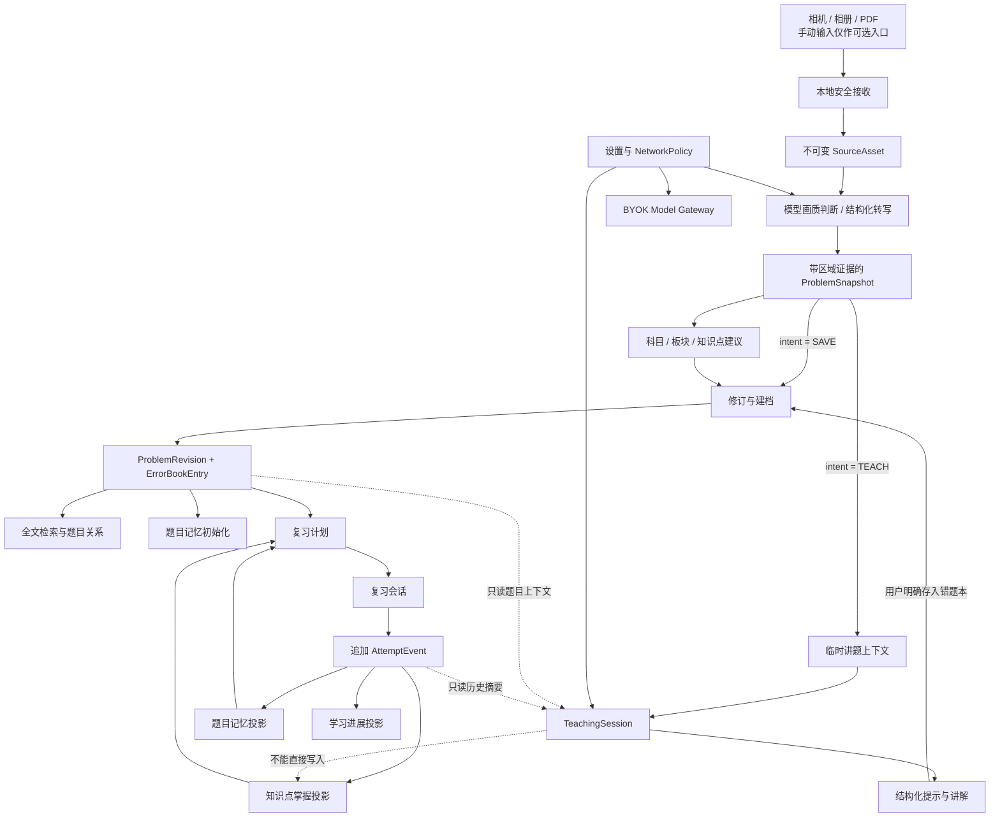
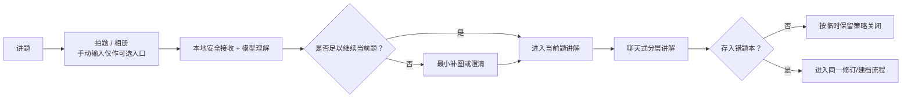
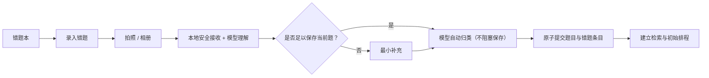
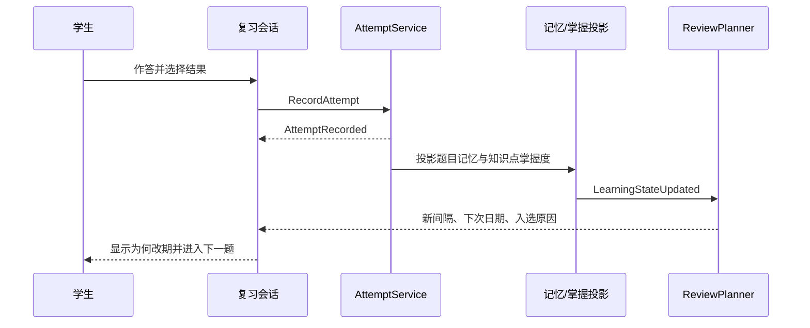

# 智能错题本：产品信息架构与功能依赖基线

状态：已冻结的产品信息架构  
日期：2026-07-22  
适用范围：高中阶段、Android、模型优先且端侧保存可信学习记忆的核心闭环

治理入口：当前界面体验与完整功能以 [`student-experience-spec.md`](student-experience-spec.md) 为权威，本地/模型职责以 [`model-first-product-boundaries.md`](model-first-product-boundaries.md) 为权威，当前实现证据见 [`scenario-registry.md`](scenario-registry.md)。本文继续提供导航、页面归属和最短路径基线。若需给本文决策分配 ID，只能使用 `IA-*`；合同场景必须引用完整 `M1-*`，不得在本文另造验收 ID。

> **2026-07-22 冻结 IA：** 底栏固定为 `复习 / 讲题 / 错题本 / 我的`。模型负责画质/完整性语义判断、多模态结构化转写、科目/板块/知识点建议、讲题和当前题内按需 GUI spec；本地负责安全接收、可信持久化、规则、Schema/allowlist 校验、确定性渲染、调度和密钥。候选足以继续时直接使用且始终可修订，只有无法继续才请求最小补充；不设强制 OCR 校对或手录关卡，也不展示内部流水线状态。没有用户明确要求，不生成新题、同类题、变式题或校准题，也不用额外题探测能力；能力边界只来自用户给出的题和历史可信行为。错题本只按 `科目 → 板块 → 知识点` 可见归类，掌握程度独立；错因、来源、题型不作为可见分类。无数据显示“暂无学习记录”或隐藏。不做手写演算板。记忆跨会话、绑定精确题目修订且可追溯；模型省略字段/关系不等于删除，请求只携带当前任务相关的最小记忆，模型不能直接写掌握度。答案曝光绑定精确模型任务和答案表面，只有该表面的底部真实进入视口才落事实。生产不注入 seed/fixture，所有 `ACTIVE` 真实错题均可排程，复习显示保存时的原始转写/明确修订。当前不提供面向学生的离线智能模式或自建云端；未配置 BYOK 时保留原任务并就地引导配置。每个逻辑外部操作最多 3 次真实 dispatch，本地执行不计数；恢复发送必须有当前进程内有效租约，或经一次明确“继续”签发新租约，初始自动启动不可重复。

> **2026-07-23 原子记忆补充：** 内部能力层采用学科隔离的原子知识节点，并以当前题步骤归因控制记忆读取；学生仍只看到科目→板块→知识点和独立掌握程度，不增加逐项确认或录入负担。

> **2026-07-23 本体基线：** 应用首次使用与每次归类前幂等安装 `moe-2020-foundation-v1`，九科代表性原子节点均绑定教育部 2020 修订课程标准的独立 PDF 指纹与页码。该包只验证来源、层级和记忆链路，不冒充全量知识覆盖；没有可靠节点时继续走受控补全，而不是让模型临时发明分类。

## 1. 产品主线

产品只围绕一条长期价值链组织：

> 拍下题目 → 得到可随时修订的结构化题目 → 形成学习资产 → 在正确时间复习 → 根据真实作答更新掌握度 → 必要时获得分层讲解。

以下原则优先于页面数量和视觉表现：

1. 用户每次进入只表达一个意图：复习、求讲解、管理错题或查看进展。
2. “能被讲解”不等于“已经存入错题本”。
3. “看过讲解”不等于“完成了一次可评分作答”。
4. OCR、归类、解析和模型结论都是候选；用户明确保存时形成带来源与生产者版本的题目修订，但不要求先完成 OCR 校对，之后仍可精确修订。
5. 知识掌握只由合格作答事实投影；题目记忆还可接收提示依赖和精确答案表面底部真实进入视口后的曝光，但浏览、聊天、按钮点击和模型声明不能伪造作答或知识掌握。
6. 无网、无额度或未配置 Provider 时，已有内容与手工整理仍可完成；新图片理解、自动分类和智能讲题必须诚实等待模型，且任务可原位续跑。
7. 真实复习只使用保存时的 `ProblemRevision` 原始转写和明确修订；模型不能生成替代题面、替代答案或填充题，生产运行时没有 seed/fixture。
8. 本地记忆采用显式差异合并；模型本轮没返回的事实、字段和关系保持原值，删除必须由明确的本地命令完成。

## 2. 顶层导航裁决

采用四个底部目的地：

| 目的地 | 用户此刻的问题 | 主动作 | 高频内容 | 明确不负责 |
|---|---|---|---|---|
| `复习` | 今天该练什么？ | 开始今日复习 | 今日队列、继续上次、冲刺、改期解释 | 题目录入、模型设置 |
| `讲题` | 这题下一步怎么做？ | 拍题讲解 / 继续对话 | 分层提示、步骤检查、最近会话、从错题本选题 | 自动入库、直接改掌握度 |
| `错题本` | 我保存了哪些题？ | 录入错题 | 科目→板块→知识点、独立掌握程度、搜索、详情、再练、导出 | 自动发起讲解、错因/来源/题型可见分类 |
| `我的` | 我学得怎样，系统如何配置？ | 查看学习档案 | 掌握度、复习历史、周趋势、学习建议、设置入口 | 直接修改学习事实、替代业务模块 |

基于当前 `ASSUMED` 的导航假设，保留 `我的` 作为第四个主导航，但内部必须分成“学习档案”和“设置”两层，不能成为功能杂物箱。页面上半部分有数据时展示掌握程度和近期变化；没有数据时只显示“暂无学习记录”或隐藏这些模块。下半部分再提供以下设置分组：

- 智能模型：Provider、Base URL、模型名、API 密钥、由用户主动发起的合成图片/结构化输出能力测试、费用和发送范围；保存配置本身不联网。
- 数据与隐私：本地权威数据、存储占用、备份恢复、全部数据导出与删除。
- 学习偏好：每日时长、提醒、难度、左右手模式、外观。

当讲题能力尚未配置或鉴权失败时，讲题页提供上下文入口 `配置讲题能力`，配置完成后必须返回原草稿、原会话和未发送输入，并复用原请求；发送许可或授权指纹失效只重新确认本次发送，不跳转设置页。

### 为什么没有独立“首页”

将 `复习` 作为默认首页是待用户研究验证的 `ASSUMED` 决策。冷启动默认进入复习；如果题库为空，则同一页面切换为空状态，主动作改为 `录入第一道错题`。这样既不增加一个只做中转的首页，也不会让用户每天多点一次。

### 为什么拍照不是第五个栏目

拍照是共享能力，不是用户目的。两个高频入口必须带着明确意图：

- `讲题 > 拍题讲解`：生成临时题目，先讲解，用户之后决定是否保存。
- `错题本 > 录入错题`：得到可随时修订的题面候选，按科目→板块→知识点建档，保存后进入排程；只有无法继续时才请求最小补充。

`复习`首页可以保留一个明确写着 `录入错题` 的次操作，但不放含义模糊的全局相机按钮。只有从系统分享菜单进入、无法得知意图时，才显示二选一：`讲解这题` / `存入错题本`。

## 3. 领域依赖总图



依赖方向固定为：

```text
Compose UI
  → Application Use Cases
    → Domain Entities / Domain Ports
      ← Room、文件、过渡 OCR、任务型 Model Gateway、WorkManager Adapter
```

任一功能页不得跨模块直接操作 DAO。跨模块只能使用明确命令、只读查询、已提交事件和稳定 Schema。

## 4. 数据所有权与写权限

| 数据 | 唯一写入者 | 可读取者 | 关键限制 |
|---|---|---|---|
| `SourceAsset` | 采集服务 | 模型转写、按需修订、讲题上下文 | 原始来源不可覆盖；清除 EXIF |
| `RecognitionJob/Region` | 识别服务 | 建档服务、按需修订 UI | 识别结果不是题库事实；内部阶段名不对学生展示 |
| `EditableProblemDraft` | 修订/建档服务 | 讲题保存桥、修订 UI | 可直接保存带 provenance 的修订，不以逐字段确认为前置 |
| `ClassificationSuggestion` | 分类模型 Adapter | 建档与修订 UI | 只建议科目、板块、知识点；错因/来源/题型不进入可见分类 |
| `Problem/ProblemRevision` | 题库服务 | 四个主模块只读 | 讲题、OCR、复习 UI 均不能直接写 |
| 科目/板块/知识点绑定 | 建档服务 | 错题本、复习、讲题、我的 | 模型只能提议，提交入口统一；掌握程度是独立投影 |
| `ErrorBookEntry` | 错题建档用例 | 复习、错题本、我的 | 与题面修订分离 |
| `AttemptEvent` | 统一作答服务 | 掌握度、排程、我的页分析、讲题摘要 | 只追加；浏览或看答案不能创建 |
| 首次作答响应 | 统一作答服务 | 作答回放、纠正、学习解释 | 不可变保存选项 ID、当时显示文字和提交时间；旧数据缺失时明确不可恢复，不猜测 |
| `ProblemMemoryState` | 题目记忆投影器 | 复习、我的、讲题只读 | 可由事件重算 |
| 学科知识本体 / 原子节点 | 本地知识库维护与版本迁移 | 归类模型读取有界同科片段；错题本默认不展示内部节点 | 不含题库；模型不能直接把候选写成权威节点，缺口只生成受控检索请求 |
| `KnowledgeMasteryState` | 掌握度投影器 | 复习、我的、讲题只读 | 以原子节点为单位，单科内跨题共享、跨科隔离；UI 和模型不能直接改 |
| `ReviewPlan/Queue` | 复习计划器 | 复习 UI | 是可重算计划，不是学习事实 |
| `TeachingSession/Turn` | 讲题服务 | 讲题页、关联题详情 | 与题库、作答事件隔离 |
| 讲题答案曝光事实 / 会话题目锚点 | 讲题服务 / 题目记忆投影器 | 讲题恢复、题目记忆 | 按精确 `modelTaskRequestId + surfaceKind + responseOrdinal` 标识；只有该答案表面底部真实进入视口才追加；临时会话建立题目锚点后幂等投影，不直接写知识掌握 |
| 可信讲题记忆事件 / 模型摘要候选 | 领域服务自动追加事实；模型只可提议摘要 | 讲题恢复、学习记忆、可选纠正入口 | 学生原文、实际选择、提示请求、精确答案曝光和卡住动作按题目修订留存；模型输出按显式差异合并，省略不删除，摘要不能冒充事实 |
| 生产复习题面 / 测试 fixture | 题库服务 / 测试装配 | 复习、题目详情 / 自动化测试 | 生产只读所有 `ACTIVE` 真实题的原始转写/明确修订；测试 fixture 不进入生产列表、统计或排程 |
| 模型任务逻辑操作 / 出站租约 | ModelTask Repository / 进程内授权服务 | 讲题和采集恢复 | 相同强类型输入共享最多 3 次真实 dispatch；manifest 只存披露证据，出网须当前进程内租约，重建后一次明确继续才可签发 |
| `AnalyticsProjection` | 分析投影器 | 我的页 | 只读展示，不成为源数据 |
| API/隐私设置 | 设置服务 | 受控 Adapter | 密钥仅保存 Keystore 引用 |

三个必须永久隔离的数据层：

- 干净题面 `ProblemRevision` 与学生本次书写 `AttemptOverlay`。
- 讲题会话记忆与可重建的学习掌握度。
- 模型候选结论与用户明确保存后的权威题目修订。

模型请求不得读取完整学习账本。组装顺序必须从当前 `problemId + problemRevisionId` 出发，通过当前题步骤归因选出实际涉及的同科原子节点，再只选择这些节点与本教学目标直接需要的尝试、提示、精确答案曝光和卡住步骤；没有显式关联就发送空集合，不能把整科画像或全局薄弱项全部外发。

## 5. 两种拍题流程

### 5.1 拍题讲解



规则：

- 不要求先选知识点、错因、题型、来源或复习计划。
- 不设置 OCR 强制校对页；候选足以理解当前题就直接继续，只有无法继续才询问最小必要信息。
- 学生未明确索要完整答案时默认给一级提示；明确索要时直接给可信完整解法。
- 只有用户明确点击 `存入错题本` 才持久化。
- 保存必须复用题库修订与建档，不允许讲题模块直接写题库。
- 同一会话多次点击保存必须幂等，不能产生重复题。

### 5.2 录入错题



规则：

- 拍下后立即暂存，不能因退出或识别失败丢失。
- 正常候选由模型自动归入科目/板块/知识点并直接保存，不出现逐项确认页；学生发现错误时再打开修订。
- 科目沿用最近一次并显眼可改；板块和知识点允许 `稍后整理`。错因、来源、题型不作为可见分类或必填项。
- 任意置信度都不自动制造校对关卡；数字、符号、单位、上下标等风险字段可提示但不阻塞，只有无法继续保存当前题时才请求最小补充。
- 入库后不自动发起讲题；题目详情提供显式 `讲这题`。

## 6. 复习依赖链

生产复习的内容源只有题库中的真实 `ACTIVE` 错题。`ReviewPlanner` 可以改变顺序、间隔和今日数量，但不能替换内容：复习卡片必须读取该题保存时的 `ProblemRevision` 原始转写和明确修订，模型只能解释本地计划，不得生成替代题面、替代答案或测试题。生产首次启动为空库；seed/fixture 只能存在于测试装配，并与生产列表、统计和排程隔离。



只有以下行为可创建 `AttemptEvent`：

- 复习会话中提交一次结果。
- 错题详情中明确启动 `再练` 并提交结果。
- 讲题会话中进入独立可评分重做模式并提交结果。

普通聊天、查看解析、打开题目、复制答案、只看提示均不创建作答事件。

`打卡`不是单独按钮。完成当天最低复习计划后自动记为完成，结果页展示连续天数；这样避免“点了打卡但没有学习”的虚假数据。

## 7. 讲题交互不是普通聊天复制品

聊天形式保留用户熟悉的输入框、附件、相机、会话历史、停止生成和重新请求，但教学动作不能写死。每一轮模型根据当前题、用户当前表达和历史可信行为决定是否需要 GUI；可以只返回讲解，也可以从 allowlist 选择 0–3 个当前题内上下文动作，例如：

- `换种方法`
- `再提示一点`
- `重新梳理题意`
- `我想自己试`
- `直接完整讲解`

模型只允许从白名单动作类型中选择，并可填写简短标签；不能生成任意点击事件、路由、脚本或数据库操作。动作栏因此是“活的”，但不是每轮强制出现的选择题。

### 7.1 Markdown 与交互块统一渲染

讲题可以只显示安全 Markdown/LaTeX；动态 GUI 不是必选包装。只有可视化能实质降低当前题的理解负担时，模型才可额外返回最多一个版本化 `visualScene`。当前场景白名单是 `step_flow`、`comparison`、`evidence_chain`、`process_timeline`、`concept_map`、`formula_derivation`，由本地重建稳定 ID、校验预算并确定性渲染。上下文动作与视觉场景分开，最多显示三个当前题动作；没有合适内容时两者都不占位。

模型不得返回选择题生成器、判断题诊断器、任意布局、可执行 UI 代码、JavaScript、SVG、图片、URL、远程资源、路由、文件或数据库指令。学生对当前题的真实操作由本地领域命令记录；只有实际提交或可见的事实进入记忆。

### 7.2 当前题内 GUI 与能力边界

`TutorGuiSpec` 是模型为用户给出的当前题按需选择的 allowlist 声明式场景，不是题目生成器，也不是每轮必出的选择题。本地只接受最多一个 `step_flow`、`comparison` 或 `evidence_chain`；未知场景安全降级为纯文本，任意代码、路由、文件、远程资源或数据库指令一律拒绝。

模型的能力上下文只按以下可信顺序读取：

```text
当前 problemId + problemRevisionId
→ 用户当前输入或当前题内明确交互
→ 该精确修订的尝试 / 提示 / 答案暴露 / 卡住步骤
→ 由这些事实投影出的学习变化
```

规则：

1. 可信历史只用于跳过已经稳定的内容、选择讲解深度和延续卡点，不得扩张到与当前题无关的能力判断。
2. 没有可信历史时，界面显示“暂无学习记录”或隐藏画像；模型只依据当前题和用户表达继续，不出额外题校准或探测。
3. 没有用户明确要求时，新题、同类题、变式题、校准题的生成数必须为 0。用户明确请求练习时，生成内容保持 SESSION_ONLY 并与能力边界、知识掌握投影永久隔离；能力只从用户自己提供的题及其可信行为形成。
4. 当前题需要点选时，选项对应真实解题分支且允许“我不确定/都不是”；不需要控件时 `guiSpec` 可以缺省。“我不确定/给一点提示”是非评分会话动作，可原样保存用于续聊，但不得创建选择作答、能力判断或掌握度证据。
5. 当前题内的真实提交、提示、卡住步骤和精确答案曝光分别追加为可追溯事实。答案曝光只有在对应答案表面底部完整进入视口后，按精确模型任务/表面/响应序号写入；同回合其他表面可见、点击展开或模型声明含答案均不成立。曝光只更新题目记忆与复查节奏。只有统一 `AttemptService` 接收满足资格的明确提交，才更新知识掌握投影。
6. 模型只能读取掌握度快照，不能直接写掌握度、题目记忆、复习日期或学习变化。
7. 产品不提供手写演算板；纸笔过程通过图片补充，关键式子可用短输入。
8. 跨会话恢复继续使用精确题目修订和已提交回合；模型输出只合并明确返回的候选，省略字段或关系不删除本地记录。

## 8. 错题本可见归类

错题本只提供一个稳定的可见目录层级：`科目 → 板块 → 知识点`。掌握程度是独立视图或筛选，不进入目录层级。模型可以提出前三层的候选，本地保存用户修订与版本。自动整理与用户保存默认合并：模型省略不表示删除，用户自定义归类、用户纠正和仍被证据引用的关系继续保留；关系整理逐条提供“移除/恢复”，保存只应用明确差异，只有显式清空才清除全部关系。

| 可见归类 | 例子 | 决定方式 |
|---|---|---|
| 科目 | 数学 | 模型提议；用户可修订并保留历史 |
| 板块 | 函数与导数 | 依附科目；模型提议，用户可修订 |
| 知识点 | 函数单调性 | 依附板块；允许一题绑定多个知识点 |
| 掌握程度（独立） | 待巩固、基本掌握、稳定掌握 | 只能由可信学习事实投影；模型与 UI 均不得直接写 |

归类输出契约只允许 `subject`、`section`、`knowledgePoints` 及其 evidence/modelVersion；掌握程度不在模型输出中。错因、来源、题型可以留作内部来源证据或教学候选，但不得成为错题本的可见分类、筛选、分组、卡片标签或必填字段。原图来源仍可在题目详情中作为修订证据查看，不等于“来源分类”。

## 9. 用户习惯与最短路径

| 习惯/场景假设 | 推荐最短路径 | 便利性规则 | 证据等级 |
|---|---|---|---|
| 每日复习 | 冷启动 → `开始今日复习` | 1 次操作进入第一题 | `ASSUMED` |
| 晚自习临时求解 | `讲题` → `拍题讲解` → 快门 | 不先填分类；候选可用就直接讲，只有无法继续才澄清 | `ASSUMED` |
| 课后录入单题 | `错题本` → `录入错题` → 快门 | 拍后立即暂存；不强制 OCR 校对，随时可修订 | `ASSUMED` |
| 批量整理试卷照片 | `错题本` → `批量导入` → 一次选择多张照片 | 每张独立落盘并按稳定顺序进入待处理；PDF/整卷分页与自动拆题仍待后续 | `ASSUMED` |
| 从已有题求助 | 题目详情 → `讲这题` | 不重复拍照和 OCR | `ASSUMED` |
| 复习中卡住 | 当前题 → `需要讲解` | 在来源页面上打开共享全屏流程，返回继续当前题 | `ASSUMED` |
| 考前冲刺 | `复习` → `考前冲刺` → 开始 | 临时队列与长期排程隔离 | `ASSUMED` |
| API 未配置或鉴权失败 | 讲题错误态 → `配置讲题能力` | 保存后返回原题、原会话和精确待执行动作；当前进程无有效租约时只需一次明确继续，不创建新逻辑请求 | `ASSUMED` |

证据等级的定义、升级门槛和降级规则见 [`scenario-registry.md`](scenario-registry.md#6-用户习惯证据治理)。模拟器路径、自动化点击和设计 QA 只能证明界面行为，不能把这些条目升级为 `OBSERVED` 或 `VALIDATED`。

默认值：

- 冷启动进入 `复习`；存在中断任务时显示 `继续上次`。
- 每日计划默认按约 10 分钟组织，而不是固定塞入题数。
- 不存在面向学生的“设备内智能模式”；智能能力使用用户配置的 BYOK。未配置时保留任务并就地引导配置，任何出网都不得静默发生。
- 相机与通知权限都在首次真正需要时请求。
- 草稿、复习进度、会话输入和提示层级自动保存。
- 答案默认折叠；作答结果提交后 5–10 秒可撤销。
- 通知权限拒绝时使用应用内待复习状态，不影响计划生成。

## 10. 中断、失败与恢复

| 情况 | 必须行为 |
|---|---|
| 相机权限拒绝 | 立即提供系统照片选择器和去设置入口，不循环弹窗；手动输入仅在学生主动寻找时提供 |
| OCR/解析未完成 | 保留原图；用“暂时没完成，可稍后继续”说明结果，提供稍后重试、重拍、补拍或更换 Provider；只有确实无法继续时询问最小缺失信息，不把手工补录设为默认退路 |
| 关键字段低置信 | 可提示并允许随时编辑；仍能继续就不打断，只有无法继续才请求最小补充 |
| 进程被系统杀死 | 恢复草稿、裁切框、可选修订、当前复习题、答案草稿和提示层级 |
| 复习中转入讲题 | 暂停计时；返回后题目、答案和已用提示保持不变 |
| 讲题模型不可用 | 保留请求与题目；显示可恢复结果，不用本地规则伪装语义讲题，也不伪造答案 |
| 配置缺失或鉴权失败 | 保留原草稿、会话、输入和请求身份；进入设置，保存后返回原任务并复用原请求 |
| 发送许可、进程内租约或授权指纹失效 | 保留精确待执行的计划/回复动作并进入暂停态，显示“继续讲题/继续对话”而非假“正在准备”；学生明确点击一次后签发新租约，不自动复用持久 manifest，不跳转设置页，既有内容始终可看 |
| 重复拍摄同一题 | 用内容指纹提示复用已有题；用户可选择创建新修订 |
| 误记作答结果 | 提供撤销，不为每题增加确认弹窗 |
| 误删题目 | 禁止直接滑动永久删除；单题可撤销，批量删除显示数量并确认 |
| Provider 无额度、超时或缺少图片能力 | 原图和草稿进入待续跑；已有内容与可选题面修正仍可用；恢复后沿用原任务 |
| 同一逻辑外部操作反复失败 | 跨 request envelope 和执行者共享最多 3 次真实 Provider dispatch；本地执行、等待和渲染不计数。达到上限后保持可恢复失败，不用新 requestId 重置预算 |
| 新拍题已经批准并自动开始 | 当前进程只消费一次初始启动；重组、返回、恢复观察和导航重订阅都复用原任务，不再次发送也不显示第二个开始确认 |

## 11. 导航、深链与返回栈

1. 四个底部目的地各自保留独立返回栈、滚动位置和筛选状态。
2. 切换底栏不加入 Android 返回历史；任一根页按返回键直接退出。
3. 再次点击当前底栏：有子页则回根页，已在根页则滚到顶部。
4. 采集、题目详情和导出从来源页面压栈打开并隐藏底栏；讲题会话保留四栏且持续选中“讲题”，让学生随时能按既有习惯切换，复习中的讲题返回后仍回到原作答位置。
5. 跨域操作完成后默认回到来源，不静默切换底栏。
6. `存入错题本`成功后留在讲题页，只显示 `已存入错题本 · 查看`。
7. 从复习进入讲题，返回后继续同一题；计时、答案草稿、提示层级和“看过答案”标记均保留。
8. 通知深链构造 `复习根页 → 复习会话`；系统分享进入时先明确 `讲解` 或 `保存` 意图。
9. 所有路由按 `problemId/sessionId/draftId` 做幂等和 `singleTop`，避免重复页面、会话和保存。
10. 讲题初始自动启动另有一次性内存令牌；路由恢复只能恢复已提交内容或暂停的精确动作，不能重新获得该令牌。

建议共享全屏路由：

```text
capture/{draftId}?intent=save|teach
problem/{problemId}
review-session/{planId}
teach-session/{sessionId}
export/{selectionId}
settings/intelligence
settings/data-privacy
```

## 12. 页面归属

```text
复习
├─ 复习首页
├─ 今日队列
├─ 复习会话
├─ 结果与改期解释
├─ 考前冲刺
└─ 复习历史

讲题
├─ 新建讲题 / 继续上次
├─ 拍题讲解
├─ 从错题本选择
├─ 结构化聊天会话
└─ 存入错题本确认

错题本
├─ 全部题目
├─ 正在准备 / 可以继续 / 需要你补充
├─ 录入错题 / 批量导入多张照片（PDF/整卷分页后续）
├─ 搜索与筛选
├─ 题目详情 / 修订
├─ 再练 / 讲这题
└─ 题单导出与打印

我的
├─ 掌握度概览
├─ 薄弱知识点
├─ 近期变化
├─ 学习周报
└─ 设置分组
   ├─ 智能能力 / API
   ├─ 数据与隐私
   ├─ 提醒与复习偏好
   └─ 存储 / 备份 / 全部数据导出删除
```

## 13. UI 设计约束

- 保留已选择的暖白纸面、深墨文字、玉绿色主动作、克制线稿风格。
- 底栏只显示 `复习 / 讲题 / 错题本 / 我的`；“我的”先展示学习档案，再展示清晰分组的设置入口。
- 每个根页只保留一个主动作；讲题和错题本的相机入口必须使用不同文案。
- 复习首页以今日任务为主，不放题库筛选和 API 配置。
- 讲题空状态不是空白聊天框，主动作只提供 `拍题讲解` 和 `从错题本选择`；手动输入收在学生主动展开的“更多方式”中，不作为识别失败后的默认工作。
- 讲题快捷动作随当前题状态按需出现；纯讲解时不显示控件。当前视觉 allowlist 包含步骤流、对照表、证据链、过程轴、知识关系、公式推导和图形讲解，另可显示最多三个当前题动作。图形讲解用于当前题里的几何关系、受力关系、简单化学连接和基础电路；模型只能选择九个固定位置、受限连线及电源、电阻、灯泡、开关、电流表、电压表等课本元件，本地统一绘制。电路元件必须位于两段同向导线之间，导线连通且不与普通图节点混用；不接受任意坐标、样式、图片或动作。点选、短答、步骤排序等必须等对应本地 schema、renderer 与测试落地后才能开放。
- 所有学生可见的标题、节点、关系和提示都必须使用日常学习语言；协议名、检索术语、内部知识建模词和算法名只能留在工程与诊断边界，校验不通过时回退为已验证的纯文本讲解。
- 答案表面可正常滚动和恢复，但只有其底部完整进入视口才显示为“已看过”并影响题目记忆；不得用回合级状态替代精确表面曝光。
- 错题本空状态突出 `录入错题` 与 `从相册导入`，高阶筛选在有数据后出现。
- 错题本可见归类固定为科目→板块→知识点，掌握程度独立；错因、来源、题型不显示为标签或筛选项。
- “我的”中的学习数据只显示学生能理解且可行动的内容，不暴露 FSRS、BKT、HLR 等算法名。
- 公式、几何和题面区域优先保证可读性；纸纹、插图和动画不得抢占内容空间。
- 高频控件位于屏幕下半区，触控目标不小于 48dp，并支持左右手模式。

## 14. 便利性验收指标

| 指标 | 目标 |
|---|---:|
| 冷启动进入第一道今日复习题 | 1 次操作 |
| 单题拍摄到草稿落盘 | 2 次操作，P90 ≤ 8 秒 |
| 可用题目候选正式存入错题本 | ≤ 3 次操作，平均 ≤ 25 秒 |
| 新拍题获得首个提示 | ≤ 3 次操作，参考中端机 P90 ≤ 10 秒 |
| 已有题进入讲题 | ≤ 2 次操作 |
| 复习单题结果记录 | 1 次操作，可撤销 |
| 已有数据查看与任务恢复的飞行模式成功率 | 100% |
| 杀进程后的草稿/会话恢复率 | 100%，数据丢失率 0 |
| 用户主动修订字段中位数 | ≤ 2 个字段/题 |
| 核心任务首击归属正确率 | ≥ 90% |
| 讲题可选保存重复率 | 0 |
| 复习跨讲题往返状态丢失 | 0 |
| 单手无协助完成核心任务 | ≥ 85% |
| 未经用户请求生成新题/同类题/变式题/校准题 | 0 |
| 非阻塞 OCR 候选触发强制校对 | 0 |
| 内部流水线状态对学生可见 | 0 |
| 生产启动或升级后 seed/fixture 泄漏到列表、统计或排程 | 0 |
| `ACTIVE` 真实错题无法进入排程 | 0 |
| 复习题面与保存的原始转写/明确修订不一致 | 0 |
| 同一逻辑外部操作真实 Provider dispatch | ≤ 3 次 |
| 应用重建后未经一次明确继续自动发送 | 0 |
| 新拍题初始自动启动重复 | 0 |
| 未到精确答案表面底部可见即记录曝光 | 0 |
| 模型省略导致本地字段或关系被删除 | 0 |
| 发送与当前题无显式关联的学习记录 | 0 |

以上指标目前是产品假设，不是假装已有的实测结果。进入实现前应使用可点击原型对 8–12 名高中生做情境测试；Beta 前扩大到至少 30 名学生，并按课后录题、晚自习求解、每日复习、考前冲刺和无网场景分层验证。

## 15. 实现前必须冻结的决策

- 讲题中临时图片、会话和未保存题目的默认保留时长。
- 用户配置模型不可用时的恢复文案与续跑策略；不建设替代模型语义能力的本地讲题系统。
- 多照片入口已与 PDF/整卷分页分层；仍需冻结 PDF 自动拆题、页级故障恢复、复杂手写、公式和学科图形在 MVP 与后续版本的边界。
- 哪些统计只在设备上计算，哪些数据在用户显式开启后才允许离端。

已冻结导航：`复习 / 讲题 / 错题本 / 我的`。保留两个带意图的拍题入口，不采用含义模糊的全局相机按钮；“我的”内部以学习档案优先，模型/API、数据隐私和偏好设置分组呈现。

同时冻结：动态 GUI 只服务当前题并按需出现；错题本只按科目→板块→知识点及独立掌握程度归类；不强迫 OCR 校对或手录、不展示内部流水线状态、不做手写演算板；没有用户明确要求不生成任何额外题，也不用额外题探测能力。生产只复习真实 `ACTIVE` 错题的原始转写/明确修订且无 seed；跨会话记忆只披露相关最小集合，模型省略不删除；答案表面底部真实可见才记曝光；逻辑外部操作最多 3 次 dispatch，重建后一次明确继续，初始自动启动不重复。
