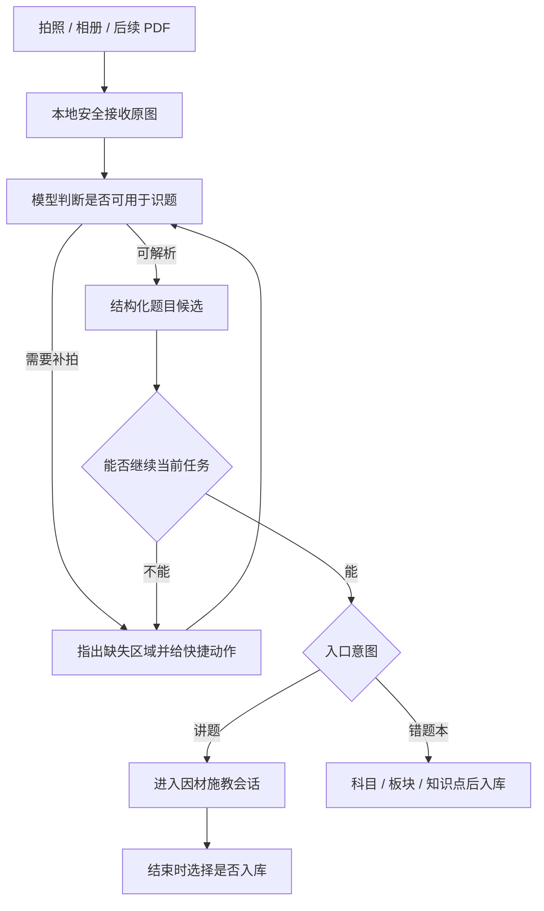
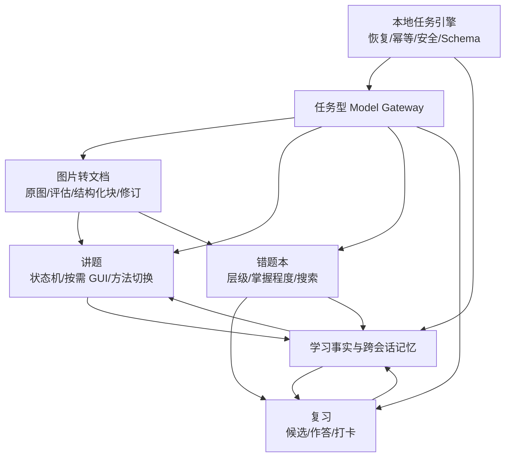

# 智能错题本：学生第一视角体验与功能全景

> **2026-08-01 最新覆盖：** 底栏顺序为 `讲题 / 复习 / 错题本 / 我的`，冷启动进入讲题；旧里程碑中的“复习在前”不再是当前体验合同。

状态：已冻结的产品体验规范（UX-001）  
日期：2026-07-22  
视觉基线：沿用用户已选择的“方案 1”画风与当前设计系统；不另造配色、圆角、图标或页面骨架。  
系统边界：智能职责遵循 [`model-first-product-boundaries.md`](model-first-product-boundaries.md)。

> **2026-07-22 冻结体验合同：** 底栏只有 `复习 / 讲题 / 错题本 / 我的`。模型理解当前题、负责讲题并按需给出当前题内 GUI spec；本地保存可信事实、执行规则、校验与渲染声明式界面、调度任务并保护密钥。OCR 不设强制校对关卡；正常候选直接继续，无法继续时只给重试、重拍/补拍、换图或稍后继续，不把手工补录题面变成失败退路。学生不看到 OCR、解析、校验、队列等内部流水线状态。没有用户明确要求，产品绝不生成新题、同类题、变式题或校准题，也不用额外题探测能力；能力只从学生自己给出的题与可信行为中被动形成。错题本只按 `科目 → 板块 → 知识点` 可见归类，并独立按掌握程度查看；错因、来源、题型不作为可见分类。错题总目录为空显示“还没有错题”，筛选为空使用筛选空状态；“暂无学习记录”只用于复习/我的缺少学习证据。不做手写演算板。记忆跨会话、绑定精确题目修订并记录尝试、提示、答案暴露、卡住步骤和学习变化；每次只把当前题真正相关的最小记忆发给模型，模型省略内容不表示删除本地事实，也不能直接写掌握度。答案只有在精确答案表面的底部完整进入真实视口后才算暴露。生产库不写入演示题；复习只使用真实保存且仍为 `ACTIVE` 的错题及其已保存原始转写，不生成替代题面或虚构答案。产品以用户配置的 BYOK 模型提供智能能力，不建设面向学生的离线智能模式。每个逻辑外部操作最多三次真实 Provider dispatch，本地执行不占次数；应用重建后必须有当前内存租约或学生明确点一次“继续”才可恢复精确未完成动作，不能重复首次自动启动。

> **2026-07-23 原子记忆补充：** 每道用户题按真实解题步骤拆成原子知识/技能，能力在单科内跨题复用、跨科隔离；已稳定掌握的基础节点不重复询问。内部原子层不增加学生的分类操作，也不改变错题本可见三级目录。

## 1. 先把自己当成真正的使用者

我是一个高中生。我的真实状态不是“准备认真研究一个软件”，而通常是：

- 晚自习刚错了一题，只想在 20 秒内拍下来；
- 一道题没听懂，心里有点烦，希望有人先问到我卡住的点；
- 周末想把一周错题打印出来，不想逐题重新排版；
- 考前很焦虑，只想知道今天最值得复习哪几题；
- 我不想学习 App 追问我已经会的幼稚问题；
- 我更不想看一堆“模型、OCR、置信度、projection”之类的技术词。

因此产品应让我感到：**快、懂我、不打扰、不会丢、随时可改、每一步都有意义。**

## 2. 什么会让我心情愉悦

### 2.1 正向体验

- 打开 App 就能看到最常用动作，不先看仪表盘或配置页。
- 拍照后立刻看到图片已经安全收到；题目准备期间可以返回，不被锁在转圈页。
- 模型默认带我继续；只有题面缺失到无法继续时才问最小必要信息，不让我走 OCR 校对流程。
- 讲题每轮短而有用，按钮能代替大部分打字。
- “换种方法”不是重开聊天，而是记得刚才哪里没懂。
- 存入错题本前后都能撤销或修订，不怕误操作。
- 错题按科目、板块、知识点稳定归类，掌握程度单独查看，不让我理解一套复杂标签系统。
- 复习完成后告诉我“今天完成了什么、为什么明天会更轻松”，不制造打卡焦虑。
- 模型/API 出错时原图、草稿、会话和当前位置都还在。

### 2.2 负向体验，必须禁止

- 拍题后连续出现“检查图片 → 检查题干 → 检查分类 → 检查知识点”四个整页步骤。
- 每个页面同时出现多个同等醒目的主按钮。
- 讲题一上来就给完整答案或长篇解析。
- 为了显得智能而问“1+1 等于几”式的无区分度问题。
- 错题本只是一堆图片卡片，没有题面、搜索、修订、关系和导出能力。
- 让模型擅自增加错因、来源、题型等可见目录维度。
- 断网、限流或 Key 失效后只弹“网络错误”，让用户从头再来。
- 用技术分数代替人话，例如“图像清晰度 37%”。
- 展示“模型处理中、OCR 识别中、Schema 校验中”等内部流水线状态。
- 未经我明确要求生成新题、同类题、变式题或校准题，或用额外题偷偷测试我的能力。
- 把每轮讲题都强制做成选择题，或要求我在应用内手写演算。
- 打卡天数压过真实学习进展，错过一天就惩罚用户。

## 3. 信息架构：只有四个稳定根页

| 根页 | 用户脑中的一句话 | 首屏只回答什么 |
|---|---|---|
| 复习 | “今天我该练什么？” | 今天的计划、预计时间、开始复习、为什么是这些题 |
| 讲题 | “这题我哪里没懂？” | 拍题/上传/选已有题，以及最近可继续的讲题 |
| 错题本 | “我的错题在哪里？” | 科目→板块→知识点、掌握程度、搜索、直接录题、最近错题 |
| 我的 | “它记住了我什么，智能能力怎么配？” | 学习概览、记忆纠正、模型/API、隐私与数据 |

拍照不是第五个根页。拍照是共享能力，进入时必须携带意图：

- 从“讲题”进入：解析后开始讲解，结束时可选是否入库；
- 从“错题本”进入：候选可用后直接保存，不强迫 OCR 校对，也不自动讲解。

打卡也不是第五个根页。完成有效复习后自动形成当天结果，显示在复习页和我的学习数据中。

## 4. 全局交互规则

1. **每屏一个主任务。** 主按钮最多一个，其余动作使用次级按钮、文字按钮或上下文菜单。
2. **渐进展开。** 高频操作直接可见，批量、导出、合并、历史版本等进入二级页或选择模式。
3. **意图不丢。** 从讲题去配置 API，保存后返回同一题、同一输入和同一请求；发送许可或授权指纹变化只重新确认本次发送。配置过程不丢原草稿或会话；从复习进入讲题，返回后仍在同一道复习题。
4. **草稿自动保存。** 不用“是否保存草稿”打断用户；离开时显示轻量状态。
5. **模型工作可离开。** 内部任务可恢复，底栏和返回始终可用；界面只说“正在准备这道题”“可以继续”“需要补充内容”或“暂时没完成”，不暴露内部阶段名。
6. **模型建议与用户事实视觉区分。** 建议可接受、修改、拒绝；用户明确保存或修订后才成为正式记录，不要求逐字段确认。
7. **当前题内按需 GUI。** 模型可为当前题选择 allowlist 声明式场景，最多三个动态动作；本轮不需要点选时只显示讲解，绝不为了显得智能而强塞选择题。
8. **错误就地恢复。** 错误卡片说明发生了什么、已保留什么、下一步能做什么。
9. **撤销优先。** 删除、合并、批量归类、取消保存应先软处理并提供撤销。
10. **主任务不展示“即将支持”。** 尚未形成闭环的大功能留在路线图，不占据根页黄金位置；已有单题能力用真实动作命名，例如“拍照或上传错题”，不能让学生误以为只能使用相机。
11. **学生语言。** 页面不显示内部模型、表名、算法缩写、置信度或流水线状态；没有学习数据时只显示“暂无学习记录”或隐藏对应模块。
12. **不额外出题探测。** 能力判断只来自用户给出的当前题与历史可信行为；没有用户明确请求时，不生成任何新题、同类题、变式题或校准题。
13. **不做手写演算板。** 允许拍摄纸笔过程或输入关键步骤，但不在产品内建设画布式演算工具。
14. **答案以真实阅读为准。** 生成成功、开始渲染、答案卡顶部露出都不算暴露；只有绑定精确模型任务请求/响应序号的答案表面底部完整进入真实视口才幂等记录一次。
15. **记忆只按相关性披露。** 本地保留可追溯事实，模型每次只收到当前题需要的最小摘要；模型没返回某段记忆、标签或关系不表示删除，删除必须来自学生的明确动作。
16. **能力记忆细到原子知识。** 每道用户题先按真实解题步骤拆成原子知识/技能；这些能力只在同一学科内跨题共享。讲题只读取本题涉及的原子节点，已经稳定掌握的基础步骤不重复问；不跨科类推，也不为补画像另出题。
17. **外部执行有硬上限。** 同一不可变类型输入确定的逻辑外部操作最多三次真实 Provider dispatch；本地运行不消费次数。进程重建后，持久化发送清单不是授权，必须重新取得当前内存租约或由学生明确点一次“继续”。
18. **恢复精确动作且只启动一次。** “继续”恢复暂停前的计划或回复，不偷换成新动作；首次拍题已自动启动过的讲题不能因重组或返回页面再次启动。

## 5. 四个根页的具体界面

### 5.1 复习

首屏顺序：

1. 顶部：今天日期、连续学习的轻量状态，不把 streak 做成压力中心。
2. 今日卡：题数、预计时间、难度组合、主要薄弱点。
3. 主按钮：“开始今天复习”。
4. 一句话解释：“为什么今天是这些题”。
5. 今日队列预览：最多 3 题，可展开完整计划。
6. 已完成区域：今天的独立答对、提示后答对、待巩固，不用单一正确率掩盖差异。

复习题页：题面 → 用户作答 → “提交” → 结果与下一动作。默认不显示解析。需要帮助时进入同一讲题会话，返回后继续作答。题面必须来自真实保存且仍为 `ACTIVE` 的错题及其精确 `problemRevisionId` 原始转写；排程、模型不可用或缺少标准答案都不得把它替换为生成题、演示题或伪造答案。生产初始化为空库，不自动种入 fixture/seed；测试样例只能存在于显式测试或演示环境。

没有任何可信学习事实时，今日卡与学习统计显示“暂无学习记录”，并隐藏薄弱点、趋势和个性化理由；不得显示“证据不足”“完全未知”或用额外题做校准。

### 5.2 讲题

空状态首屏：

- 主动作：“拍题讲解”，进入一次相机/相册选择，不在空状态放两个实际通向同一页面的重复入口；
- 次动作：“从错题本选择”；
- 最近会话：最多 3 条，支持继续；
- 一句能力说明：“把题发来，我会从你当前卡住的地方接着讲。”

进入拍题页后，只显示“拍照并整理 / 选图并整理”和一行最小发送说明：仅把本次选中的当前题图交给当前模型，不附带其他题目或学习记录。点击本身就是本次知情意图，系统相机或照片选择器返回后不再追加一层确认；意图只在当前进程内短时有效，并精确绑定 Provider、配置、草稿和全部返回资产。应用重建、超时或任一绑定项变化时停在原任务，只允许学生点一次“继续整理这道题”。

会话页：

- 顶部是题目摘要，可展开原图和当前题面修订；
- 中间是消息流，支持 Markdown、公式、图片裁切，以及模型为当前题按需选择的白名单步骤卡或点选卡；
- 底部固定输入区：文本、拍照补充、语音预留、发送；
- 输入区上方按需显示最多 3 个动态动作；没有合适动作时不占位；
- 右上角菜单包含题面修订、查看学习依据、清空本次会话，不把它们挤在主界面。

### 5.3 错题本

首屏顺序：

1. 搜索框；
2. 可见归类：`科目 → 板块 → 知识点`；掌握程度作为独立筛选或视图，不混入目录层级；
3. 主按钮：“拍照或上传错题”；相机、相册和截图进入同一图片转文档链；“批量导入试卷照片”可一次选择多张，每张逐一保存为独立草稿且不自动讲题。PDF/整卷分页、自动拆题和页级故障恢复仍属于后续批量作业；
4. 待处理卡：只在有任务时出现；根页给出平静的临时题数量，工作台批量读取并按稳定顺序恢复全部草稿，只用“正在准备 / 可以继续 / 需要你补充”这类用户结果汇总，并逐题给出继续、补拍或重试动作；不得显示 OCR、模型任务、解析、校验或重试队列等内部阶段；
5. 错题列表：默认按最近学习，不按静态文件夹展示；
6. 视图切换：列表/紧凑卡片；批量选择进入独立模式。

错题卡只显示决策所需信息：科目/板块/知识点、短题面、掌握程度和下次复习。错因、来源、题型不显示为标签、筛选项或分组；原图缩略图不是唯一内容。

详情页分四块：

- 题目：当前结构化题面、原图、版本和修订；
- 学习：最近作答、提示依赖、掌握变化、下次复习；
- 归类：模型建议的科目/板块/知识点，用户可随时修正；整理默认合并，模型省略不删除旧归类或用户纠正；不扩展其他可见维度；
- 掌握：独立展示本题与知识点的学习变化，不混入目录分类。

来源资产只在“题目”区域作为原图与修订证据查看，不参与归类；错因、来源、题型都不建立错题目录维度、筛选项、卡片标签或必填字段。既有题关系只在用户明确发起“整理关系”时展示；模型候选只与现有关系合并，省略不表示删除，不得借此自动生成同类题或变式题。

版本与关系必须让学生看得懂、敢操作：

- 当前题面明确标为“当前”，历史题面明确标为“历史只读”，讲题、复习和重新整理只使用当前版；
- 历史版可以核对和导出，但不能把过期题面继续写进学习记录；即使历史快照损坏，也要保留“回到当前版”的出口；
- 关系卡只在用户明确整理时显示目标题名、关系含义与“由你保留”的说明，不展示模型置信度；每条关系都可单独“移除/恢复”，保存只应用明确变化，移除 A 不影响 B；
- 只有目标题的精确修订仍在本机错题本时才能打开；目标已换版时提示重新整理关系，不静默跳到内容不同的新版；
- 点开相关题后，系统返回键回到原题和原滚动上下文，避免学生在题间跳转后迷路。

固定底部动作只保留“重做”和“讲题”。编辑、导出、打印、归档、删除进入更多菜单。

### 5.4 我的

首屏不是设置列表，而是两部分：

1. 学习概览：本周完成、主要薄弱点、独立答对变化、记忆待巩固；
2. 常用入口：学习记忆、智能模型、提醒与节奏、数据与隐私。

“智能模型”页：Provider、Base URL、模型名、Key、图片/结构化输出能力测试、费用与隐私提示。保存配置只写入本机且不联网；“测试能力”必须由学生主动点击，只发送彼此独立的合成样例，不上传真实错题、会话或学习记录，并分别说明连接、图片输入和结构化输出是否可用。测试结果绑定当前 Provider、Base URL、模型和 Key 版本，任一配置变化后失效。

“学习记忆”页允许用户看到并纠正：本题尝试、提示依赖、答案是否看过、卡住步骤、近期会话摘要和学习变化。每次作答保留当时选择的 ID、显示文字和提交时间；纠正只追加，不覆盖原回答。答案只有绑定精确任务请求/响应序号的答案表面底部完整进入真实视口后才算暴露，只影响本题记忆与复查节奏，不直接降低知识点掌握度。没有记录时显示“暂无学习记录”。

## 6. 图片转文档：一条共享主链，两个出口

图片转文档不能被隐藏在 OCR 细节里，它是讲题和错题本共同依赖的核心产品能力。

结构化候选至少支持：题号、题干、选项、小问、公式、图形引用、表格、手写批注、教师标记、阅读顺序和来源区域。

结构化预览始终可编辑，但不是必经确认页：

- 顶部显示原图和结构化预览，可左右/上下对照；
- 不阻塞的风险块用柔和描边标出，点击可直接编辑；默认继续当前任务；
- 公式用渲染结果 + 原图裁切并排；
- 手写与印刷分层作为内部转写证据保留，不在正常路径展示技术标签；只有学生主动修订题面时才按需对照原图区域；
- 只有缺失使讲题或保存无法继续时才请求最小补充；不得要求逐块确认或点击“整题没问题”才能前进；
- 模型重跑产生新候选版本，不覆盖用户已经保存或修订的版本。

## 7. 讲题完整逻辑

### 7.1 初次进入

模型只读取：用户给出的当前题、用户刚才的说明，以及绑定该 `problemId + problemRevisionId` 且与本轮目标直接相关的最小历史可信行为摘要（尝试、提示、答案暴露、卡住步骤和学习变化）。为跨教学周期延续真实卡点，还可读取有界的前几轮学生原文；这些原文不得成为补问能力、另出校准题或扩展到当前题之外的理由。模型响应中省略某条记忆不产生删除命令，本地原始事实与用户修订仍完整保留。

首轮优先顺序：

1. 题面不清但仍可继续 → 结合原图继续，并保留随时修订入口；只有无法继续才要求最小补图或澄清；
2. 用户说了具体卡点 → 直接回应卡点；
3. 有可信历史 → 跳过已经稳定的内容，并从当前题的真实卡点继续；
4. 完全没思路且未明确索要完整答案 → 给方法路线选择，不直接铺完整答案；若学生明确要完整答案，则直接给可信完整解法。

### 7.2 当前题内按需 GUI

动态 GUI 是模型为当前题选择的 allowlist 声明式场景，本地校验并确定性渲染，也可以完全不出现。当前实现开放 `step_flow`、`comparison`、`evidence_chain`、`process_timeline`、`concept_map`、`formula_derivation` 六种视觉场景和最多三个当前题上下文动作；其中式子推导只展示当前题内同一个式子的变化理由与结果，不要求学生重复录入。步骤点选、当前式子的短答、顺序调整、图上点选等仍是目标扩展；只有对应本地 schema、renderer 与回归测试落地后才可加入版本化 allowlist。使用时必须满足：

- 与当前解题决策直接相关；
- 学生不是已经稳定掌握；
- 有真实区分度，交互能改变当前题的下一步讲法；
- 选择项对应真实思路或常见误区；
- 允许“我不确定/都不是”，避免强迫错误选择；这是非评分会话动作，只用于请求提示和延续当前题，不形成作答、能力或掌握证据。
- 不生成或嵌入另一道题，不以额外题校准、验证或探测能力，不把每轮固定成选择题。

### 7.3 讲解动作

可用动作包括：给一点提示、再具体一点、换种方法、解释这一步、我想自己做、检查我的步骤、直接看完整解法。模型只能从当前题状态允许的动作中选择。只有用户明确提出“给我一道练习”时才可另行生成；生成内容不得自动进入能力判断或掌握度。

模型声明回复含答案不等于学生已经看见。每个答案表面必须绑定精确 `modelTaskRequestId + surfaceKind + responseOrdinal`；只有该表面的底部完整进入真实视口后，本地才幂等记录一次答案暴露。生成完成、开始渲染、仅顶部露出、滚动尚未到达底部、同回合另一条回复可见或重建后重复显示都不能代替该证据或重复计数。

### 7.4 结束

结束卡包含：今天真正弄懂了什么、仍需巩固什么、是否独立完成、建议何时重做。随后根据入口决定：

- 临时拍题：询问是否加入错题本；
- 已有错题：只追加真实发生的尝试、提示、答案暴露、卡住步骤与学习变化，不重复建题，模型不直接改掌握度；
- 复习中进入：返回原复习会话并继续当前题。

## 8. 错题本不能被讲题掩盖

错题本是长期资产系统，必须独立满足：

- 单题拍照、相册、截图，以及一次选择多张照片并逐张进入待处理；PDF/整卷分页仍为后续能力；
- 结构化题面与原图证据并存；
- 科目 → 板块 → 知识点的稳定可见层级，以及独立的掌握程度视图；
- 模型提出科目/板块/知识点候选，用户可覆盖且保留版本；
- 搜索、层级筛选、掌握程度筛选、排序和未归类工作队列；
- 题目修订、重复候选与合并；既有题关系只在用户明确要求时整理；
- 不可变题面历史、当前版标记、历史只读与损坏旧版恢复；
- 用户明确整理的关系保留目标身份、语义理由、用户决定与陈旧关系拦截；
- 重做、讲题、加入复习、暂缓、归档、软删除、恢复；
- 按当前筛选结果直接导出 PDF、系统打印；只有删除等高风险动作才进入批量选择；
- 题面、公式、图形在屏幕和打印中使用同一结构化内容模型；
- 千题规模下仍能快速定位，而不是无限滚图片。

错题本的可见归类合同只有 `科目 → 板块 → 知识点`，掌握程度独立于目录。错因、来源、题型不得成为可见分类、筛选、分组或卡片标签；模型也不得自行扩展新的可见分类维度。

## 9. 复习、推送与打卡

本地事实层根据到期、薄弱和冷却约束确定候选、顺序与日期；模型只把既定计划解释成人话，不能改动调度。这样既利用模型的表达能力，又不让一次随机输出破坏复习历史。

需要覆盖：

- 每日普通复习与考前冲刺分开；
- 学生可设置时间预算，不强制固定题数；
- 队列兼顾遗忘风险、薄弱知识、难度、题簇去重和近期负担；
- 独立正确、提示后正确、看答案后重做分别记录；
- 中途退出可继续，不把半次会话算打卡；
- 完成有效学习后自动打卡；
- 错过一天不惩罚，只平滑重排；
- 推送文案说明具体收益，不用焦虑式催促。

每日提醒是“回来复习”的轻入口，不另造一套题单：学生主动开启并选择时间后，系统使用本地非精确闹钟提醒；重启、改时间或改时区后按当前偏好重新排程。通知不展示具体错题，不在后台调用模型，点击后直接回到“复习”根页。权限被拒绝或后来撤销时，应用内题单和复习会话不受影响；只有完成至少一个有效学习 Attempt 才算打卡。

## 10. 需要存住的记忆

| 记忆层 | 学生能获得什么 | 例子 |
|---|---|---|
| 题目记忆 | 知道某道题是不是只记住答案 | “两周后仍能独立完成” |
| 知识掌握 | 不再问明显会的基础问题 | “二次函数配方已稳定，参数讨论仍薄弱” |
| 提示依赖 | 防止看提示后答对被算成完全掌握 | “一级提示后完成” |
| 答案暴露 | 防止看过答案后的正确冒充独立掌握 | “精确答案表面底部已真实进入视口” |
| 卡住步骤 | 下次从精确卡点继续 | “在导数符号与单调区间的对应处停住” |
| 会话摘要 | 跨会话换方法时不丢上下文 | “前一种几何法没懂切线关系” |
| 学习变化 | 解释掌握投影为什么变化 | “一次独立完成后，从待巩固变为基本掌握” |

所有记忆都必须跨会话、绑定精确 `problemId + problemRevisionId`，并可解释、可纠正、可失效；不能只剩一段模型总结。模型只读与当前题和本轮目标相关的有界摘要并提出讲法，不得直接写掌握度。模型输出省略某条事实、归类或关系不构成删除；只有学生明确删除/纠正并通过本地领域命令提交，才改变权威记忆。

作答事实必须保留首次提交的选项 ID、当时显示文字和提交时间；旧记录缺失这些字段时明确显示不可恢复，不允许猜测。临时讲题尚未入库时，实际可见的答案暴露先保存在会话事实中，建立精确题目锚点后再幂等投影到题目记忆。

## 11. 真实场景覆盖清单

### 11.1 拍题与转写

| ID | 情况 | 体验要求 |
|---|---|---|
| UX-CAP-01 | 单题清晰完整 | 自动解析并直接继续；提供随时修订，不强制 OCR 校对 |
| UX-CAP-02 | 题目右侧/下方被裁掉 | 明确指出缺哪部分并一键补拍 |
| UX-CAP-03 | 一张图有多道题 | 让用户选择讲哪题或批量入库 |
| UX-CAP-04 | 题干跨两张图 | “补充下一张”并保持同一任务 |
| UX-CAP-05 | 公式反光或模糊 | 定位公式区域，不笼统说图片质量差 |
| UX-CAP-06 | 手写答案覆盖印刷题干 | 分层保留；只有被遮挡条件导致无法继续时才询问 |
| UX-CAP-07 | 教师红笔、叉号、批注 | 作为独立批注，不混进题干 |
| UX-CAP-08 | 几何图/函数图/表格 | 保留原图块；能结构化才生成候选 |
| UX-CAP-09 | 截图带状态栏/聊天水印 | 建议裁切，但不静默删题面 |
| UX-CAP-10 | 模型失败/限流/超时 | 原图入待处理，稍后继续 |
| UX-CAP-11 | 未配置模型 | 原任务内引导配置，配置后返回继续 |
| UX-CAP-12 | 用户不同意发送原图 | 草稿留在本机，可稍后重试、重拍、补拍、换图或更换 Provider；不得把手工补录题面作为识别失败退路 |
| UX-CAP-13 | 模型把两小问顺序识错 | 块级拖动/修订并保存用户版本 |
| UX-CAP-14 | 识别到可能重复题 | 先比较再选择新修订/变式/独立题 |
| UX-CAP-15 | 多照片导入后退出或应用重建 | 每张照片保持独立草稿，待处理页按稳定顺序恢复全部条目，不重复建题 |

### 11.2 讲题

| ID | 情况 | 体验要求 |
|---|---|---|
| UX-TUT-01 | 用户完全没思路 | 直接给当前题的最小有用提示；只有交互确实能降低理解负担时才提供路线按钮 |
| UX-TUT-02 | 用户明确卡在某一步 | 不重复讲前面已会内容 |
| UX-TUT-03 | 数据显示该知识点已会 | 跳过已稳定内容，直接讲当前题真正卡点；不为摸索能力额外提问 |
| UX-TUT-04 | 回答选择题 | 点击即可，立即说明选择暴露了什么思路 |
| UX-TUT-05 | 用户输入自己的步骤 | 检查该步骤，标注依据和不确定点 |
| UX-TUT-06 | 用户说“换种方法” | 保留卡点，选择真正不同的方法 |
| UX-TUT-07 | 用户只想要一点提示 | 不泄露后续关键步骤和答案 |
| UX-TUT-08 | 用户明确要完整答案 | 给完整解法；请求本身不记暴露，仍须等精确答案表面底部完整进入真实视口后才记录 |
| UX-TUT-09 | 题面可能错 | 仍可继续就保留修订入口；只有无法继续才最小澄清 |
| UX-TUT-10 | 模型结论与参考答案冲突 | 展示冲突，不能假装确定 |
| UX-TUT-11 | 中途退出或进程被杀 | 回到同一题、同一教学状态 |
| UX-TUT-12 | 讲完决定不入库 | 保留临时会话策略，题库不新增正式题 |
| UX-TUT-13 | 当前轮不需要交互控件 | 只显示讲解；不为凑形式强制生成选择题 |
| UX-TUT-14 | 没有历史学习数据 | 显示“暂无学习记录”或隐藏画像；只依据当前题继续，不另出题探测 |
| UX-TUT-15 | 用户未要求额外练习 | 新题、同类题、变式题、校准题生成数为 0 |
| UX-TUT-16 | 跨教学周期恢复会话 | 保留有界的学生原文卡点，从当前题的真实卡点继续，不追加探测问题 |
| UX-TUT-17 | 含答案回复尚未滚到精确答案表面底部 | 不记录答案暴露；绑定精确任务请求/响应序号的答案表面底部完整进入真实视口后只记录一次，且只影响题目记忆 |

### 11.3 错题本

| ID | 情况 | 体验要求 |
|---|---|---|
| UX-LIB-01 | 快速存一题 | 拍照→可用候选→模型自动归类并原子保存；科目/板块/知识点归类不阻塞、不设确认页，学生发现错误时再一点修改；只有无法继续才打断 |
| UX-LIB-02 | 模型归类不合适 | 一点修改科目/板块/知识点，记录纠正 |
| UX-LIB-03 | 不知道属于什么分类 | 可先存入待整理，不阻塞录入 |
| UX-LIB-04 | 想找半年前某类题 | 搜索 + 科目/板块/知识点层级 + 独立掌握程度筛选 |
| UX-LIB-05 | 一题多个知识点 | 同一板块下可绑定多个知识点，不增加错因/来源/题型可见维度 |
| UX-LIB-06 | 同题被重复拍摄 | 比较原图证据与题面版本，避免重复历史；不增加“来源”分类 |
| UX-LIB-07 | 题面后来修正 | 旧讲解和科目/板块/知识点归类按版本失效/重算 |
| UX-LIB-08 | 批量导出打印 | 当前搜索/分类结果→固定范围→A4 预览→保存或系统打印；不要求逐题勾选 |
| UX-LIB-09 | 删除后反悔 | 回收站和撤销；永久删除需二次确认 |
| UX-LIB-10 | 千题规模 | 分页/索引/紧凑视图，不无限加载原图 |
| UX-LIB-11 | 想核对题面改过什么 | 版本列表标出当前/历史、标题和确认时间；历史只读，可导出，可一键返回当前版 |
| UX-LIB-12 | 相关题后来换了题面 | 显示“目标题面已更新”，不把旧关系静默重定向到新修订；引导重新整理 |
| UX-LIB-13 | 历史题面损坏或缺失 | 不影响当前版本；详情页始终提供回到当前版的恢复动作 |
| UX-LIB-14 | 用户主动整理两题关系 | 展示关系语义、目标题名和用户决定，不展示置信度；精确目标可点开并可返回原题 |
| UX-LIB-15 | 整理关系时移除 A、保留 B | 保存只删除明确移除的 A；可在提交前恢复 A，B 始终不受影响 |

### 11.4 复习与数据

| ID | 情况 | 体验要求 |
|---|---|---|
| UX-REV-01 | 今日没有到期题或没有学习数据 | 显示“暂无学习记录”或隐藏统计，不制造空白焦虑、不额外出题 |
| UX-REV-02 | 今日题太多 | 按时间预算缩短并说明延期影响 |
| UX-REV-03 | 连续遇到同类题 | 题簇去重；需要调换时只从真实 `ACTIVE` 错题中选择不同知识点，不生成新题 |
| UX-REV-04 | 看答案后重做正确 | 不算独立掌握，安排更近复查 |
| UX-REV-05 | 复习中请求讲题 | 返回后继续当前 Attempt，不重复建题 |
| UX-REV-06 | 时区/系统时间变化 | 不重复计划或打卡 |
| UX-REV-07 | 新安装或生产库为空 | 显示真实空状态，不自动写入 fixture、seed 或演示错题 |
| UX-REV-08 | 真实保存的错题到期 | 展示该 `ACTIVE` 错题已保存的精确题面修订与原始转写；不得生成替代题面或虚构答案 |
| UX-ME-01 | Provider 图片能力不足 | 测试页明确指出并提供可用模型选择 |
| UX-ME-02 | Key 失效/额度用尽 | 保留任务和会话，修复后续跑 |
| UX-ME-03 | 系统记错薄弱点 | 用户可纠正，并影响未来讲题但不删历史 |
| UX-ME-04 | 用户导出/删除数据 | 预览范围、可验证完成、无隐藏副本 |
| UX-ME-05 | 主动测试模型能力或修复配置 | 保存配置不联网；测试只用合成样例。配置/鉴权修复后回到原任务复用原请求，发送许可失效只重新确认本次发送 |
| UX-ME-06 | 外部请求中断或应用重建 | 同一逻辑外部操作累计最多三次 Provider dispatch；本地失败不占次数。重建后仅凭持久清单不自动重发，学生点一次“继续”恢复精确动作且不重复首次启动 |

## 12. 功能完整性检查

任何版本交付前逐项确认：

- 四根页是否都能完成自己的第一任务；
- 讲题是否支持拍照、上传、已有题、当前题内按需 GUI、换方法、提示、完整解法和可选入库，并允许某轮没有选择题；
- 错题本是否只以科目→板块→知识点及独立掌握程度提供可见归类，并支持图片转文档、搜索、修订、重做、讲题、批量、导出和打印；
- 复习是否有真实记忆依据、有效打卡和中断恢复；
- 生产初始化是否保持真实空库，且复习只展示 `ACTIVE` 错题已保存的精确原始转写，不用生成题或假答案替代；
- 我的是否能配置模型/API、测试能力、查看并纠正学习记忆、控制数据；
- 图片转文档是否保留原图、区域证据、结构化块和用户修订，且只有无法继续才打断；
- 所有模型结果是否有 Schema、版本、证据和失败恢复；
- 所有核心学习事实是否跨会话、按精确题目修订持久化尝试/提示/答案暴露/卡住步骤/学习变化，而不是为了演示写死；
- 模型输入是否只含当前题相关最小记忆，模型省略是否保持为“不删除”；答案曝光是否只在精确答案表面底部完整可见后写入；
- 每个逻辑外部操作是否最多三次 Provider dispatch，本地执行是否不消耗预算；进程重建后是否必须有当前租约或一次明确“继续”，并恢复精确动作而不重复首次启动；
- 学习数据为空时是否只显示“暂无学习记录”或隐藏，且未生成额外题探测能力；
- 是否没有手写演算板入口。

## 13. 最终体验验收

找 8–12 名不同年级、学科和设备的高中生，完成以下连续任务：

1. 从讲题页拍一道真实错题，在不打字或少量打字下完成一次有区分度的教学回合；
2. 选择把该题存入错题本，修正一次板块或知识点归类；
3. 从错题本按科目→板块→知识点找到半年前的一道题并开始重做；
4. 在复习中请求提示、返回作答并完成当天学习；
5. 在我的页面指出系统记忆的一处错误并修正；
6. 模拟模型超时、Key 失效和进程重启，确认任务可继续。

关键指标：首个主动作发现率、单题录入时间、需要人工修改的字段数、讲题按钮完成率、错误恢复成功率、任务完成率、用户对“为什么问这个问题”的理解率，以及完成后主观轻松度。界面漂亮但这些指标失败，仍然不算好产品。

## 14. 用户目标不遗漏矩阵

| 用户明确要求 | 产品裁决 | 落点 |
|---|---|---|
| 沿用“方案 1”画风 | 不重做视觉语言，复用当前颜色、排版、圆角、图标和组件 | 全部页面；视觉回归必须与现有参考同屏比较 |
| 底部栏贴近习惯 | 固定为复习、讲题、错题本、我的四栏 | 第 3、5 节 |
| 讲题像聊天机器人 | 消息流 + 输入框 + 图片补充 + 流式状态 + Markdown/公式/步骤卡 | 第 5.2、7 节 |
| 拍照/上传后讲解，可决定是否入库 | 讲题入口产生临时题，讲完才决定是否正式入库 | 第 3、6、7.4 节 |
| 错题本可直接拍题但不自动讲解 | 同一图片转文档链路，以 `SAVE` 意图直接形成可修订候选并保存 | 第 3、5.3、6、8 节 |
| 我的包含模型 API 与学习数据 | Provider/API/能力测试、费用隐私、学习概览、记忆纠正 | 第 5.4 节 |
| 每日推送与打卡 | 归入复习；有效学习完成后自动打卡，提醒不制造焦虑 | 第 9 节 |
| 讲题不需要僵硬“检查”步骤 | 只有题面缺失使任务无法继续时才就地澄清；正常情况直接进入教学 | 第 2.2、6、7.1 节 |
| “换种方法”等话题动作应动态 | 动作随教学状态变化，最多 3 个，且保留前一种方法的卡点 | 第 4、7.3 节 |
| Markdown 中按需加入可点击选择 | 选择题只是当前题内可选的声明式消息块，不依赖用户手打，也不要求每轮出现 | 第 5.2、7.2 节 |
| 问题不能太简单，要读取掌握情况 | 只读取当前题与历史可信行为，跳过已稳定掌握内容；不另出题探测 | 第 7.1、7.2、10 节 |
| 错题归类保持简单稳定 | 可见分类固定为科目→板块→知识点，掌握程度独立；错因/来源/题型不可见 | 第 5.3、8 节 |
| 图片转文档不能忘 | 是讲题与错题本共同的一级系统，保留原图、结构化块、区域证据和修订 | 第 6 节 |
| 记忆存储是重点 | 不可变事实、可重建投影、模型记忆候选三层分离且可纠正 | 第 10 节与 D-001 第 7 节 |
| 讲题规范必须严格 | 本地状态机、答案揭示规则、动作白名单、证据引用约束模型 | 第 7 节与 D-001 第 6 节 |
| 不把离线模式当重点 | 无模型只查看、手工整理和排队；不建设第二套本地智能 | D-001 第 9 节 |
| 本地图片质量判断不做产品门禁 | 本地只保证安全打开；是否缺题、遮挡、反光影响内容由多模态模型判断 | D-001 第 2、5 节 |
| 前端交互与 GUI 演示优先 | P0 先做四根页、真实状态、Fake Provider、失败恢复和可点击教学回合 | D-001 第 8、11 节 |
| 不能只考虑讲题 | 错题本、图片转文档、复习、记忆、设置分别有独立第一任务和验收清单 | 第 5、6、8、9、10、12 节 |
| 不强迫 OCR 校对 | 默认直接继续并保留修订入口；只有任务无法继续才请求最小补充 | 第 6、7.1 节 |
| 不生成额外题探测能力 | 未经明确请求，新题/同类题/变式题/校准题生成数为 0 | 第 4、7.2、11.2 节 |
| 记忆跨会话且可追溯 | 精确绑定题目修订，记录尝试/提示/答案暴露/卡住步骤/学习变化；只发相关最小记忆，模型省略不删除且不写掌握度 | 第 4、10 节 |
| 复习必须基于真实错题 | 生产无 seed；所有 `ACTIVE` 错题可进入排程，展示其已保存精确原始转写，不生成替代题或假答案 | 第 5.1、9、11.4 节 |
| 外部恢复不能偷偷重发 | 同一逻辑外部操作最多三次 Provider dispatch；重建后凭当前租约或一次明确“继续”恢复精确动作，不重复首次启动 | 第 4、11.4 节 |
| 不做手写演算板 | 接受文本、图片和当前题内白名单交互，纸笔演算留在应用外 | 第 4 节 |

矩阵中的每项都必须在实现注册表中拥有状态和证据；任何一项只有文档或静态界面，都不能标记为完成。

## 15. 功能依赖与系统规模裁决

学生看到的是四个简单入口，背后不能做成四套互不相认的功能。共享依赖如下：

| 系统 | 规模 | 为什么必须独立 | 首版必须做到 | 不应塞进去的责任 |
|---|---|---|---|---|
| 图片转文档 | 大型 P0 | 讲题和错题本共同入口，涉及多图、结构化块、证据和修订 | 单题/跨图任务、模型评估、结构化候选、仅阻塞时最小补充、恢复 | 讲题策略、题库直接写入、强制 OCR 校对 |
| 任务型 Model Gateway | 大型 P0 | Provider 能力、流式、重试、费用和 Schema 不能散落到页面 | Fake/真实 Provider 统一契约、逻辑操作指纹、外部 dispatch 最多三次、当前租约/一次明确继续、精确动作续跑、脱敏 | Room 直接访问、任意模型动作执行、重建后仅凭持久清单自动重发 |
| 讲题编排 | 大型 P0 | 自由聊天无法保证不泄题、不弱智追问和可恢复 | TutorPlan/Turn/Evaluate、当前题内按需 GUI、提示层级、方法切换 | 直接修改掌握度、直接建题、额外题探测 |
| 学习账本与记忆 | 大型 P0 | 所有个性化都依赖可信历史，错误记忆会污染长期体验 | 精确修订上的尝试/提示/答案暴露/卡住步骤/学习变化、投影版本、证据引用 | 让模型覆盖原始事实 |
| 错题目录 | 大型 P0 | 千题规模、稳定层级、修订和重复不是图片列表能承载 | 科目→板块→知识点、独立掌握程度、结构化详情、FTS、版本 | 暴露错因/来源/题型分类，或让模型扩展可见维度 |
| 复习与打卡 | 中大型 P0 | 需要稳定约束、尝试恢复和真实学习事实 | 时间预算、候选去重、作答、提示差异、自动打卡 | 只按连续天数或单一正确率判断 |
| Provider/密钥设置 | 中型 P0 | 智能能力是产品前提且密钥安全敏感 | 用户主动的合成能力测试、Keystore、发送范围、配置/鉴权恢复与发送许可续跑 | 产品自有 Key 写进 APK；保存配置时自动联网 |
| 结构化渲染与导出 | 中大型 P1 | 屏幕、讲题卡、PDF/打印应共享同一题面模型 | Markdown/公式/图片块白名单、模板预览、失败隔离 | 从聊天纯文本二次猜题面 |
| PDF/批量导入 | 中大型 P1 | 多页拆题、部分失败和重复处理需要作业系统 | 页级进度、部分成功、暂停/恢复、需要补充队列 | 阻塞单题快速录入 |
| 提醒与普通偏好 | 小型 | 是体验增强，不应主导核心架构 | 本地提醒、时间预算、外观和无障碍 | 独立“打卡社区”或焦虑营销 |

界面的复杂度预算保持不变：一个页面只暴露当前任务需要的复杂度。大型系统可以存在于背后，但不能通过更多步骤、更多表单或更多技术词把复杂度转嫁给学生。
