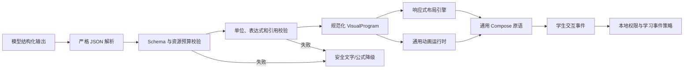

# 通用动态 GUI 与动画运行时架构计划

## 1. 目标

建设一个跨学科、可版本化、声明式、安全、可恢复的本地渲染系统。后方模型只输出结构化命令，Android 客户端使用同一套通用组件、布局和动画运行时生成界面。

完成后应满足：

- 新题只产生新的命令和数据，不增加题目专用页面。
- 新运动只要能由现有变量、表达式、路径和约束表达，就不增加专用动画代码。
- 数学、物理、化学、生物、地理等内容可以复用同一套基础原语。
- 模型不能输出或执行任意程序。
- 无效 GUI 命令不影响讲题主流程，可安全降级为文字/公式。

## 2. 明确不做

- 不为一道题写一个 Composable。
- 不为一个题型复制一套页面。
- 不把模型生成图片当作动态 GUI。
- 不执行模型输出的 Kotlin、JavaScript、HTML、CSS、SVG、WebView 内容或其他脚本。
- 不提供无限制的自由画布。
- 不做手写演算板。
- 不把播放、拖动等浏览行为自动当作学生掌握证据。

## 3. 总体管线



## 4. 三层核心架构

### 4.1 声明式命令层

顶层对象暂命名为 `VisualProgram`，包含：

```text
schemaVersion
programId
purpose
fallbackMarkdown
variables[]
scenes[]
accessibility
```

一条模型回复允许：

- 1 个主场景；
- 最多 1 个确有必要的辅助场景；
- 0 个场景也是合法结果。

场景包含：

```text
sceneId
role: PRIMARY | SUPPORTING
layout
components[]
animation?
interactions[]
accessibility
```

所有引用都使用当前 `VisualProgram` 内的稳定 ID。禁止文件路径、URL、数据库 ID、Android 资源名和任意代码入口。

### 4.2 通用原语与组合层

#### 内容原语

- 文本块
- 数学表达式
- 关键数值
- 标签
- 说明/注释

#### 数据原语

- 标量
- 点
- 向量
- 数据序列
- 矩阵/表格
- 分类集合

#### 布局原语

- 纵向流
- 横向对照
- 网格
- 覆盖层
- 可折叠区域
- 横向滚动区域

#### 图形原语

- 坐标轴
- 数据点/折线/曲线
- 节点
- 连线/有向边
- 点、线段、圆、矩形、多边形
- 向量箭头
- 受控图标/学科符号注册项

#### 交互原语

- 单选/多选
- 排序
- 匹配
- 展开/收起
- 滑块
- 播放/暂停/复位
- 时间拖动
- 显示/隐藏图层

步骤、对照、证据链、时间线、知识关系、公式推导、函数图、数据图、空间关系、电路和化学关系均由上述原语组合，不拥有题目专用页面。

### 4.3 通用动画运行时

动画运行时只理解统一状态，不理解“这是哪一道题”：

```text
clock
entities[]
properties[]
tracks[]
constraints[]
derivedValues[]
controls
```

#### 可动画属性

- `x / y`
- 旋转
- 缩放
- 透明度
- 路径进度
- 向量方向与长度
- 图层可见性
- 数值读数

#### 状态驱动方式

- 关键帧
- 分段关键帧
- 路径跟随
- 受限数值表达式
- 变量绑定
- 几何约束

直线、抛体、圆周和振动只是一组变量、实体、表达式和路径命令。以后出现新的运动，优先组合现有能力；只有通用表达能力确实缺失时，才扩展运行时原语，而不是增加题目或题型专用渲染器。

## 5. 安全表达式

模型不能提交字符串脚本。表达式使用结构化 AST：

```text
constant
variable
add / subtract / multiply / divide
power
negate
sin / cos / tan
sqrt / abs
min / max / clamp
piecewise
```

禁止：

- 循环、递归和自定义函数；
- 文件、网络、时间、随机数和系统调用；
- 动态加载；
- 无界数组；
- 非有限数字；
- 超过深度和节点数的表达式。

本地先做维度分析和单位校验，再允许执行。单位不一致、除零风险、越界或非有限结果必须拒绝该动画并使用降级内容。

## 6. 单位与数值系统

所有数值使用显式结构：

```text
value
unit
displayName
precisionPolicy
range?
```

规则：

- 内部使用标准单位和明确维度。
- UI 使用学生熟悉的名称。
- 整数不显示无意义的 `.00`。
- 默认只显示当前最重要的 3–4 个读数。
- 数值和单位分层清晰，不堆成一行。
- 极大/极小数使用适合学科的科学计数法。
- 模型不能自行发明单位。

## 7. 结构预算与失败关闭

初始预算在真实测试后校准，第一版至少限制：

| 项目 | 初始上限 |
|---|---:|
| 场景数 | 2 |
| 组件树深度 | 8 |
| 单场景组件数 | 40 |
| 图节点数 | 50 |
| 图连线数 | 80 |
| 单序列数据点 | 512 |
| 表格行/列 | 50 / 12 |
| 表达式节点数 | 128 |
| 动画实体数 | 40 |
| 动画总时长 | 120 秒 |
| 模型可见文字总量 | 6000 字符 |

超过预算时：

1. 不尝试部分执行危险命令；
2. 保留通过验证的讲题文字；
3. 显示安全公式/表格降级或纯文字；
4. 记录内部诊断，不向学生展示工程错误。

## 8. 响应式布局

- 手机竖屏优先。
- 横向内容使用局部滚动，不让整页左右漂移。
- 大字体下自动改为纵向布局。
- 辅助场景默认可折叠。
- 键盘出现时保留当前回复和输入框。
- 不依赖固定像素坐标表达文字布局。
- 图形坐标和 UI 坐标分离。

## 9. 无障碍与静态降级

每个场景必须提供：

- 一句目的说明；
- 关键关系的文字替代；
- 交互控件的语义名称；
- 动画当前状态；
- 禁用动画时可拖动或逐步查看的静态方式。

系统关闭动画、低性能设备或渲染失败时，核心知识仍能通过文字、公式、表格或关键帧理解。

## 10. 交互事件与学习记忆边界

交互分为两类：

### 浏览事件

- 播放、暂停、拖动、倍速、展开、切换图层。
- 只用于恢复界面和本地体验统计。
- 不写掌握度。

### 学习证据事件

- 回答模型明确提出的当前题问题；
- 选择当前步骤判断；
- 提交文字回答。

只有经过讲题意图、当前题绑定和本地证据策略确认的学习事件才能进入能力账本。模型不能把任意 GUI 点击标记为“答对”。

## 11. 版本、持久化与旧会话

- `VisualProgram` 必须带 Schema 版本。
- 数据库存储原始模型响应、规范化命令和安全降级文本。
- 新版本需要向后读取已支持版本，或执行确定性迁移。
- 无法迁移时仍显示降级文字，不能让旧会话打不开。
- 渲染器升级不能改变已记录的学生答案语义。
- 使用 Golden 命令快照验证相同版本的确定性输出。

## 12. 模型协议

模型需要：

- 先判断 GUI 是否比纯文字更清楚；
- 选择一个主场景，必要时才加辅助场景；
- 只引用当前题数据；
- 使用允许的组件和单位；
- 给出文字降级；
- 不输出实现说明；
- 不输出“示意动画”等标签；
- 不把内部字段名放进学生文字。

本地永远把输出视为不可信输入，Prompt 不能替代校验器。

## 13. 跨学科通用性验收

首个完整版本至少用以下命令样本验证，期间不得为单个样本增加专用页面：

- 数学：函数变化、几何关系、统计数据、公式推导。
- 物理：受力关系、运动、波形、电路。
- 化学：反应过程、粒子关系、实验步骤、数据变化。
- 生物：过程时间线、结构关系、调节反馈。
- 地理：剖面关系、过程变化、统计图。
- 历史：时间线、因果关系、对照表。
- 语文/英语：结构层次、证据对应、句子成分关系。
- 政治：概念关系、条件与结论、材料证据链。

验收核心不是“样本看起来能显示”，而是证明新增样本只增加结构化命令数据，没有修改渲染源码。

## 14. 测试矩阵

### 协议

- JSON Schema 正反例
- 未知版本
- 缺失引用
- 循环引用
- 超预算
- 恶意文本与任意代码字段

### 表达式与单位

- 属性测试
- 除零/溢出/NaN
- 单位不一致
- 分段边界
- 关键帧顺序

### 渲染

- 竖屏/横屏
- 大字体
- 不同密度
- 深长表格
- 多语言和长标签
- 系统禁用动画

### 生命周期

- 旋转
- 返回重进
- 进程强杀
- App 升级
- Schema 迁移

### 性能

- 解析与校验
- 首帧
- 滚动
- 动画帧稳定性
- 内存峰值
- 多轮长会话

### 真实 Provider

- 至少两家兼容 Provider
- 跨学科真实题
- 无效/截断/流式输出
- GUI 不适用时正确选择纯文字

## 15. 完成门槛

只有同时满足以下条件才算通用 GUI 子系统完成：

1. 模型输出协议已版本化并严格校验。
2. 原语、组合和动画三层职责分离。
3. 新题不会增加专用页面或专用动画。
4. 跨九科学科样本通过。
5. 恶意和超预算命令失败关闭。
6. 旧会话可重放或安全降级。
7. 浏览交互不会污染学习记忆。
8. 模拟器和中端 ARM 真机性能通过。
9. 真实 Provider 能稳定生成合规命令。
10. 无障碍与禁动画模式仍可学习。

