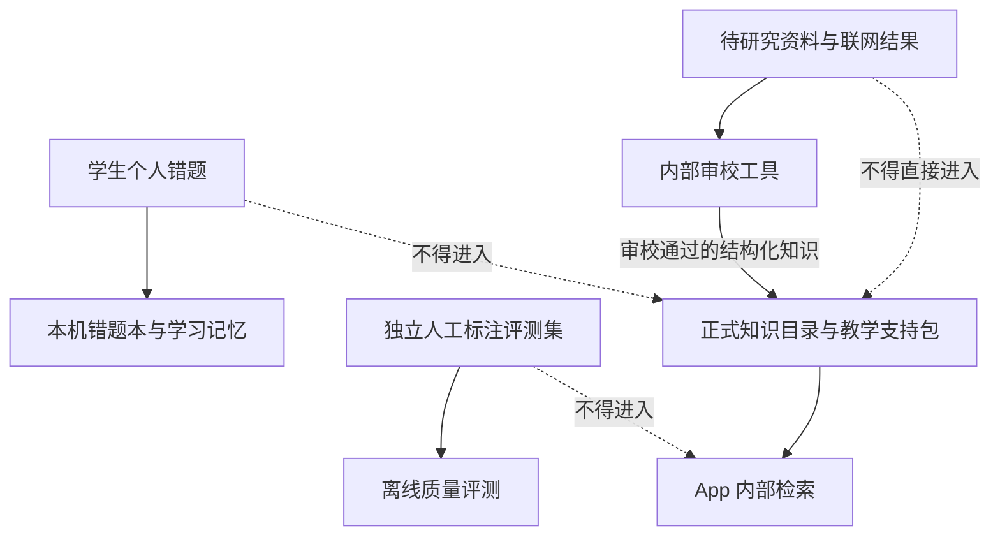
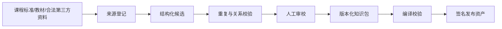

# AI 内部高中知识库架构计划

## 1. 定义

高中知识库是供模型归类、检索和形成有限学习上下文使用的内部知识目录，不是题库。

正式内容分为两层，两层都只服务于模型理解和讲题，不形成可抽取练习池。

**知识目录层**包含：

- 科目；
- 板块；
- 细化知识点；
- 名称与常用别名；
- 知识边界；
- 所属关系；
- 先后学习关系；
- 易混/关联关系；
- 课程范围；
- 可靠来源和版本记录。

**教学支持层**可以包含：

- 概念的完整解释；
- 可复用的解题方法模型；
- 已审校的完整例题与推导；
- 常见误区和表征转换；
- 方法适用条件、边界和来源版本。

正式内容禁止包含：

- 可被独立抽取、布置、评分或排入复习的练习单元；
- 题库题号、答案键、分值、难度和练习调度信息；
- 可用于批量生成练习题的参数化题目模板；
- 学生个人错题；
- 人工标注评测题。

是否属于题库不能按“有没有题目、答案或解析”判断。教学支持层允许完整例题和完整解答；只有当内容拥有独立练习身份、可被检索为待做题、可评分或可进入复习队列时，才越过题库边界。

## 2. 四类数据必须物理隔离



建议采用不同目录、不同构建任务和不同数据访问接口：

- `knowledge-pack`：可发布的知识目录和已审校教学支持内容；二者使用不同 Schema。
- `retrieval-evaluation`：开发/CI 使用，发布构建明确排除。
- `learner-data`：Room 中的个人题目和学习事实。
- `knowledge-research`：开发期内部资料、搜索结果和审校状态。

构建必须扫描 APK/AAB，证明评测题和研究资料没有进入发布资产。

## 3. 知识结构

### 3.1 节点

```text
knowledgeId
subject
kind
canonicalName
studentSafeName
aliases[]
definitionBoundary
curriculumScopes[]
parentIds[]
sourceEvidence[]
version
reviewStatus
```

`studentSafeName` 只在确需向学生显示其掌握情况时使用。内部节点名、检索词和来源状态不能直接进入学生端。

### 3.2 关系

- `PART_OF`
- `PREREQUISITE_OF`
- `EQUIVALENT_TO`
- `EASILY_CONFUSED_WITH`
- `APPLIED_WITH`

关系需要：

- 同科约束或明确允许的跨学科类型；
- 来源依据；
- 方向；
- 版本；
- 防自环、防无依据环路；
- 失效和替代关系。

### 3.3 课程范围

“高中全部知识”不是一个无版本集合。内容包需要明确：

- 课程标准版本；
- 必修/选择性必修/选修；
- 学段与年级；
- 教材版本差异；
- 地区考试范围差异；
- 生效与废止时间。

当前目标基线为《普通高中课程标准日常修订版（2017 年版 2025 年修订）》。仓库中的 `moe-2020-foundation-v1` 只是一份历史定位样例，不能计入当前版本的全量完成证明；必须先完成九科 2020→2025 差异清单，再生成、审校并签署新的内容包。

内容包 Schema v2 支持“一个科目 → 多个板块 → 多个细化知识点”，同一科目内的直接学习顺序也可以跨板块表达。每个包必须声明课程基线，以及知识目录、教学支持分别处于 `PARTIAL` 还是 `FULL`。旧 Schema v1 被固定解释为 2020 历史样例，不能通过修改文件数量或节点数量冒充当前完整内容。

未学到的内容不能因为存在于完整知识库，就在学生掌握页显示为薄弱。

## 4. 内容生产流水线



### 每条正式知识点至少需要

- 一个权威课程或教材依据；
- 清晰边界；
- 同科位置；
- 名称和常用别名；
- 适用课程范围；
- 审校记录。

第三方资料只有在版权允许时保存正文；否则仅保存来源定位和经审核形成的结构化结论。

## 5. 运行时检索

检索输入来自当前题的模型结构化查询，但模型不能直接决定正式归类。

管线：

1. 题目科目确认；
2. 模型生成候选名称、别名、板块提示和题内步骤；
3. 本地强制同科检索；
4. 名称/别名/全文召回；
5. 父级、先修和易混关系有界扩展；
6. 稳定排序；
7. 返回少量有依据候选给模型复核；
8. 本地协议验证后绑定当前题；
9. 低置信或无候选进入静默知识缺口队列。

结构化检索优先。只有独立评测证明召回仍不足，才考虑增加本地向量索引；不得因“看起来先进”增加移动端复杂度。

## 6. 联网搜索边界

运行中的学生 App 不应把任意网页直接写进正式知识库。

可允许两种联网用途：

1. 模型在当前讲解中使用 Provider 自身能力补充解释，但不得把该内容当作正式知识节点或掌握事实。
2. 内部知识研究工具根据缺口搜索可信来源，进入审校队列，通过后随新的版本化知识包发布。

学生不负责审校，也不看到缺口、来源抓取和待完善状态。

## 7. 独立评测题集

真实题目只用于评测：

- 科目识别；
- 细化知识点召回；
- 多知识点覆盖；
- 同名异义；
- 长题面；
- 图片/图表题；
- 边界与模糊题；
- 跨科误召。

最低规划：

- 2700 道；
- 九科每科不少于 300 道；
- 双人独立标注；
- 不一致由第三方仲裁；
- 训练/开发/盲测隔离；
- 有版权和使用记录；
- 永不进入发布包和运行时检索。

目标门槛：

- 科目识别 ≥ 99%；
- Recall@5 ≥ 95%；
- Precision@5 ≥ 90%；
- 跨科误召 < 0.5%；
- 长题面与多知识点单独报告。

## 8. 与学习记忆的边界

知识库回答“有哪些知识、彼此怎样关联”；学习记忆回答“这个学生在何时、通过什么证据表现如何”。

禁止：

- 因知识库存在某节点就把学生标成未掌握；
- 因模型低置信归类就改掌握度；
- 因批量导入一批旧错题就当作今天再次做错；
- 把其他学生或评测题的结果写入个人记忆。

学习掌握页只展示真实个人证据覆盖到的内容，不展示知识库覆盖率。

## 9. 版本、更新与迁移

- 知识包有独立版本和内容哈希。
- App 数据库记录题目绑定时使用的知识包版本。
- 节点更名、合并、拆分和废止都有迁移映射。
- 更新知识包不能静默改写历史学习事实。
- 投影重算需要保留原始证据。
- 更新失败回滚到上一完整版本。
- 没有通过校验的部分包不得进入生产。

## 10. 性能与规模

初始验收规模：

- 至少 2 万个细化知识点；
- 多种别名和关系；
- 同科检索 p95 < 150 ms；
- 单科学习摘要 p95 < 250 ms；
- 中端 ARM 真机；
- 长题面和批量题目压力测试；
- 有界内存和有界关系扩展。

索引需要覆盖：

- 科目；
- 规范化名称；
- 别名；
- 父级；
- 关系类型；
- 版本；
- 审校状态。

时间和掌握程度属于个人学习数据库索引，不属于知识目录分类。

## 11. 学生端不可见内容

学生端不得显示：

- 资料数量；
- 分类依据；
- 待完善分类；
- 覆盖率；
- 审校状态；
- 检索词；
- 召回结果；
- 内部关系类型；
- 来源抓取状态。

学生真正看到的是自己的：

- 掌握较好；
- 基本掌握；
- 需要巩固；
- 最近未练习；
- 最近变化。

## 12. 完成门槛

1. 正式知识目录 Schema 拒绝题库字段；教学支持 Schema 允许方法、例题和完整解答，但明确拒绝练习身份、答案键、评分、难度和调度字段。
2. 知识包、评测题、个人错题、研究资料四类数据物理隔离。
3. APK/AAB 扫描证明评测题和研究资料未打包。
4. 独立于内容包的九科课程范围清单完成审校，且内容包与清单逐点双向一致，不能靠内容包自报范围。
5. 每个正式节点有可靠依据和审校记录。
6. 版本迁移不会改写历史学习事实。
7. 独立评测达到召回与精度目标。
8. 中端 ARM 真机性能达标。
9. 学生端无知识库运维信息。
10. 知识库帮助归类、检索和讲题；其中例题只能作为讲解上下文，不能被抽取为刷题、评分或复习单元。
11. `tools/audit-knowledge-coverage-ledger.ps1 -RequireComplete` 与 `tools/audit-knowledge-packs.ps1 -RequireFullCoverage` 通过，且报告明确指向 2025 基线、九科范围清单齐全、内容包逐点匹配、知识目录与教学支持均经审校声明为完整；历史样例不得参与计算。
